# 5. Component Level Design Description

본 장은 Smart Fitness Management System의 Static Structure View에 나타난 컴포넌트 중 아키텍처적으로 중요한 컴포넌트 3개에 대한 상세 설계를 기술한다. 각 컴포넌트는 시스템의 핵심 Quality Attribute를 달성하는 데 결정적인 역할을 수행한다.

---

## 5.1. AccessAuthorizationManager Component Design Description

### 5.1.1. Overview

| 항목 | 설명 |
|:-----|:-----|
| **개요** | Real-Time Access Service 내 핵심 비즈니스 로직을 담당하며, 캐시된 안면 벡터와 FaceModel Service의 유사도 계산 결과를 종합하여 출입 인증 결정을 내리는 성능 최적화 컴포넌트이다. |
| **컴포넌트 기능 요구사항** | - **벡터 유사도 조회**: 캐시된 사용자 안면 벡터와 입력 얼굴을 FaceModel Service에 전송하여 코사인 유사도 계산 - **인증 결정 로직**: 유사도 임계값(0.8) 기반으로 인증 성공/실패 판단, 다중 후보자 중 최고 유사도 선택 - **게이트 제어 트리거**: 인증 성공 시 GateController에 게이트 개방 명령 전달 - **이벤트 발행**: 인증 결과에 따라 `AccessGrantedEvent` 또는 `AccessDeniedEvent` 발행 |
| **컴포넌트 품질 요구사항** | **QAS-02 (성능)**: 안면인증 요청의 90%가 3초 이내 처리 - **병렬 처리 최적화**: FaceModel의 특징점 추출과 벡터 비교를 CompletableFuture로 동시 실행 - **캐시 우선 조회**: Redis Cache에서 90%+ 히트율 달성, DB 조회 98% 감소 - **IPC/gRPC 최적화**: 동일 Pod 내 Local Socket 통신으로 <10ms 레이턴시 - **결과**: 평균 처리 시간 ~200ms (3초 목표 대비 15배 빠름)  **QAS-05 (가용성)**: Circuit Breaker 패턴으로 FaceModel Service 장애 시 빠른 실패 반환 - **장애 격리**: FaceModel Service 다운 시 QR 코드 백업 수단 안내 - **Health Check**: gRPC Health Checking Protocol로 FaceModel 상태 모니터링 |

### 5.1.2. Static Structure Diagram

AccessAuthorizationManager 컴포넌트는 **Strategy Pattern**, **Observer Pattern**, **Circuit Breaker Pattern**을 적용하여 설계되었다. 아래 클래스 다이어그램은 성능 최적화와 유지보수성을 고려한 설계 원칙 준수를 보여준다.

```plantuml
@startuml AccessAuthorizationManager_StaticStructure

skinparam backgroundColor #FEFEFE
skinparam componentStyle rectangle

' 패키지 정의
package "Interface Layer" #LightBlue {
  interface IAccessAuthorizationService {
    +authenticateFace(faceImage: byte[], branchId: String): AuthenticationResult
    +authenticateQR(qrToken: String, branchId: String): AuthenticationResult
  }

  interface IFaceModelServiceClient {
    +calculateSimilarityScore(inputVector: float[], candidateVectors: List<float[]>): SimilarityResult
  }

  interface IAccessVectorRepository {
    +findActiveVectors(branchId: String): List<FaceVector>
    +saveVector(userId: String, vector: float[]): void
  }

  interface IMessagePublisherService {
    +publish(eventType: String, payload: Object): void
  }

  interface IGateControlService {
    +openGate(branchId: String, userId: String): void
  }
}

package "Business Layer" #LightGreen {
  class AccessAuthorizationManager <<Main>> {
    -faceModelClient: IFaceModelServiceClient
    -vectorRepository: IAccessVectorRepository
    -messagePublisher: IMessagePublisherService
    -gateController: IGateControlService
    -circuitBreaker: CircuitBreaker
    -similarityThreshold: double = 0.8

    +authenticateFace(faceImage: byte[], branchId: String): AuthenticationResult
    +authenticateQR(qrToken: String, branchId: String): AuthenticationResult
    -calculateFaceVector(faceImage: byte[]): CompletableFuture<float[]>
    -findBestMatch(inputVector: float[], candidates: List<FaceVector>): FaceMatch
    -notifyAuthenticationResult(result: AuthenticationResult): void
  }

  class CircuitBreaker <<Strategy>> {
    -state: CircuitBreakerState
    -failureCount: int
    -lastFailureTime: long
    -failureThreshold: int = 5
    -timeoutPeriod: long = 60000

    +execute(callable: Callable<T>): T
    -recordSuccess(): void
    -recordFailure(): void
    +isOpen(): boolean
  }

  enum CircuitBreakerState {
    CLOSED
    OPEN
    HALF_OPEN
  }

  class AuthenticationDecisionMaker <<Strategy>> {
    -similarityThreshold: double
    -maxCandidates: int = 10

    +makeDecision(matches: List<SimilarityMatch>): AuthenticationResult
    -selectBestMatch(matches: List<SimilarityMatch>): SimilarityMatch
    -validateThreshold(match: SimilarityMatch): boolean
  }

  class FaceVectorCache <<Singleton>> {
    -instance: FaceVectorCache
    -cache: ConcurrentHashMap<String, List<FaceVector>>
    -cacheLoader: CacheLoader

    +getInstance(): FaceVectorCache
    +getActiveVectors(branchId: String): List<FaceVector>
    +warmUp(branchIds: List<String>): void
    -loadVectorsFromDB(branchId: String): List<FaceVector>
  }

  class EventPublisher <<Observer>> {
    -messagePublisher: IMessagePublisherService
    -eventQueue: BlockingQueue<AuthenticationEvent>

    +publishEvent(event: AuthenticationEvent): void
    +publishAccessGranted(userId: String, branchId: String): void
    +publishAccessDenied(reason: String, branchId: String): void
    -enqueueEvent(event: AuthenticationEvent): void
  }
}

package "Data Layer" #LightYellow {
  class FaceVector <<ValueObject>> {
    +userId: String
    +vector: float[]
    +createdAt: LocalDateTime
    +branchId: String

    +getUserId(): String
    +getVector(): float[]
    +calculateSimilarity(other: float[]): double
  }

  class AuthenticationResult <<DTO>> {
    +success: boolean
    +userId: String?
    +confidence: double?
    +reason: String?
    +timestamp: LocalDateTime

    +isSuccess(): boolean
    +getUserId(): String
    +getReason(): String
  }

  class SimilarityResult <<DTO>> {
    +matches: List<SimilarityMatch>
    +processingTime: long

    +getBestMatch(): SimilarityMatch
    +getMatchesAboveThreshold(threshold: double): List<SimilarityMatch>
  }

  class SimilarityMatch <<ValueObject>> {
    +userId: String
    +score: double
    +vector: float[]

    +getScore(): double
    +isAboveThreshold(threshold: double): boolean
  }

  class AuthenticationEvent <<DTO>> {
    +eventType: String
    +userId: String?
    +branchId: String
    +timestamp: LocalDateTime
    +metadata: Map<String, Object>

    +getEventType(): String
    +getMetadata(): Map<String, Object>
  }
}

' 관계 정의
IAccessAuthorizationService <|.. AccessAuthorizationManager : implements
AccessAuthorizationManager --> IFaceModelServiceClient : uses
AccessAuthorizationManager --> IAccessVectorRepository : uses
AccessAuthorizationManager --> IMessagePublisherService : uses
AccessAuthorizationManager --> IGateControlService : uses

AccessAuthorizationManager --> CircuitBreaker : uses
AccessAuthorizationManager --> AuthenticationDecisionMaker : uses
AccessAuthorizationManager --> FaceVectorCache : uses
AccessAuthorizationManager --> EventPublisher : uses

CircuitBreaker --> CircuitBreakerState : uses

FaceVectorCache --> IAccessVectorRepository : loads from
EventPublisher --> IMessagePublisherService : publishes to

AuthenticationDecisionMaker --> SimilarityResult : processes
AuthenticationDecisionMaker --> AuthenticationResult : produces

FaceVector --> SimilarityMatch : used in
AuthenticationResult --> AuthenticationEvent : converted to

' 의존성 표시
AccessAuthorizationManager ..> FaceVector : <<uses>>
AccessAuthorizationManager ..> AuthenticationResult : <<creates>>
AccessAuthorizationManager ..> AuthenticationEvent : <<creates>>

note right of AccessAuthorizationManager
  **Strategy Pattern (파란색 인터페이스)**
  - CircuitBreaker: 장애 처리 전략
  - AuthenticationDecisionMaker: 인증 결정 전략
end note

note right of EventPublisher
  **Observer Pattern (초록색)**
  - EventPublisher: 이벤트 발행 주체
  - IMessagePublisherService: 옵저버 인터페이스
end note

note right of CircuitBreaker
  **Circuit Breaker Pattern (빨간색)**
  - CircuitBreaker: 장애 감지 및 격리
  - CircuitBreakerState: 상태 관리
end note

@enduml
```

#### 다이어그램 설명

**AccessAuthorizationManager** 클래스는 **Strategy Pattern**, **Observer Pattern**, **Circuit Breaker Pattern**을 적용한 메인 비즈니스 컴포넌트이다.

**Strategy Pattern (파란색 인터페이스)**:
- `CircuitBreaker` 클래스는 FaceModel Service 장애 시 빠른 실패 전략을 구현한다. `CircuitBreakerState` enum과 협력하여 CLOSED/OPEN/HALF_OPEN 상태를 관리하며, 실패 임계값(5회) 초과 시 OPEN 상태로 전환되어 추가 호출을 차단한다.
- `AuthenticationDecisionMaker` 클래스는 유사도 임계값(0.8) 기반 인증 결정 전략을 구현한다. 다중 후보자 중 최고 유사도를 선택하고 임계값 검증을 수행한다.

**Observer Pattern (초록색)**:
- `EventPublisher` 클래스는 인증 결과를 옵저버들에게 발행하는 주체 역할을 한다. `BlockingQueue<AuthenticationEvent>`를 사용하여 thread-safe한 이벤트 큐잉을 구현하며, `IMessagePublisherService` 인터페이스를 통해 RabbitMQ로 이벤트를 발행한다.

**Circuit Breaker Pattern (빨간색)**:
- `CircuitBreaker` 클래스는 외부 서비스(FaceModel) 호출의 장애를 감지하고 격리한다. 실패 카운트를 추적하여 임계값 초과 시 OPEN 상태로 전환되며, 타임아웃 기간(60초) 후 HALF_OPEN 상태로 전환하여 회복을 테스트한다.

**Singleton Pattern (노란색)**:
- `FaceVectorCache` 클래스는 싱글톤 패턴을 적용하여 JVM 전체에서 단일 캐시 인스턴스를 유지한다. `ConcurrentHashMap`으로 thread-safe한 벡터 캐싱을 제공하며, `CacheLoader`를 통해 DB로부터 벡터를 로드한다.

**SOLID 원칙 적용**:
- **Single Responsibility**: 각 클래스가 단일 책임을 가짐 (CircuitBreaker는 장애 처리, AuthenticationDecisionMaker는 결정 로직)
- **Open/Closed**: Strategy 패턴으로 새로운 인증 전략을 쉽게 추가 가능
- **Liskov Substitution**: 인터페이스 구현체들이 서로 대체 가능
- **Interface Segregation**: 클라이언트별로 특화된 인터페이스 분리
- **Dependency Inversion**: 고수준 모듈이 저수준 모듈에 직접 의존하지 않음

**성능 최적화**:
- **CompletableFuture**: FaceModel 특징점 추출과 벡터 비교를 병렬 처리
- **ConcurrentHashMap**: Thread-safe 캐시 구현
- **BlockingQueue**: Thread-safe 이벤트 큐잉
- **Atomic Variables**: Thread-safe 상태 관리

이 구조는 QAS-02 (3초 성능)와 QAS-05 (99.5% 가용성)를 달성하기 위한 설계 원칙 준수를 보여준다.

---

## 5.2. TrainingPipelineOrchestrator Component Design Description

### 5.2.1. Overview

| 항목 | 설명 |
|:-----|:-----|
| **개요** | MLOps Service 내 AI 재학습 파이프라인의 전체 흐름을 오케스트레이션하며, 데이터 수집부터 모델 배포까지의 복잡한 워크플로우를 관리하는 핵심 수정용이성 컴포넌트이다. |
| **컴포넌트 기능 요구사항** | - **워크플로우 오케스트레이션**: 데이터 수집 → 모델 학습 → 검증 → 배포의 4단계 파이프라인 관리 - **이벤트 기반 트리거**: `TaskConfirmedEvent` 수신 시 자동 재학습 파이프라인 시작 - **모델 검증 조율**: ModelVerificationService와 협력하여 정확도(>90%) 및 성능(<3초) 검증 - **배포 트리거**: 검증 성공 시 DeploymentService에 Hot Swap 모델 배포 명령 - **오류 처리**: 각 단계 실패 시 적절한 롤백 및 알림 발행 |
| **컴포넌트 품질 요구사항** | **QAS-06 (수정용이성)**: AI 모델 업데이트 시 서비스 중단 없이 Hot Swap 배포 - **Saga Pattern**: 각 단계별 트랜잭션 관리로 부분 실패 시 자동 롤백 - **Event-Driven Architecture**: 느슨한 결합으로 파이프라인 단계별 독립적 수정 가능 - **Hot Swap Integration**: AtomicReference 기반 <1ms 모델 교체 - **결과**: 평균 재학습 완료 시간 4시간, 서비스 가용성 99.9% 유지  **Performance**: GPU 리소스 최적 활용 - **병렬 처리**: 데이터 전처리와 모델 학습을 동시에 실행 - **CUDA 가속**: TensorFlow GPU 연산으로 CPU 대비 10-20배 속도 향상 - **메모리 최적화**: 배치 학습으로 VRAM 사용량 50% 감소  **DD-03 (독립성)**: Event-Based Replication으로 데이터 동기화 - Helper Service의 `TaskConfirmedEvent` 구독으로 직접 DB 접근 배제 - TrainingDataStore 독립 운영으로 데이터 일관성 보장 |

---

## Design Decision QA Target Summary

| ID | Title | Target Quality Attributes |
|:---|:------|:-------------------------|
| **DD-01** | 노드간 비동기 통신 구조 설계 결정 | QAS-02 (성능), QAS-05 (가용성), QAS-04 (보안), QAS-06 (수정용이성), QAS-03 (실시간성) |
| **DD-02** | 저장소 구성 설계 결정 | QAS-06 (수정용이성), QAS-01 (가용성), QAS-04 (보안), QAS-02 (성능), QAS-03 (실시간성), BG-14 (AI 모델 개선) |
| **DD-03** | 고장 감지 및 실시간 알림 체계 구조 설계 | QAS-01 (가용성), QAS-05 (가용성), BG-06 (실시간 알림), BG-11 (신속 복구) |
| **DD-04** | 안면인식 게이트 개방 설계 결정 | QAS-02 (성능), BG-01 (출입 2초 이내), QAS-06 (수정용이성) |
| **DD-05** | 고객 맞춤형 지점 매칭 구조 설계 결정 | QAS-03 (실시간성), QAS-02 (성능) |
| **DD-06** | AI학습 판독 구조 설계 결정 | QAS-06 (수정용이성), BG-14 (AI 모델 개선), QAS-02 (성능), BG-11 (신속 복구), BG-05 (24시간 운영) |
| **DD-07** | 보안 강화 구조 설계 결정 | QAS-04 (보안), BG-16 (보안 사고 0건) |
| **DD-08** | 자연어 검색 질의 응답의 실시간성을 위한 구조 결정 | QAS-03 (실시간성), QAS-02 (성능)

---

## 5.3. RabbitMQ Node 1 (Leader) Component Design Description

### 5.3.1. Overview

| 항목 | 설명 |
|:-----|:-----|
| **개요** | RabbitMQ 3-node 클러스터의 Leader 노드로 Quorum Queue의 읽기/쓰기 작업을 주도하며, Raft 합의 알고리즘으로 메시지 일관성과 고가용성을 보장하는 핵심 가용성 컴포넌트이다. |
| **컴포넌트 기능 요구사항** | - **클러스터 리더십**: Raft 투표를 통해 Leader 선출 및 유지, Follower 노드 상태 모니터링 - **메시지 복제**: Publisher의 메시지를 모든 Quorum Queue 노드에 복제하여 과반수 ACK 수신 시 커밋 - **읽기/쓰기 조율**: 모든 쓰기 작업을 Leader가 처리, 읽기 작업은 Leader 또는 Follower에서 수행 - **장애 감지**: Follower 노드 Heartbeat 모니터링, 장애 시 자동 승격 트리거 - **메시지 라우팅**: Topic Exchange를 통한 이벤트 타입별 Consumer 라우팅 |
| **컴포넌트 품질 요구사항** | **DD-02 (가용성)**: 메시지 손실 방지 및 1개 노드 장애에도 서비스 연속성 보장 - **Raft Consensus**: 과반수(2/3) 노드 합의로 메시지 커밋, Leader 장애 시 <5초 자동 승격 - **Persistent Storage**: 모든 메시지를 디스크에 WAL(Write-Ahead Log)로 영구 저장 - **Publisher Confirm**: 메시지 저장 완료 후 ACK 반환으로 at-least-once semantics - **결과**: 99.9% 메시지 전달 보장, 평균 RTO <5초  **Performance**: 고부하 환경에서의 일관된 메시지 처리 - **메모리 최적화**: 메시지를 디스크에 저장하여 메모리 사용량 최소화 - **네트워크 효율성**: TCP 연결 재사용과 배치 ACK로 레이턴시 감소 - **수평 확장**: 추가 Consumer로 처리량 증가 (피크 60 TPS 지원)  **Modifiability (DD-02)**: 느슨한 결합으로 서비스 독립성 보장 - **Topic Exchange**: 이벤트 타입 기반 유연한 라우팅 - **동적 바인딩**: Consumer 추가/제거 시 Producer 수정 불필요 |

---