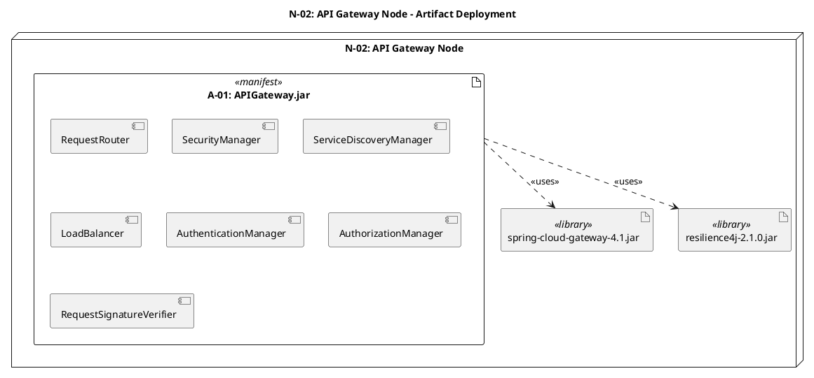
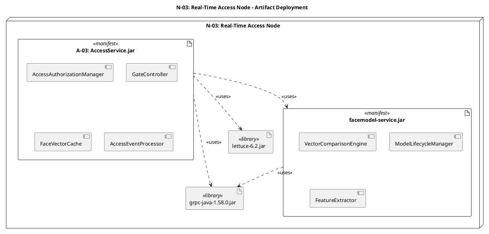
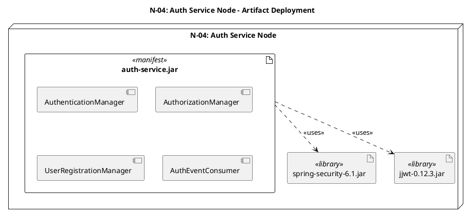
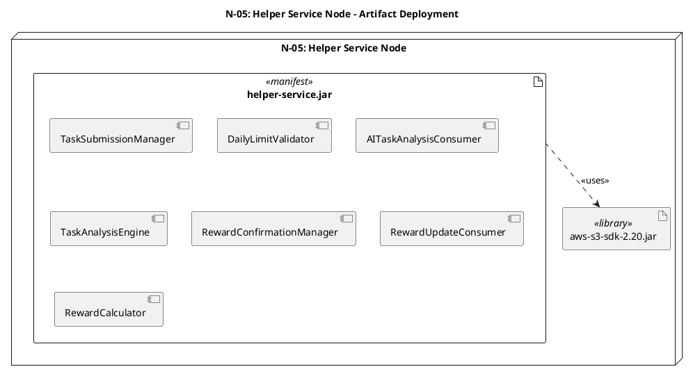
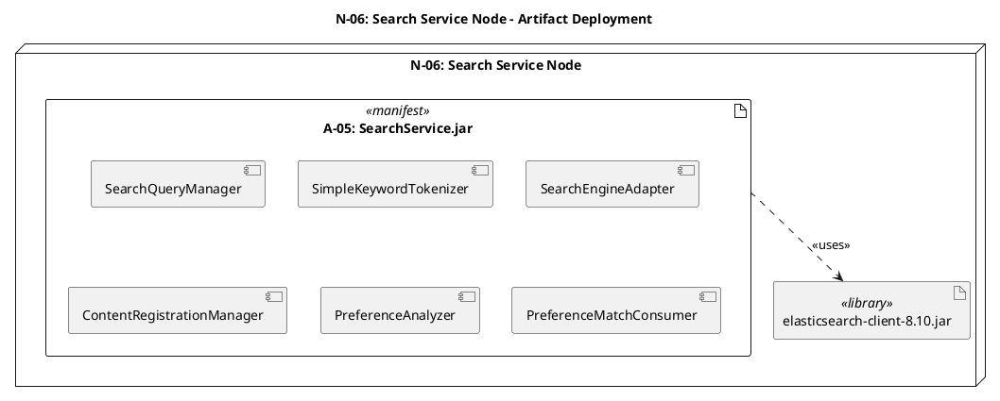
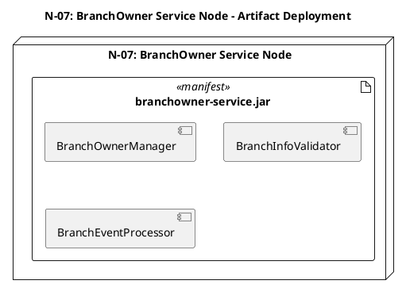
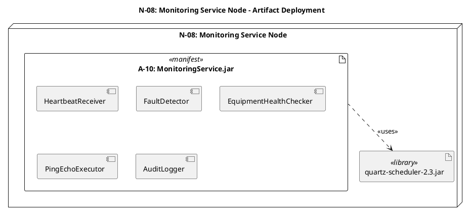
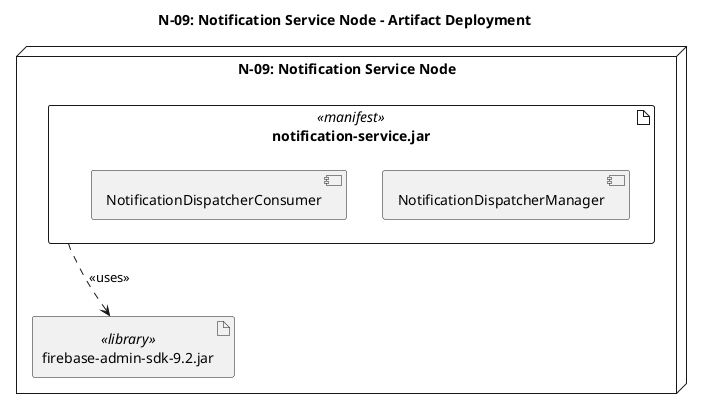
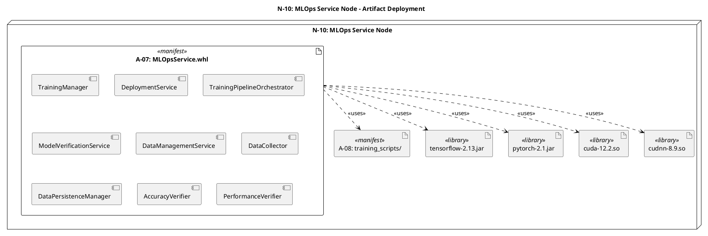

# 4.3.6.2 Node별 Artifact 파일 및 컴포넌트 리스트

## Overview
본 문서는 Smart Fitness Management System의 각 노드(N-01 ~ N-15)에 배포되는 Artifact 파일 리스트와 각 Artifact에 포함된 컴포넌트 리스트를 상세히 기술한다. 각 컴포넌트는 Component Diagram에서 정의된 구조를 반영한다.

---

## N-01: Load Balancer Node

### Artifact 파일 리스트
1. **nginx-ingress-controller.yaml** (Configuration)
2. **ingress-config.yaml** (Configuration)
3. **tls-certificates.pem** (Certificate)

### 컴포넌트 리스트
- **nginx-ingress-controller.yaml**
  - Nginx Ingress Controller

---

## N-02: API Gateway Node

### Artifact 파일 리스트
1. **A-01: APIGateway.jar** (Java Executable JAR)
2. **A-02: gateway-config.yml** (Configuration)
3. **spring-cloud-gateway-4.1.jar** (Library)
4. **resilience4j-2.1.0.jar** (Library)
5. **jwt-public-key.pem** (Certificate)

### PlantUML Artifact Deployment Diagram

### 컴포넌트 리스트

#### A-01: APIGateway.jar
**Interface Layer:**
- ApiGatewayController
- ApiGatewayManagementController

**Business Layer:**
- RequestRouter
- SecurityManager
- ServiceDiscoveryManager
- LoadBalancer
- AuthenticationManager
- AuthorizationManager
- RequestSignatureVerifier

**System Interface Layer:**
- EurekaServiceRegistry
- AuthenticationClientAdapter
- AuthorizationClientAdapter
- RabbitMQAdapter
- ResilientCircuitBreaker
- ResilientRateLimiter

#### A-02: gateway-config.yml
- RoutingConfiguration
- RateLimitConfiguration
- CircuitBreakerConfiguration
- SecurityConfiguration

---

## N-03: Real-Time Access Node

### Artifact 파일 리스트
1. **A-03: AccessService.jar** (Java Executable JAR)
2. **A-04: access-config.yml** (Configuration)
3. **facemodel-service.jar** (Java Executable JAR)
4. **application-facemodel.yml** (Configuration)
5. **grpc-java-1.58.0.jar** (Library)
6. **lettuce-6.2.jar** (Library)

### PlantUML Artifact Deployment Diagram

### 컴포넌트 리스트

#### A-03: AccessService.jar
**Interface Layer:**
- AccessControlController
- QRAccessController

**Business Layer:**
- AccessAuthorizationManager
- GateController
- FaceVectorCache
- AccessEventProcessor

**System Interface Layer:**
- VectorRepository
- FaceModelServiceIPCClient
- EquipmentGatewayAdapter
- RabbitMQAdapter

#### A-04: access-config.yml
- DataSourceConfiguration
- CacheConfiguration
- KafkaProducerConfiguration
- FaceModelClientConfiguration

#### facemodel-service.jar
**Interface Layer:**
- FaceModelIPCHandler

**Business Layer:**
- VectorComparisonEngine
- ModelLifecycleManager
- FeatureExtractor

**System Interface Layer:**
- ModelVersionJpaRepository
- MLInferenceEngineAdapter
- RabbitMQAdapter

---

## N-04: Auth Service Node

### Artifact 파일 리스트
1. **auth-service.jar** (Java Executable JAR)
2. **application-auth.yml** (Configuration)
3. **spring-security-6.1.jar** (Library)
4. **jjwt-0.12.3.jar** (Library)

### PlantUML Artifact Deployment Diagram

### 컴포넌트 리스트

#### auth-service.jar
**Interface Layer:**
- AuthServiceController
- UserManagementController

**Business Layer:**
- AuthenticationManager
- AuthorizationManager
- UserRegistrationManager
- AuthEventConsumer

**System Interface Layer:**
- AuthJpaRepository
- RabbitMQAdapter
- JwtTokenManager
- CreditCardVerificationClient

---

## N-05: Helper Service Node

### Artifact 파일 리스트
1. **helper-service.jar** (Java Executable JAR)
2. **application-helper.yml** (Configuration)
3. **aws-s3-sdk-2.20.jar** (Library)

### PlantUML Artifact Deployment Diagram

### 컴포넌트 리스트

#### helper-service.jar
**Interface Layer:**
- TaskController
- RewardController

**Business Layer:**
- TaskSubmissionManager
- DailyLimitValidator
- AITaskAnalysisConsumer
- TaskAnalysisEngine
- RewardConfirmationManager
- RewardUpdateConsumer
- RewardCalculator

**System Interface Layer:**
- HelperJpaRepository
- S3PhotoStorage
- MLInferenceEngineAdapter
- RabbitMQAdapter

---

## N-06: Search Service Node

### Artifact 파일 리스트
1. **A-05: SearchService.jar** (Java Executable JAR)
2. **A-06: search-config.yml** (Configuration)
3. **elasticsearch-client-8.10.jar** (Library)

### PlantUML Artifact Deployment Diagram

### 컴포넌트 리스트

#### A-05: SearchService.jar
**Interface Layer:**
- BranchSearchController
- ReviewController

**Business Layer (Hot Path):**
- SearchQueryManager
- SimpleKeywordTokenizer
- SearchEngineAdapter

**Business Layer (Cold Path):**
- ContentRegistrationManager
- PreferenceAnalyzer
- PreferenceMatchConsumer

**System Interface Layer:**
- ElasticSearchRepository
- LLMServiceClient
- RabbitMQAdapter

#### A-06: search-config.yml
- ElasticSearchConfiguration
- KafkaConfiguration
- LLMConfiguration

---

## N-07: BranchOwner Service Node

### Artifact 파일 리스트
1. **branchowner-service.jar** (Java Executable JAR)
2. **application-branchowner.yml** (Configuration)

### PlantUML Artifact Deployment Diagram

### 컴포넌트 리스트

#### branchowner-service.jar
**Interface Layer:**
- BranchOwnerController
- BranchQueryController

**Business Layer:**
- BranchOwnerManager
- BranchInfoValidator
- BranchEventProcessor

**System Interface Layer:**
- BranchJpaRepository
- AuthJpaRepository
- RabbitMQAdapter

---

## N-08: Monitoring Service Node

### Artifact 파일 리스트
1. **A-10: MonitoringService.jar** (Java Executable JAR)
2. **A-11: monitoring-config.yml** (Configuration)
3. **quartz-scheduler-2.3.jar** (Library)

### PlantUML Artifact Deployment Diagram

### 컴포넌트 리스트

#### A-10: MonitoringService.jar
**Interface Layer:**
- EquipmentStatusReceiver
- EquipmentCommandController

**Business Layer:**
- HeartbeatReceiver
- FaultDetector
- EquipmentHealthChecker
- PingEchoExecutor
- AuditLogger

**System Interface Layer:**
- EquipmentStatusJpaRepository
- EquipmentGatewayClient
- QuartzScheduler
- RabbitMQAdapter

#### A-11: monitoring-config.yml
- ScheduledTaskConfiguration
- RedisConfiguration
- KafkaProducerConfiguration
- PingEchoConfiguration

---

## N-09: Notification Service Node

### Artifact 파일 리스트
1. **notification-service.jar** (Java Executable JAR)
2. **application-notification.yml** (Configuration)
3. **fcm-service-account.json** (Credential)
4. **firebase-admin-sdk-9.2.jar** (Library)

### PlantUML Artifact Deployment Diagram

### 컴포넌트 리스트

#### notification-service.jar
**Interface Layer:**
- NotificationController

**Business Layer:**
- NotificationDispatcherManager
- NotificationDispatcherConsumer

**System Interface Layer:**
- FcmPushGateway
- RabbitMQAdapter

---

## N-10: MLOps Service Node

### Artifact 파일 리스트
1. **A-07: MLOpsService.whl** (Python Wheel Package)
2. **A-08: training_scripts/** (Python Scripts Directory)
3. **A-09: mlops-config.yml** (Configuration)
4. **model-weights-v1.0.pb** (Model File)
5. **tensorflow-2.13.jar** (Library)
6. **pytorch-2.1.jar** (Library)
7. **cuda-12.2.so** (Library)
8. **cudnn-8.9.so** (Library)

### PlantUML Artifact Deployment Diagram

### 컴포넌트 리스트

#### A-07: MLOpsService.whl
**Interface Layer:**
- TrainingController
- DeploymentController

**Business Layer:**
- TrainingManager
- DeploymentService
- TrainingPipelineOrchestrator
- ModelVerificationService
- DataManagementService
- DataCollector
- DataPersistenceManager
- AccuracyVerifier
- PerformanceVerifier

**System Interface Layer:**
- ModelJpaRepository
- TrainingDataJpaRepository
- MLInferenceEngineAdapter
- RabbitMQAdapter
- FaceModelClientAdapter
- AuthRepositoryAdapter
- HelperRepositoryAdapter

#### A-08: training_scripts/
- ML Inference Engine (Python Scripts)

#### A-09: mlops-config.yml
- TrainingConfiguration
- DeploymentConfiguration
- ModelVerificationConfiguration

---

## N-11: RDS Cluster

### Artifact 파일 리스트
1. **A-15: database-schema.sql** (SQL DDL Script)
2. **A-16: initial-data.sql** (SQL DML Script)
3. **auth-db-primary** (Database Instance)
4. **helper-db-primary** (Database Instance)
5. **vector-db-primary** (Database Instance)
6. **model-db-primary** (Database Instance)
7. **search-db-primary** (Database Instance)
8. **branch-db-primary** (Database Instance)
9. **monitor-db-primary** (Database Instance)
10. **pgvector-extension.so** (Extension)
11. **ivfflat-index.sql** (SQL Script)

### 컴포넌트 리스트

#### A-15: database-schema.sql
- user_table (DDL)
- branch_table (DDL)
- reservation_table (DDL)
- payment_table (DDL)
- access_log_table (DDL)
- device_status_table (DDL)

#### A-16: initial-data.sql
- branch_initial_data (INSERT)
- admin_user_data (INSERT)

---

## N-12: ElasticSearch Cluster

### Artifact 파일 리스트
1. **A-18: branch-index-mapping.json** (ElasticSearch Index Mapping)
2. **A-19: review-index-mapping.json** (ElasticSearch Index Mapping)
3. **A-20: nori-analyzer-plugin.zip** (ElasticSearch Plugin)
4. **A-21: elasticsearch.yml** (Configuration)
5. **elasticsearch-8.10.tar.gz** (Binary)

### 컴포넌트 리스트

#### A-18: branch-index-mapping.json
- branch_id (keyword)
- branch_name (text with nori analyzer)
- address (text)
- facilities (text array)
- keywords (text array)
- location (geo_point)

#### A-19: review-index-mapping.json
- review_id (keyword)
- branch_id (keyword)
- rating (integer)
- review_text (text with nori analyzer)
- keywords (text array)
- created_at (date)

#### A-20: nori-analyzer-plugin.zip
- NoriTokenizer
- NoriPartOfSpeechFilter
- NoriReadingFormFilter
- KoreanStopFilter

#### A-21: elasticsearch.yml
- ClusterConfiguration
- NetworkConfiguration
- DiscoveryConfiguration
- SecurityConfiguration

---

## N-13: RabbitMQ Cluster

### Artifact 파일 리스트
1. **rabbitmq-server-3.12.8.tar.gz** (Binary)
2. **rabbitmq.conf** (Configuration)
3. **queue-definitions.json** (Queue Definition)
4. **exchange-definitions.json** (Exchange Definition)
5. **erlang-26.tar.gz** (Runtime)

### 컴포넌트 리스트

#### rabbitmq-server-3.12.8.tar.gz
- MessagePublisherApi
- MessageSubscriptionApi
- RoutingKeyResolver
- QueueManager
- ExchangeManager
- MessagePersistenceManager
- QuorumQueueManager

---

## N-14: Redis Cache Cluster

### Artifact 파일 리스트
1. **A-17: redis.conf** (Configuration)
2. **redis-server-7.2.tar.gz** (Binary)
3. **sentinel.conf** (Configuration)

### 컴포넌트 리스트

#### A-17: redis.conf
- ClusterConfiguration
- MemoryPolicyConfiguration
- PersistenceConfiguration
- AuthenticationConfiguration

---

## N-15: S3 Storage

### Artifact 파일 리스트
1. **A-22: face-recognition-model.h5** (TensorFlow/Keras Model Binary)
2. **task-photos/** (S3 Bucket)
3. **face-images/** (S3 Bucket)
4. **ml-models/** (S3 Bucket)
5. **lifecycle-policy.json** (Lifecycle Policy)
6. **bucket-policy.json** (Bucket Policy)

### 컴포넌트 리스트

#### A-22: face-recognition-model.h5
- FaceRecognitionModel (Neural Network Weights)
- ModelMetadata (version, accuracy, timestamp)

---

## 컴포넌트 계층 구조 요약

### 레이어별 컴포넌트 분류

| Layer | 컴포넌트 개수 | 주요 역할 |
|:------|:--------------|:----------|
| **Interface Layer** | 20+ | REST API Controller, HTTP 요청 처리 |
| **Business Layer** | 50+ | 비즈니스 로직, 도메인 서비스 |
| **System Interface Layer** | 30+ | 외부 시스템 연동, 데이터베이스 접근 |

### 주요 컴포넌트 그룹

1. **Controller 컴포넌트** (Interface Layer)
   - ApiGatewayController, AccessControlController, AuthServiceController 등
   - 총 20개 이상의 REST API 엔드포인트 제공

2. **Manager/Service 컴포넌트** (Business Layer)
   - AccessAuthorizationManager, AuthenticationManager, TrainingPipelineOrchestrator 등
   - 핵심 비즈니스 로직 처리

3. **Adapter 컴포넌트** (System Interface Layer)
   - RabbitMQAdapter, ElasticSearchRepository, FcmPushGateway 등
   - 외부 시스템 및 인프라 연동

4. **Repository 컴포넌트** (System Interface Layer)
   - AuthJpaRepository, HelperJpaRepository, VectorRepository 등
   - 데이터 영속성 처리

---

## Artifact-Component 매핑 요약

| Artifact | 포함 컴포넌트 수 | 주요 컴포넌트 그룹 |
|:---------|:----------------|:-------------------|
| A-01 (APIGateway.jar) | 13 | Interface: 2, Business: 7, System: 4 |
| A-03 (AccessService.jar) | 10 | Interface: 2, Business: 4, System: 4 |
| facemodel-service.jar | 7 | Interface: 1, Business: 3, System: 3 |
| auth-service.jar | 8 | Interface: 2, Business: 4, System: 4 |
| helper-service.jar | 11 | Interface: 2, Business: 7, System: 4 |
| A-05 (SearchService.jar) | 9 | Interface: 2, Business: 6, System: 3 |
| branchowner-service.jar | 6 | Interface: 2, Business: 3, System: 3 |
| A-10 (MonitoringService.jar) | 9 | Interface: 2, Business: 5, System: 4 |
| notification-service.jar | 4 | Interface: 1, Business: 2, System: 2 |
| A-07 (MLOpsService.whl) | 16 | Interface: 2, Business: 9, System: 7 |

**총 컴포넌트 수**: 100개 이상

