## 4.3.6.1. N-01: Load Balancer Node Artifacts

### 💻 PlantUML Artifact Definition Diagram

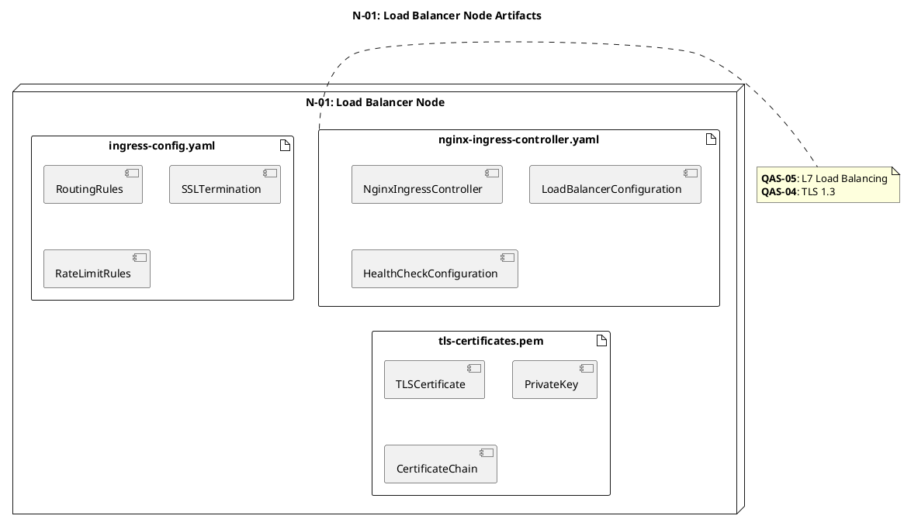

## nginx-ingress-controller.yaml

**Artifact Type**: Configuration File  
**Description**: Nginx Ingress Controller 설정 파일로 L7 로드 밸런싱을 수행한다.

**<<manifest>> Components**:

- NginxIngressController
    
- LoadBalancerConfiguration
    
- HealthCheckConfiguration
    

**Dependencies**: None

**관련 QAS**: QAS-05 (L7 Load Balancing), QAS-04 (TLS 1.3)

---

## ingress-config.yaml

**Artifact Type**: Configuration File  
**Description**: Ingress 라우팅 규칙, SSL 종료, Rate Limiting 설정을 포함한다.

**<<manifest>> Components**:

- RoutingRules
    
- SSLTermination
    
- RateLimitRules
    

**Dependencies**: None

---

## tls-certificates.pem

**Artifact Type**: Certificate File  
**Description**: TLS 1.3 인증서 파일로 HTTPS 통신을 보장한다.

**<<manifest>> Components**:

- TLSCertificate
    
- PrivateKey
    
- CertificateChain
    

**Dependencies**: None

**관련 QAS**: QAS-04 (TLS 1.3)

---

## 4.3.6.2. N-02: API Gateway Node Artifacts

### 💻 PlantUML Artifact Definition Diagram

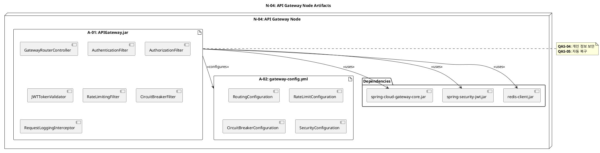

## A-01: APIGateway.jar

**Artifact Type**: Java Executable JAR  
**Description**: Spring Cloud Gateway 기반 API Gateway로 모든 외부 요청의 진입점 역할을 수행한다.

**<<manifest>> Components**:

- GatewayRouterController
    
- AuthenticationFilter
    
- AuthorizationFilter
    
- JWTTokenValidator
    
- RateLimitingFilter
    
- CircuitBreakerFilter
    
- RequestLoggingInterceptor
    

**Dependencies**:

- spring-cloud-gateway-core.jar
    
- spring-security-jwt.jar
    
- redis-client.jar (세션 관리)
    

**관련 QAS**: QAS-04 (개인 정보 보안), QAS-05 (자동 복구)

---

## A-02: gateway-config.yml

**Artifact Type**: Configuration File  
**Description**: API Gateway의 라우팅 규칙, Rate Limiting, Circuit Breaker 설정을 포함한다.

**<<manifest>> Components**:

- RoutingConfiguration
    
- RateLimitConfiguration
    
- CircuitBreakerConfiguration
    
- SecurityConfiguration
    

**Dependencies**: None

---

## 4.3.6.3. N-03: Real-Time Access Node Artifacts

### 💻 PlantUML Artifact Definition Diagram

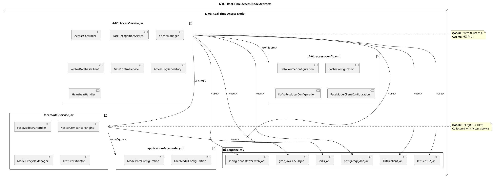

## A-03: AccessService.jar

**Artifact Type**: Java Executable JAR  
**Description**: 안면 인식 기반 출입 인증을 처리하는 Spring Boot 애플리케이션이다.

**<<manifest>> Components**:

- AccessController
    
- FaceRecognitionService
    
- CacheManager
    
- VectorDatabaseClient
    
- GateControlService
    
- AccessLogRepository
    
- HeartbeatHandler
    

**Dependencies**:

- spring-boot-starter-web.jar
    
- jedis.jar (Redis Client)
    
- postgresql-jdbc.jar
    
- kafka-client.jar
    
- face-model-client.jar
    

**관련 QAS**: QAS-02 (안면인식 출입 인증), QAS-05 (자동 복구)

---

## A-04: access-config.yml

**Artifact Type**: Configuration File  
**Description**: Access Service의 Redis, PostgreSQL, Kafka 연결 설정을 포함한다.

**<<manifest>> Components**:

- DataSourceConfiguration
    
- CacheConfiguration
    
- KafkaProducerConfiguration
    
- FaceModelClientConfiguration
    

**Dependencies**: None

---

## facemodel-service.jar

**Artifact Type**: Java Executable JAR  
**Description**: 안면 인식 모델 추론을 수행하는 서비스로 Access Service와 동일 Pod에 Co-located되어 IPC/gRPC로 통신한다.

**<<manifest>> Components**:

- FaceModelIPCHandler
    
- VectorComparisonEngine
    
- ModelLifecycleManager
    
- FeatureExtractor
    

**Dependencies**:

- grpc-java-1.58.0.jar (IPC/gRPC 통신)
    

**관련 QAS**: QAS-02 (IPC/gRPC < 10ms)

---

## application-facemodel.yml

**Artifact Type**: Configuration File  
**Description**: FaceModel Service의 모델 경로 및 설정을 포함한다.

**<<manifest>> Components**:

- FaceModelConfiguration
    
- ModelPathConfiguration
    

**Dependencies**: None

---

## 4.3.6.4. N-04: Auth Service Node Artifacts

### 💻 PlantUML Artifact Definition Diagram

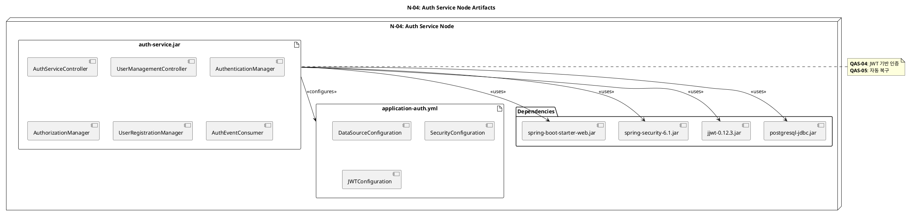

## auth-service.jar

**Artifact Type**: Java Executable JAR  
**Description**: 사용자 인증/인가, 회원가입, JWT 발급을 수행하는 Spring Boot 애플리케이션이다.

**<<manifest>> Components**:

- AuthServiceController
    
- UserManagementController
    
- AuthenticationManager
    
- AuthorizationManager
    
- UserRegistrationManager
    
- AuthEventConsumer
    

**Dependencies**:

- spring-boot-starter-web.jar
    
- spring-security-6.1.jar
    
- jjwt-0.12.3.jar
    
- postgresql-jdbc.jar
    

**관련 QAS**: QAS-04 (JWT 기반 인증), QAS-05 (자동 복구)

---

## application-auth.yml

**Artifact Type**: Configuration File  
**Description**: Auth Service의 데이터베이스, 보안, JWT 설정을 포함한다.

**<<manifest>> Components**:

- DataSourceConfiguration
    
- SecurityConfiguration
    
- JWTConfiguration
    

**Dependencies**: None

---

## 4.3.6.5. N-05: Helper Service Node Artifacts

### 💻 PlantUML Artifact Definition Diagram

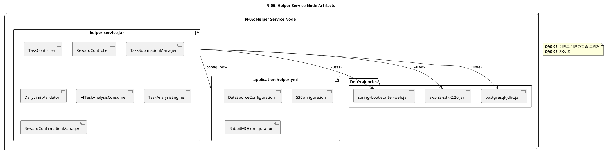

## helper-service.jar

**Artifact Type**: Java Executable JAR  
**Description**: 헬퍼 작업 등록, AI 판독 요청, 보상 관리를 수행하는 Spring Boot 애플리케이션이다.

**<<manifest>> Components**:

- TaskController
    
- RewardController
    
- TaskSubmissionManager
    
- DailyLimitValidator
    
- AITaskAnalysisConsumer
    
- TaskAnalysisEngine
    
- RewardConfirmationManager
    

**Dependencies**:

- spring-boot-starter-web.jar
    
- aws-s3-sdk-2.20.jar (S3 업로드)
    
- postgresql-jdbc.jar
    

**관련 QAS**: QAS-06 (이벤트 기반 재학습 트리거), QAS-05 (자동 복구)

---

## application-helper.yml

**Artifact Type**: Configuration File  
**Description**: Helper Service의 데이터베이스, S3, RabbitMQ 연결 설정을 포함한다.

**<<manifest>> Components**:

- DataSourceConfiguration
    
- S3Configuration
    
- RabbitMQConfiguration
    

**Dependencies**: None

---

## 4.3.6.6. N-06: Search Service Node Artifacts

### 💻 PlantUML Artifact Definition Diagram

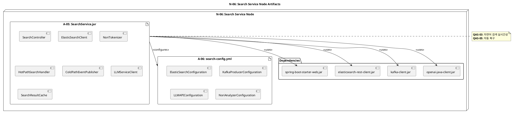

## A-05: SearchService.jar

**Artifact Type**: Java Executable JAR  
**Description**: 자연어 검색을 처리하는 Spring Boot 애플리케이션이다. Hot Path 및 Cold Path 처리를 수행한다.

**<<manifest>> Components**:

- SearchController
    
- ElasticSearchClient
    
- NoriTokenizer
    
- HotPathSearchHandler
    
- ColdPathEventPublisher
    
- LLMServiceClient
    
- SearchResultCache
    

**Dependencies**:

- spring-boot-starter-web.jar
    
- elasticsearch-rest-client.jar
    
- kafka-client.jar
    
- openai-java-client.jar
    

**관련 QAS**: QAS-03 (자연어 검색 실시간성), QAS-05 (자동 복구)

---

## A-06: search-config.yml

**Artifact Type**: Configuration File  
**Description**: Search Service의 ElasticSearch, Kafka, LLM API 연결 설정을 포함한다.

**<<manifest>> Components**:

- ElasticSearchConfiguration
    
- KafkaProducerConfiguration
    
- LLMAPIConfiguration
    
- NoriAnalyzerConfiguration
    

**Dependencies**: None

---

## 4.3.6.7. N-07: BranchOwner Service Node Artifacts

### 💻 PlantUML Artifact Definition Diagram

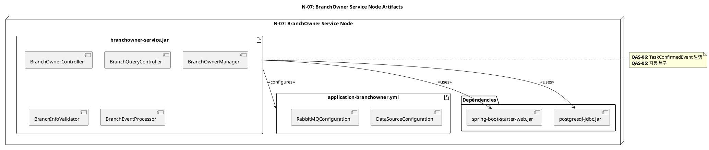

## branchowner-service.jar

**Artifact Type**: Java Executable JAR  
**Description**: 지점 정보 관리, 작업 검수/컨펌을 수행하는 Spring Boot 애플리케이션이다.

**<<manifest>> Components**:

- BranchOwnerController
    
- BranchQueryController
    
- BranchOwnerManager
    
- BranchInfoValidator
    
- BranchEventProcessor
    

**Dependencies**:

- spring-boot-starter-web.jar
    
- postgresql-jdbc.jar
    

**관련 QAS**: QAS-06 (TaskConfirmedEvent 발행), QAS-05 (자동 복구)

---

## application-branchowner.yml

**Artifact Type**: Configuration File  
**Description**: BranchOwner Service의 데이터베이스, RabbitMQ 연결 설정을 포함한다.

**<<manifest>> Components**:

- DataSourceConfiguration
    
- RabbitMQConfiguration
    

**Dependencies**: None

---

## 4.3.6.8. N-08: Monitoring Service Node Artifacts

### 💻 PlantUML Artifact Definition Diagram

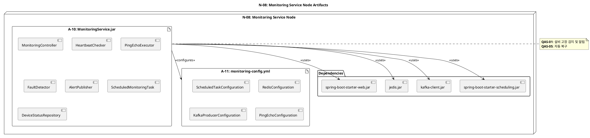

## A-10: MonitoringService.jar

**Artifact Type**: Java Executable JAR  
**Description**: 설비 상태 모니터링 및 고장 감지를 수행하는 Spring Boot 애플리케이션이다.

**<<manifest>> Components**:

- MonitoringController
    
- HeartbeatChecker
    
- PingEchoExecutor
    
- FaultDetector
    
- AlertPublisher
    
- ScheduledMonitoringTask
    
- DeviceStatusRepository
    

**Dependencies**:

- spring-boot-starter-web.jar
    
- jedis.jar (Redis Client)
    
- kafka-client.jar
    
- spring-boot-starter-scheduling.jar
    

**관련 QAS**: QAS-01 (설비 고장 감지 및 알림), QAS-05 (자동 복구)

---

## A-11: monitoring-config.yml

**Artifact Type**: Configuration File  
**Description**: Monitoring Service의 Scheduled Task, Redis, Kafka 연결 설정을 포함한다.

**<<manifest>> Components**:

- ScheduledTaskConfiguration
    
- RedisConfiguration
    
- KafkaProducerConfiguration
    
- PingEchoConfiguration
    

**Dependencies**: None

---

## 4.3.6.9. N-09: Notification Service Node Artifacts

### 💻 PlantUML Artifact Definition Diagram

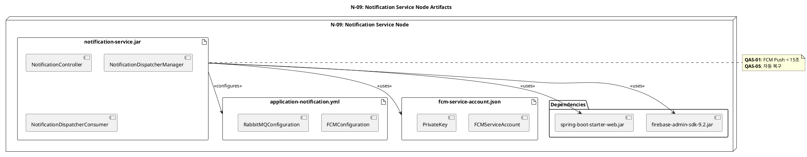

## notification-service.jar

**Artifact Type**: Java Executable JAR  
**Description**: 이벤트 기반 푸시 알림 발송(FCM)을 수행하는 Spring Boot 애플리케이션이다.

**<<manifest>> Components**:

- NotificationController
    
- NotificationDispatcherManager
    
- NotificationDispatcherConsumer
    

**Dependencies**:

- spring-boot-starter-web.jar
    
- firebase-admin-sdk-9.2.jar (FCM Push)
    

**관련 QAS**: QAS-01 (FCM Push < 15초), QAS-05 (자동 복구)

---

## application-notification.yml

**Artifact Type**: Configuration File  
**Description**: Notification Service의 FCM, RabbitMQ 연결 설정을 포함한다.

**<<manifest>> Components**:

- FCMConfiguration
    
- RabbitMQConfiguration
    

**Dependencies**: None

---

## fcm-service-account.json

**Artifact Type**: Credential File  
**Description**: Firebase Cloud Messaging 인증을 위한 서비스 계정 키 파일이다.

**<<manifest>> Components**:

- FCMServiceAccount
    
- PrivateKey
    

**Dependencies**: None

**관련 QAS**: QAS-04 (보안 인증)

---

## 4.3.6.10. N-10: MLOps Service Node Artifacts

### 💻 PlantUML Artifact Definition Diagram

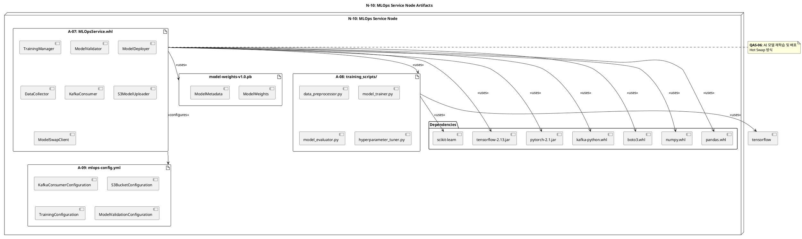

## A-07: MLOpsService.whl

**Artifact Type**: Python Wheel Package  
**Description**: AI 모델 재학습 및 배포를 수행하는 Python 애플리케이션이다.

**<<manifest>> Components**:

- TrainingManager
    
- ModelValidator
    
- ModelDeployer
    
- DataCollector
    
- KafkaConsumer
    
- S3ModelUploader
    
- ModelSwapClient
    

**Dependencies**:

- tensorflow-2.13.jar
    
- pytorch-2.1.jar
    
- kafka-python.whl
    
- boto3.whl (AWS SDK)
    
- numpy.whl
    
- pandas.whl
    

**관련 QAS**: QAS-06 (AI 모델 재학습 및 배포)

---

## A-08: training_scripts/

**Artifact Type**: Python Scripts Directory  
**Description**: AI 모델 학습을 위한 Python 스크립트 모음이다.

**<<manifest>> Components**:

- data_preprocessor.py
    
- model_trainer.py
    
- model_evaluator.py
    
- hyperparameter_tuner.py
    

**Dependencies**:

- tensorflow
    
- scikit-learn
    

---

## A-09: mlops-config.yml

**Artifact Type**: Configuration File  
**Description**: MLOps Service의 Kafka, S3, 학습 파라미터 설정을 포함한다.

**<<manifest>> Components**:

- KafkaConsumerConfiguration
    
- S3BucketConfiguration
    
- TrainingConfiguration
    
- ModelValidationConfiguration
    

**Dependencies**: None

---

## model-weights-v1.0.pb

**Artifact Type**: Model File  
**Description**: TensorFlow 모델 가중치 파일로 Hot Swap 방식으로 배포된다.

**<<manifest>> Components**:

- ModelWeights
    
- ModelMetadata
    

**Dependencies**: None

**관련 QAS**: QAS-06 (Hot Swap 모델 배포)

---

## 4.3.6.11. N-11: RDS Cluster Artifacts

### 💻 PlantUML Artifact Definition Diagram

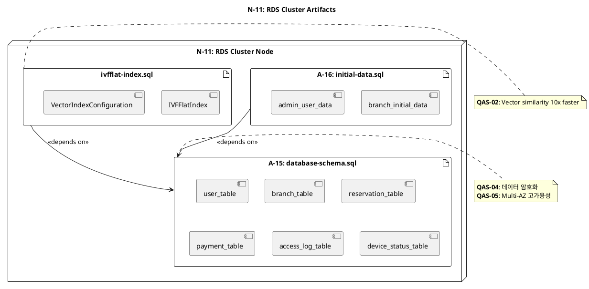

## A-15: database-schema.sql

**Artifact Type**: SQL DDL Script  
**Description**: 회원 정보, 지점 정보, 예약 정보, 결제 정보 테이블의 DDL 스크립트이다.

**<<manifest>> Components**:

- user_table (DDL)
    
- branch_table (DDL)
    
- reservation_table (DDL)
    
- payment_table (DDL)
    
- access_log_table (DDL)
    
- device_status_table (DDL)
    

**Dependencies**: None

**관련 QAS**: QAS-04 (데이터 암호화), QAS-05 (Multi-AZ 고가용성)

---

## A-16: initial-data.sql

**Artifact Type**: SQL DML Script  
**Description**: 초기 데이터 로드를 위한 DML 스크립트이다.

**<<manifest>> Components**:

- branch_initial_data (INSERT)
    
- admin_user_data (INSERT)
    

**Dependencies**: A-15 (database-schema.sql)

---

## ivfflat-index.sql

**Artifact Type**: SQL DDL Script  
**Description**: PostgreSQL pgvector 확장을 사용한 IVFFlat 인덱스 생성 스크립트로 벡터 유사도 검색 성능을 10배 향상시킨다.

**<<manifest>> Components**:

- IVFFlatIndex
    
- VectorIndexConfiguration
    

**Dependencies**: A-15 (database-schema.sql)

**관련 QAS**: QAS-02 (Vector similarity 10x faster)

---

## 4.3.6.12. N-12: ElasticSearch Cluster Artifacts

### 💻 PlantUML Artifact Definition Diagram

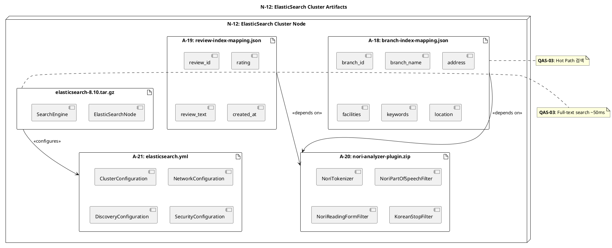

## A-18: branch-index-mapping.json

**Artifact Type**: ElasticSearch Index Mapping  
**Description**: 지점 정보 인덱스의 필드 매핑 정의이다.

**<<manifest>> Components**:

- branch_id (keyword)
    
- branch_name (text with nori analyzer)
    
- address (text)
    
- facilities (text array)
    
- keywords (text array)
    
- location (geo_point)
    

**Dependencies**: A-20 (nori-analyzer-plugin)

**관련 QAS**: QAS-03 (Hot Path 검색)

---

## A-19: review-index-mapping.json

**Artifact Type**: ElasticSearch Index Mapping  
**Description**: 리뷰 인덱스의 필드 매핑 정의이다.

**<<manifest>> Components**:

- review_id (keyword)
    
- branch_id (keyword)
    
- rating (integer)
    
- review_text (text with nori analyzer)
    
- keywords (text array)
    
- created_at (date)
    

**Dependencies**: A-20 (nori-analyzer-plugin)

---

## A-20: nori-analyzer-plugin.zip

**Artifact Type**: ElasticSearch Plugin  
**Description**: 한국어 형태소 분석기 플러그인이다.

**<<manifest>> Components**:

- NoriTokenizer
    
- NoriPartOfSpeechFilter
    
- NoriReadingFormFilter
    
- KoreanStopFilter
    

**Dependencies**: None

---

## A-21: elasticsearch.yml

**Artifact Type**: Configuration File  
**Description**: ElasticSearch 클러스터 설정 파일이다.

**<<manifest>> Components**:

- ClusterConfiguration (3 data nodes + 3 master nodes)
    
- NetworkConfiguration
    
- DiscoveryConfiguration
    
- SecurityConfiguration
    

**Dependencies**: None

---

## elasticsearch-8.10.tar.gz

**Artifact Type**: Binary Archive  
**Description**: ElasticSearch 8.10+ 바이너리 파일로 전문 검색 엔진을 제공한다.

**<<manifest>> Components**:

- ElasticSearchNode
    
- SearchEngine
    

**Dependencies**: A-21 (elasticsearch.yml)

**관련 QAS**: QAS-03 (Full-text search ~50ms)

---

## 4.3.6.13. N-13: RabbitMQ Cluster Artifacts

### 💻 PlantUML Artifact Definition Diagram

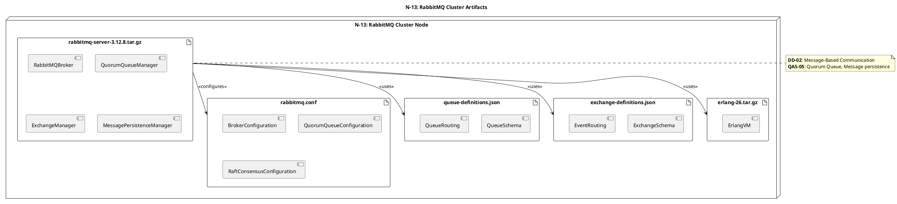

## rabbitmq-server-3.12.8.tar.gz

**Artifact Type**: Binary Archive  
**Description**: RabbitMQ Broker 바이너리로 메시지 브로커, Quorum Queue, Raft 합의를 제공한다.

**<<manifest>> Components**:

- RabbitMQBroker
    
- QuorumQueueManager
    
- ExchangeManager
    
- MessagePersistenceManager
    

**Dependencies**: erlang-26.tar.gz

**관련 QAS**: DD-02 (Message-Based Communication), QAS-05 (Quorum Queue, Message persistence)

---

## rabbitmq.conf

**Artifact Type**: Configuration File  
**Description**: RabbitMQ Broker 설정 파일로 Quorum Queue, Raft 합의 설정을 포함한다.

**<<manifest>> Components**:

- BrokerConfiguration
    
- QuorumQueueConfiguration
    
- RaftConsensusConfiguration
    

**Dependencies**: None

---

## queue-definitions.json

**Artifact Type**: Queue Definition File  
**Description**: RabbitMQ 큐 스키마 정의 파일로 이벤트 라우팅을 설정한다.

**<<manifest>> Components**:

- QueueSchema
    
- QueueRouting
    

**Dependencies**: None

**관련 QAS**: QAS-06 (Modifiability: Event routing)

---

## exchange-definitions.json

**Artifact Type**: Exchange Definition File  
**Description**: RabbitMQ Exchange 스키마 정의 파일로 이벤트 라우팅을 설정한다.

**<<manifest>> Components**:

- ExchangeSchema
    
- EventRouting
    

**Dependencies**: None

**관련 QAS**: QAS-06 (Modifiability: Event routing)

---

## erlang-26.tar.gz

**Artifact Type**: Runtime Archive  
**Description**: Erlang VM 런타임으로 RabbitMQ 실행에 필요하다.

**<<manifest>> Components**:

- ErlangVM
    

**Dependencies**: None

---

## 4.3.6.14. N-14: Redis Cache Cluster Artifacts

### 💻 PlantUML Artifact Definition Diagram

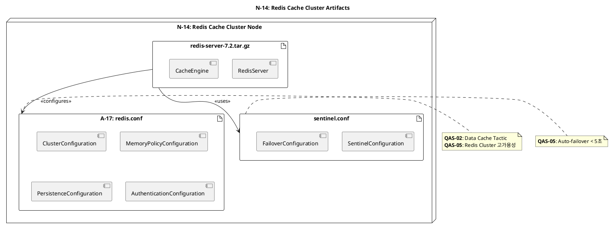

## redis-server-7.2.tar.gz

**Artifact Type**: Binary Archive  
**Description**: Redis 7.2+ 서버 바이너리로 인메모리 캐시를 제공한다.

**<<manifest>> Components**:

- RedisServer
    
- CacheEngine
    

**Dependencies**: A-17 (redis.conf)

**관련 QAS**: QAS-02 (Sub-millisecond cache)

---

## sentinel.conf

**Artifact Type**: Configuration File  
**Description**: Redis Sentinel 설정 파일로 자동 페일오버를 구성한다.

**<<manifest>> Components**:

- SentinelConfiguration
    
- FailoverConfiguration
    

**Dependencies**: None

**관련 QAS**: QAS-05 (Auto-failover < 5초)

---

## 4.3.6.10. N-10: MLOps Service Node Artifacts

### 💻 PlantUML Artifact Definition Diagram

## A-07: MLOpsService.whl

**Artifact Type**: Python Wheel Package  
**Description**: AI 모델 재학습 및 배포를 수행하는 Python 애플리케이션이다.

**<<manifest>> Components**:

- TrainingManager
    
- ModelValidator
    
- ModelDeployer
    
- DataCollector
    
- KafkaConsumer
    
- S3ModelUploader
    
- ModelSwapClient
    

**Dependencies**:

- tensorflow-2.13.jar
    
- pytorch-2.1.jar
    
- kafka-python.whl
    
- boto3.whl (AWS SDK)
    
- numpy.whl
    
- pandas.whl
    

**관련 QAS**: QAS-06 (AI 모델 재학습 및 배포)

---

## A-08: training_scripts/

**Artifact Type**: Python Scripts Directory  
**Description**: AI 모델 학습을 위한 Python 스크립트 모음이다.

**<<manifest>> Components**:

- data_preprocessor.py
    
- model_trainer.py
    
- model_evaluator.py
    
- hyperparameter_tuner.py
    

**Dependencies**:

- tensorflow
    
- scikit-learn
    

---

## A-09: mlops-config.yml

**Artifact Type**: Configuration File  
**Description**: MLOps Service의 Kafka, S3, 학습 파라미터 설정을 포함한다.

**<<manifest>> Components**:

- KafkaConsumerConfiguration
    
- S3BucketConfiguration
    
- TrainingConfiguration
    
- ModelValidationConfiguration
    

**Dependencies**: None

---

## model-weights-v1.0.pb

**Artifact Type**: Model File  
**Description**: TensorFlow 모델 가중치 파일로 Hot Swap 방식으로 배포된다.

**<<manifest>> Components**:

- ModelWeights
    
- ModelMetadata
    

**Dependencies**: None

**관련 QAS**: QAS-06 (Hot Swap 모델 배포)

---

## 4.3.6.11. N-11: RDS Cluster Artifacts

### 💻 PlantUML Artifact Definition Diagram

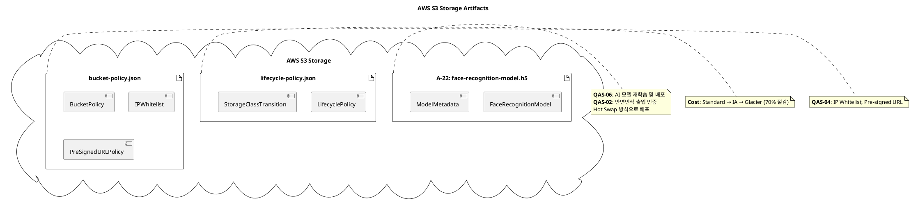

## A-22: face-recognition-model.h5

**Artifact Type**: TensorFlow/Keras Model Binary  
**Description**: 안면 인식 AI 모델 바이너리 파일로 S3에 저장되고 Hot Swap 방식으로 배포된다.

**<<manifest>> Components**:

- FaceRecognitionModel (Neural Network Weights)
    
- ModelMetadata (version, accuracy, timestamp)
    

**Dependencies**: None

**관련 QAS**: QAS-06 (AI 모델 재학습 및 배포), QAS-02 (안면인식 출입 인증)

---

## lifecycle-policy.json

**Artifact Type**: Lifecycle Policy File  
**Description**: S3 버킷의 자동 아카이빙 정책으로 오래된 데이터를 저렴한 저장소로 이동시킨다.

**<<manifest>> Components**:

- LifecyclePolicy
    
- StorageClassTransition (Standard → IA → Glacier)
    

**Dependencies**: None

**관련 QAS**: Cost Optimization (70% 절감)

---

## bucket-policy.json

**Artifact Type**: Bucket Policy File  
**Description**: S3 버킷 접근 정책으로 IP 화이트리스트 및 Pre-signed URL 정책을 포함한다.

**<<manifest>> Components**:

- BucketPolicy
    
- IPWhitelist
    
- PreSignedURLPolicy
    

**Dependencies**: None

**관련 QAS**: QAS-04 (IP Whitelist, Pre-signed URL)

---

## 4.3.6.16. Artifact Dependency Matrix

|Artifact|Depends On|Used By Nodes|
|---|---|---|
|nginx-ingress-controller.yaml|-|N-01|
|ingress-config.yaml|-|N-01|
|tls-certificates.pem|-|N-01|
|A-01: APIGateway.jar|spring-cloud-gateway, spring-security-jwt, redis-client|N-02|
|A-02: gateway-config.yml|-|N-02|
|A-03: AccessService.jar|spring-boot, jedis, postgresql-jdbc, kafka-client, grpc-java, lettuce|N-03|
|A-04: access-config.yml|-|N-03|
|facemodel-service.jar|grpc-java|N-03|
|application-facemodel.yml|-|N-03|
|auth-service.jar|spring-boot, spring-security, jjwt, postgresql-jdbc|N-04|
|application-auth.yml|-|N-04|
|helper-service.jar|spring-boot, aws-s3-sdk, postgresql-jdbc|N-05|
|application-helper.yml|-|N-05|
|A-05: SearchService.jar|spring-boot, elasticsearch-client, kafka-client, openai-client|N-06|
|A-06: search-config.yml|-|N-06|
|branchowner-service.jar|spring-boot, postgresql-jdbc|N-07|
|application-branchowner.yml|-|N-07|
|A-10: MonitoringService.jar|spring-boot, jedis, kafka-client, scheduling|N-08|
|A-11: monitoring-config.yml|-|N-08|
|notification-service.jar|spring-boot, firebase-admin-sdk|N-09|
|application-notification.yml|-|N-09|
|fcm-service-account.json|-|N-09|
|A-07: MLOpsService.whl|tensorflow, pytorch, kafka-python, boto3, numpy, pandas|N-10|
|A-08: training_scripts/|tensorflow, scikit-learn|N-10|
|A-09: mlops-config.yml|-|N-10|
|model-weights-v1.0.pb|-|N-10|
|A-15: database-schema.sql|-|N-11|
|A-16: initial-data.sql|A-15|N-11|
|ivfflat-index.sql|A-15|N-11|
|A-18: branch-index-mapping.json|A-20|N-12|
|A-19: review-index-mapping.json|A-20|N-12|
|A-20: nori-analyzer-plugin.zip|-|N-12|
|A-21: elasticsearch.yml|-|N-12|
|elasticsearch-8.10.tar.gz|A-21|N-12|
|rabbitmq-server-3.12.8.tar.gz|erlang-26|N-13|
|rabbitmq.conf|-|N-13|
|queue-definitions.json|-|N-13|
|exchange-definitions.json|-|N-13|
|erlang-26.tar.gz|-|N-13|
|A-17: redis.conf|-|N-14|
|redis-server-7.2.tar.gz|A-17|N-14|
|sentinel.conf|-|N-14|
|A-22: face-recognition-model.h5|-|N-15 → N-10 → N-03|
|lifecycle-policy.json|-|N-15|
|bucket-policy.json|-|N-15|