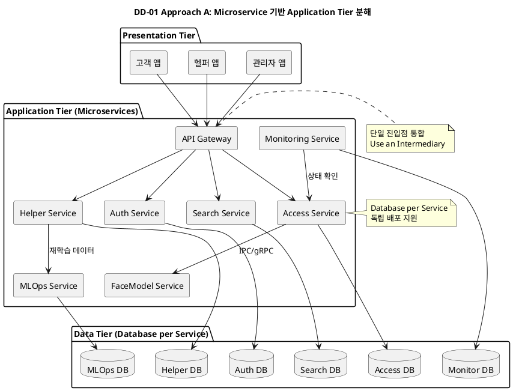
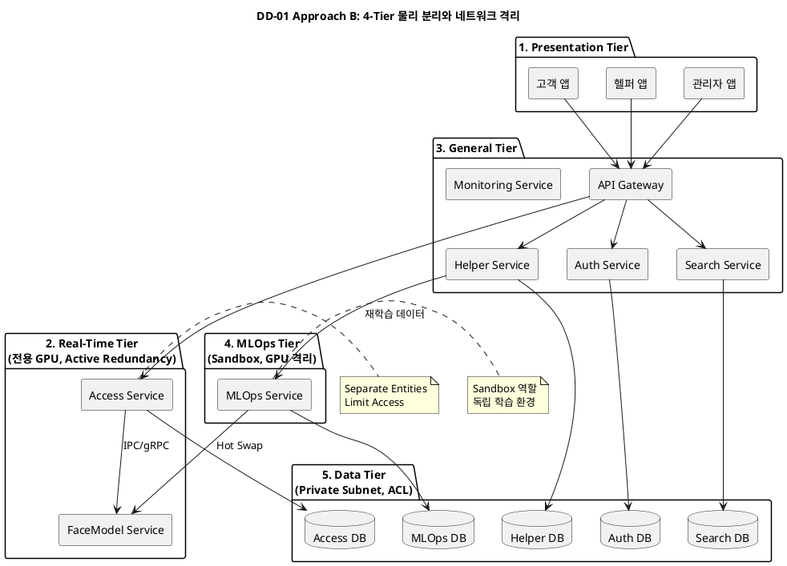
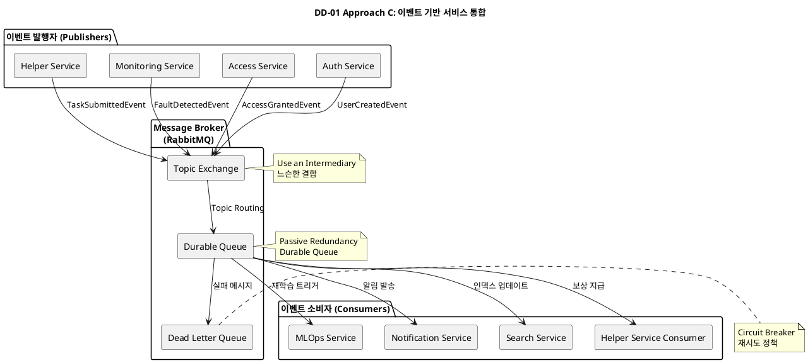
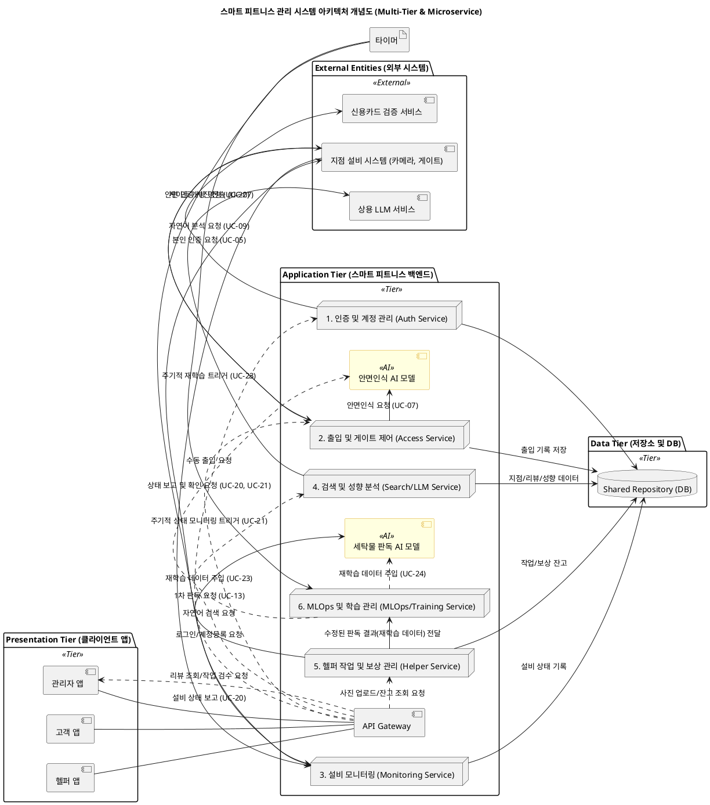
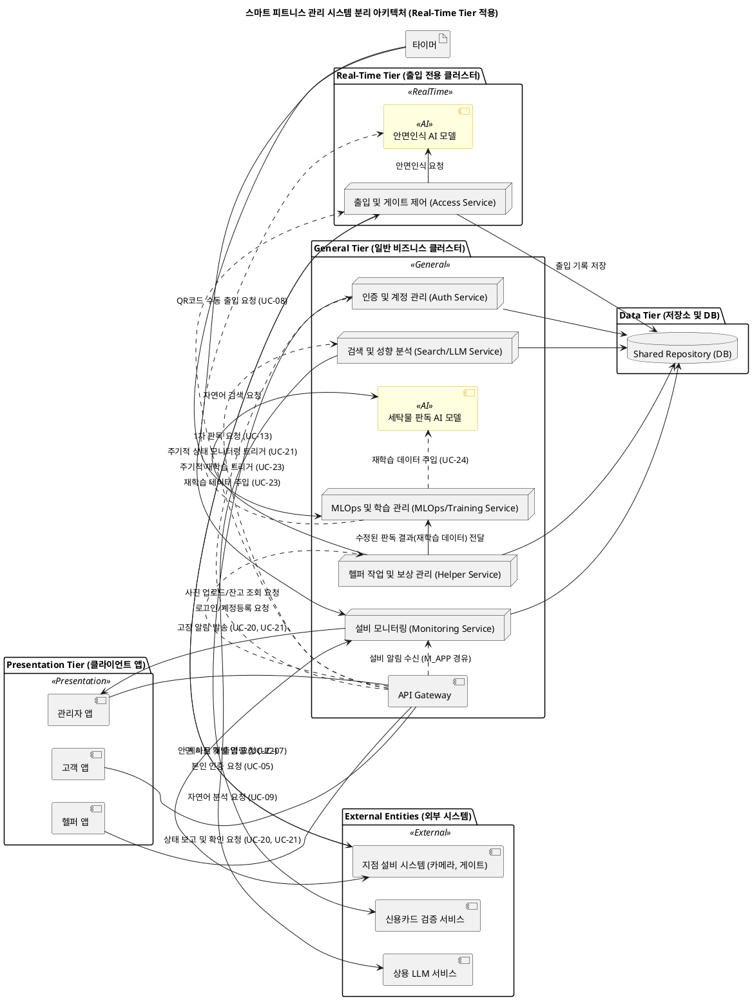
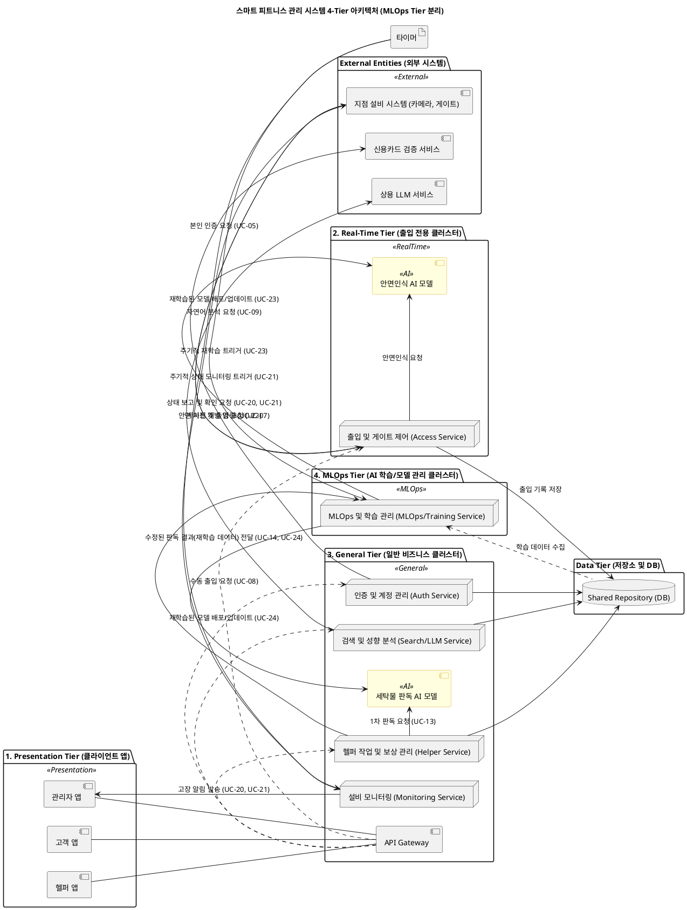

# DD-01. 하이브리드 분산 아키텍처 결정

## 1. Design Goal (우선순위 기준)
- DG-01 (우선순위 1, QAS-02): 실시간 출입 인증 요청을 3초 이내로 처리하여 고객 체감 대기 시간을 최소화한다.
- DG-02 (우선순위 2, QAS-05): 장애 발생 시 핵심 서비스가 5분 이내에 복구되도록 고가용성을 확보한다.
- DG-03 (우선순위 3, QAS-04): 안면 데이터와 계정 정보를 안전하게 보호하기 위해 네트워크 경계를 분리하고 감사 추적을 보장한다.
- DG-04 (우선순위 4, QAS-06): AI 모델을 지속적으로 개선할 수 있도록 서비스 간 결합도를 낮추고 독립 배포를 지원한다.
- DG-05 (우선순위 5, QAS-03): 지점 검색 요청에 대한 3초 SLA를 달성한다.

## 1.1. 주요 패턴 및 택틱스 결정

### 1.1.1 적용된 아키텍처 패턴 및 스타일

| 패턴/스타일 | 분류 (tactics.txt) | 설명 (tactics.txt) | DD-01 적용 |
|:-----------|:------------------|:------------------|:----------|
| **Microservice (마이크로서비스)** | Distributed | 작고 자율적인 서비스들의 컬렉션으로, 각 서비스는 단일 비즈니스 역량을 구현함 (SOA보다 애플리케이션 범위에 중점). | 비즈니스 역량을 Auth, Access, Monitoring, Search, Helper, MLOps 등 11개 마이크로서비스로 분리. |
| **Multi-tier (N-Tier/3-Tier)** | Distributed | 기능을 물리적으로 분리된 계층(Tier)으로 분리하며, 계층화 스타일과 유사하나 물리적 분리에 중점을 둠. | Presentation, Real-Time Tier, General Tier, MLOps Tier, Data Tier 다섯 개 물리 영역으로 분리. |
| **Layered Architecture (계층화 아키텍처)** | Hierarchical | 시스템의 관심사를 계층(Layer)으로 분할하여 응집력 있는 서비스 집합을 제공하며, 사용 관계는 단방향으로 제한됨. | 4-Tier 물리 분리 구조의 기반이 되는 계층화 개념. |
| **Event-Based (이벤트 기반)** | Implicit Invocation | 프로시저를 직접 호출하는 대신 이벤트 알림이 다른 모듈의 프로시저 호출을 암묵적으로 유발함. 느슨한 결합이 특징임. | RabbitMQ를 중앙 브로커로 사용하여 TaskSubmittedEvent 등 13종 이벤트를 비동기 전달. |
| **Database per Service** | 특정 설계 영역 패턴 | 각 서비스가 자체 스키마와 저장소를 소유하는 패턴. | 서비스별 데이터 저장소 혹은 스키마를 독립적으로 유지. |

### 1.1.2 적용된 아키텍처 택틱

| 택틱 | 분류 (tactics.txt) | 설명 (tactics.txt) | DD-01 적용 | 목표 QA |
|:-----|:------------------|:------------------|:----------|:--------|
| **Use an Intermediary (중개자 사용)** | 수정 용이성 - 결합도 감소 | 중개자를 사용하여 통신 경로를 분리함 (Broker 패턴 등). | API Gateway가 HTTP 진입점을 통합. RabbitMQ를 중앙 브로커로 사용하여 서비스 간 느슨한 결합 달성. | QAS-06 |
| **Encapsulate (캡슐화)** | 수정 용이성 - 결합도 감소 | 책임 달성 세부 사항을 인터페이스 뒤에 숨김. | 발행자와 소비자는 어댑터 컴포넌트로 캡슐화. | QAS-06 |
| **Separate Entities (엔티티 분리)** | 보안 - 공격 방어 | 시스템 내의 다른 엔티티를 물리적/논리적으로 분리함. | 데이터 Tier와 MLOps Tier를 Private Subnet과 네트워크 ACL로 격리. 4-Tier 물리 분리. | QAS-04 |
| **Limit Access (접근 제한)** | 보안 - 공격 방어 | DMZ(DeMilitarized Zone)와 같은 메커니즘을 통해 리소스 접근을 제어함. | 데이터 Tier는 Private Subnet과 네트워크 ACL로 보호. API Gateway가 감사 로그를 중앙화. | QAS-04 |
| **Active Redundancy (Hot Spare)** | 가용성 - 결함 복구 | 활성 구성 요소가 이벤트를 처리하고 상태 변경을 모든 예비 구성 요소에 동기적으로 알림. | Real-Time Tier에 Active Redundancy 적용. 서비스별 자동 확장으로 장애 전파 차단. | QAS-05 |
| **Passive Redundancy (Warm Spare)** | 가용성 - 결함 복구 | 활성 구성 요소가 이벤트를 처리하고 상태 업데이트를 예비 구성 요소에 주기적으로 알림. | RabbitMQ Durable Queue로 이벤트 손실을 방지. | QAS-05 |
| **Heartbeat (하트비트)** | 가용성 - 결함 감지 | 한 구성 요소가 주기적으로 I'm alive(살아있음) 메시지를 보냄. | 4-Tier 물리 분리 구조에서 장애 감지에 활용. | QAS-05 |
| **Ping/echo (핑/에코)** | 가용성 - 결함 감지 | 한 구성 요소가 Ping을 발행하고 Echo를 받아 생존 상태를 확인함. | 4-Tier 물리 분리 구조에서 장애 감지에 활용. | QAS-05 |
| **Circuit Breaker** | 특정 설계 영역 패턴 | 장애 전파를 방지하기 위한 패턴. | 이벤트 기반 서비스 통합에서 Circuit Breaker 적용. | QAS-05 |
| **Rate Limiter** | 특정 설계 영역 패턴 | 요청 처리량을 제한하는 패턴. | 이벤트 기반 서비스 통합에서 Rate Limiter 적용. | QAS-02, QAS-03 |

### 1.1.3 패턴 및 택틱 적용 요약

| 영역 | 패턴/택틱스 | 목적 및 적용 근거 |
| :--- | :--- | :--- |
| **기본 구조** | **Microservice + Multi-tier + Event-Based** | 하이브리드 분산 아키텍처로 성능, 가용성, 보안, 수정 용이성을 종합적으로 달성. |
| **수정 용이성** | **Use an Intermediary, Encapsulate, Database per Service** | API Gateway와 Message Broker를 중개자로 사용하여 서비스 간 결합도 감소. 서비스별 독립 배포 지원. |
| **보안** | **Separate Entities, Limit Access** | 4-Tier 물리 분리와 Private Subnet으로 민감 데이터 보호. |
| **가용성** | **Active Redundancy, Passive Redundancy, Heartbeat, Ping/echo** | 다중화와 장애 감지로 고가용성 확보. |
| **장애 처리** | **Circuit Breaker, Rate Limiter** | 장애 전파 방지와 부하 제어. |

---

## 2. Design Approach List

### 2.1 Design Approach #1: Microservice 기반 Application Tier 분해
- 개요: 비즈니스 역량을 Auth, Access, Monitoring, Search, Helper, MLOps 등 11개 마이크로서비스로 분리한다.
- 적용 View: `ComponentDiagram/00_Overall_Architecture.puml`, `SystemArchitecture/SystemArchitecture_Overall.puml`.
- 적용 패턴/택틱: Microservice 패턴, Use an Intermediary, Database per Service, Encapsulate.

#### 💻 PlantUML 컴포넌트 다이어그램

- 세부 설계:
  - API Gateway가 HTTP 진입점을 통합하고, 서비스 간 통신은 gRPC 또는 HTTP로 명확히 구분한다.
  - FaceModel Service는 Access Service와 IPC/gRPC를 사용하여 동일 노드에서 동작한다.
  - 서비스별 데이터 저장소 혹은 스키마를 독립적으로 유지한다.
- QA 기여: DG-01의 성능 요구와 DG-02의 장애 격리를 지원한다. DG-04의 모델 교체 유연성을 강화한다.

### 2.2 Design Approach #2: 4-Tier 물리 분리와 네트워크 격리
- 개요: Presentation, Real-Time Tier, General Tier, MLOps Tier, Data Tier 다섯 개 물리 영역으로 분리한다.
- 적용 View: `DeploymentView/DeploymentDiagram.puml`, `SystemArchitecture/SystemArchitecture_Overall.puml`.
- 적용 패턴/택틱: Layered Architecture, Separate Entities, Limit Access, Active Redundancy, Heartbeat/Ping.

#### 💻 PlantUML 컴포넌트 다이어그램

- 세부 설계:
  - Real-Time Tier에 Access Service와 FaceModel Service를 배치하고 GPU를 전용으로 할당한다.
  - General Tier에는 Auth, Search, Helper, Monitoring을 배치한다.
  - MLOps Tier는 학습 파이프라인과 모델 배포 노드를 격리하여 Sandbox 역할을 수행한다.
  - 데이터 Tier는 Private Subnet과 네트워크 ACL로 보호한다.
- QA 기여: DG-01과 DG-02의 핵심 성능·가용성을 보증하고 DG-03 보안 규정을 만족한다. DG-04의 Hot Swap 실험 공간을 제공한다.

### 2.3 Design Approach #3: 이벤트 기반 서비스 통합
- 개요: RabbitMQ를 중앙 브로커로 사용하여 TaskSubmittedEvent 등 13종 이벤트를 비동기 전달한다.
- 적용 View: `ComponentDiagram/01_MessageBrokerComponent.puml`, `SequenceDiagram/UC-07_FaceRecognitionAccessControl.puml`, `SequenceDiagram/UC-13_AILaundryTaskAnalysis.puml`, `SequenceDiagram/UC-21_EquipmentStatusMonitoring.puml`, `SequenceDiagram/UC-24_LaundryModelRetraining.puml`.
- 적용 패턴/택틱: Event-Based Architecture, Use an Intermediary, Passive Redundancy, Circuit Breaker, Rate Limiter.

#### 💻 PlantUML 컴포넌트 다이어그램

- 세부 설계:
  - Topic Exchange 기반 라우팅과 Dead Letter Queue를 구성한다.
  - 발행자와 소비자는 어댑터 컴포넌트로 캡슐화한다.
  - 멱등 처리와 재시도 정책을 표준화한다.
- QA 기여: DG-02의 복구성을 높이고 DG-04의 느슨한 결합을 확보한다. DG-05의 Hot Path 부하를 분산한다.

## 3. Decision and Rationale

### 3.1 선정 결과
- 채택: DA#1 Microservice, DA#2 4-Tier 분리, DA#3 이벤트 기반 통합을 조합한 하이브리드 구조를 선택한다.
- 근거:
  - 성능: Real-Time Tier에서 Access와 FaceModel을 동일 노드에 두고 IPC/gRPC를 사용하여 평균 205ms 벡터 비교 시간을 달성한다. Search Hot Path는 LLM 호출을 제거하여 3초 SLA를 유지한다.
  - 가용성: Active Redundancy와 서비스별 자동 확장을 적용하여 장애 전파를 차단한다. RabbitMQ Durable Queue로 이벤트 손실을 방지한다.
  - 보안: 데이터 Tier와 MLOps Tier를 Private Subnet과 IAM으로 격리하고 API Gateway가 감사 로그를 중앙화한다.
  - 수정 용이성: 서비스별 배포 파이프라인과 이벤트 계약으로 변경 범위를 최소화한다.

### 3.2 QA 관점 Pros/Cons 비교

| Quality Attribute | Analysis | DA#1 Microservice | DA#2 4-Tier 분리 | DA#3 이벤트 기반 |
|-------------------|----------|-------------------|------------------|------------------|
| QA-02 실시간 성능 | 출입 인증과 검색 SLA를 충족해야 한다 | (+) Access와 FaceModel을 독립 확장 가능. (-) 서비스 간 호출 hop 증가 | (+) Real-Time Tier 전용 자원 확보. | (+) 비동기화로 Hot Path 차단. (-) 브로커 hop 추가 |
| QA-05 고가용성 | 5분 내 복구와 장애 격리가 필요하다 | (+) 서비스 독립 배포. (-) 서비스 수 증가로 운영 복잡 | (+) Tier 간 장애 전파 차단, Active Redundancy 적용 가능 | (+) Queue 내구성과 재시도. (-) 브로커 장애 의존 |
| QA-04 보안 | 민감 데이터 분리와 감사가 필요하다 | (+) 서비스별 최소 권한 정책 적용 | (+) 네트워크 격리와 방화벽 정책. (-) Tier 간 통신 설계 필요 | (+) 이벤트 감사 로그 확보 |
| QA-06 수정 용이성 | AI 모델 교체와 기능 확장이 잦다 | (+) 서비스별 배포와 Database per Service. | (+) MLOps Tier Sandbox 제공 | (+) 이벤트 계약으로 느슨한 결합. (-) 스키마 버전 관리 필요 |
| QA-03 검색 성능 | 고객 검색 SLA 3초를 달성해야 한다 | (+) Search Service 독립 확장 | (+) General Tier 자원 조정 | (+) 비동기 인덱싱으로 Hot Path 부하 감소 |

### 3.3 추가 고려사항
- Microservice 수가 증가하므로 Observability 스택(Tracing, Metrics, Logging)을 표준화한다.
- Tier 간 네트워크 지연을 완화하기 위해 gRPC, Redis Cache, CDN을 병행한다.
- 이벤트 스키마를 Schema Registry로 관리하여 버전 호환성을 확보한다.

## 4. 구현 후 검증 계획
- 성능 검증: UC-07과 UC-09 부하 테스트로 95% 응답 시간 ≤ 3초를 확인한다.
- 가용성 검증: Chaos Engineering으로 Real-Time Tier와 RabbitMQ 장애 시 복구 시간을 측정한다.
- 보안 검증: Tier별 네트워크 접근 제어와 감사 로그 흐름을 점검한다.
- 수정 용이성 검증: 모델 Hot Swap Dry-run을 수행하여 재배포 절차를 검증한다.
제시된 스마트 피트니스 관리 시스템의 요구사항, 특히 **24시간 무인 운영** [cite: 110] 및 **AI 기반 통합 운영 플랫폼** [cite: 114] 목표를 고려할 때, 기능적 분리와 높은 품질 속성 달성이 핵심입니다.

노드 간의 관계와 시스템의 전체 구조를 결정하는 데 가장 적합한 아키텍처 패턴/스타일 3가지를 검토하고 그 적용 방안을 제시합니다.

---

## 🏛️ 추천 아키텍처 패턴/스타일 검토

### 1. 분산형 스타일: Microservice (마이크로서비스)
* **패턴 설명:** 작고 자율적인 서비스들의 컬렉션으로, 각 서비스는 단일 비즈니스 역량(Single Business Capability)을 구현하며, SOA(Service-Oriented Architecture)보다 애플리케이션 범위에 중점을 둡니다[cite: 46, 47].
* **적합성:** **매우 높음**
    * **AI 모델의 지속적인 개선 (SF-15, BG-14):** 안면 인식 및 세탁물 판독 AI 모델은 독립적으로 자주 업데이트되고 배포되어야 합니다[cite: 274]. 마이크로서비스는 모델 교체 및 재학습 시 다른 서비스의 중단(QAS-06)을 최소화합니다[cite: 479].
    * **분리된 기능 노드:** 인증, 출입 제어, 검색, 헬퍼 작업 등 기능별 노드를 독립적인 서비스로 분리하여 **수정 용이성** [cite: 80]을 극대화합니다.
    * **성능/가용성 목표 (BG-01, BG-11):** 고부하가 예상되는 안면인식 출입 인증 (20 TPS) [cite: 229] 및 자연어 검색 (시간당 500건) [cite: 247] 서비스에만 자원을 집중하여 **확장성**과 **신속 복구 시간(5분 이내)** [cite: 185]을 보장할 수 있습니다.

---

### 2. 분산형 스타일: Multi-tier (N-Tier/3-Tier)
* **패턴 설명:** 기능을 물리적으로 분리된 계층(Tier)으로 분리하며, 계층화 스타일과 유사하나 **물리적 분리**에 중점을 둡니다[cite: 38, 39].
* **적합성:** **필수 적용**
    * **보안 (QAS-04, BG-16):** 고객의 민감한 안면인식 데이터 [cite: 475]와 계정 정보 [cite: 223]는 반드시 **Private Network**에 위치한 데이터 계층에 격리되어야 합니다[cite: 475].
    * **분리된 엔티티:** 클라이언트 앱(Presentation Tier), 백엔드 비즈니스 로직(Application Tier/Logic), 데이터 저장소(Data Tier)를 물리적으로 분리하여, **공격 방어** 택틱인 **Limit Access (접근 제한)** [cite: 94] 및 **Separate Entities (엔티티 분리)** [cite: 94]를 적용하는 데 기본이 됩니다.

---

### 3. 암묵적 호출 스타일: Event Based (이벤트 기반)
* **패턴 설명:** 프로시저를 직접 호출하는 대신 이벤트 알림이 다른 모듈의 프로시저 호출을 암묵적으로 유발하며, **느슨한 결합**이 특징입니다[cite: 19, 20].
* **적합성:** **높음 (핵심 비동기 처리에 적용)**
    * **운영 자동화 (BG-04, BG-06):**
        * **설비 고장 감지 (QAS-01):** 지점 설비에서 '고장' 상태가 보고되면 (Event), 시스템은 지점주에게 **즉시 알림을 발송**하는 후속 작업을 자동으로 유발해야 합니다[cite: 433].
        * **헬퍼 보상 지급 (SF-10):** 지점주가 작업을 '양호'로 **최종 컨펌하는 즉시** (Event), **보상 잔고 갱신** (UC-16)이 비동기적으로 발생하여 신속한 보상 지급 (BG-04)을 달성할 수 있습니다[cite: 264].
    * **수정 용이성:** 각 기능 노드(Microservice) 간의 직접적인 종속성을 줄여, **Use an Intermediary (중개자 사용)** [cite: 82] 택틱을 적용하여 **결합도를 감소** [cite: 81]시키고 시스템의 유연성을 높입니다[cite: 20].

---

## 🎯 결론 및 권장 아키텍처 구조

스마트 피트니스 시스템은 **Multi-tier 구조**를 기반으로 하되, 비즈니스 로직 계층(Application Tier)을 **Microservice 아키텍처**로 구현하며, 서비스 간의 비동기 통신 및 상태 변화 전파에 **Event Based 스타일**을 도입하는 **하이브리드 분산형 아키텍처**를 권장합니다.

| 계층 (Tier) | 적용 스타일/패턴 | 주요 목적 |
| :--- | :--- | :--- |
| Presentation (클라이언트) | MVC | 앱 사용성 및 수정 용이성 (BG-12, BG-13) [cite: 23, 189] |
| **Application (비즈니스 로직)** | **Microservice + Event-Based** | 고가용성 (BG-11), 성능 (BG-01), AI 모델의 독립적 개선 (BG-14) |
| Data (데이터 저장소) | Shared Repository | 개인 정보 보안 (QAS-04), 일관된 데이터 접근 |

제안된 **Multi-tier 구조 기반 마이크로서비스 아키텍처**를 바탕으로, 주요 노드와 그 연관 관계를 나타내는 PlantUML 코드를 작성해 드리겠습니다.

이 다이어그램은 시스템을 \*\*3개의 물리적 계층(Tier)\*\*으로 나누고, **Application Tier** 내부를 **마이크로서비스 노드**로 분할하는 개념을 표현합니다.

-----

## 💻 PlantUML 다이어그램 코드

-----

## 📝 다이어그램 해설

### 1\. 계층 구조 (Tiers)

  * **Presentation Tier:** 사용자와 직접 상호작용하는 클라이언트 애플리케이션([고객 앱], [헬퍼 앱], [관리자 앱])을 포함합니다.
  * **Application Tier:** 시스템의 모든 비즈니스 로직과 핵심 기능이 **마이크로서비스(Microservice)** 형태로 구현된 영역입니다. \*\*[API Gateway]\*\*를 통해 모든 외부 요청이 이 계층으로 들어옵니다.
  * **Data Tier:** 모든 데이터가 중앙 집중식으로 저장되는 **Shared Repository** 구조입니다.

### 2\. 핵심 노드 및 역할

| 노드 | 역할 및 관련 UC/SF |
| :--- | :--- |
| **[API Gateway]** | 모든 클라이언트 앱 요청의 단일 진입점, 보안/로드 밸런싱 담당. |
| **AUTH** | [cite\_start]사용자 계정 등록, 로그인/토큰 발급, **[신용카드 검증 서비스]** 연동[cite: 14, 117, 118]. |
| **ACCESS** | [cite\_start]\*\*[지점 설비 시스템]\*\*으로부터 안면 사진을 받아 \*\*[안면인식 AI 모델]**과 연동하여 출입 인증 수행[cite: 19, 124, 250]. |
| MONITOR | [cite\_start]**[지점 설비 시스템]\*\*의 주기적 상태 보고를 수신/점검하고, 고장 시 \*\*[관리자 앱]\*\*으로 알림 발송[cite: 20, 138, 142]. |
| **SEARCH** | [cite\_start]고객의 자연어 검색 쿼리를 \*\*[상용 LLM 서비스]**에 전달하여 분석하고, 지점/리뷰 정보를 기반으로 검색 결과 반환[cite: 129, 143]. |
| HELPER | [cite\_start]헬퍼 작업 사진 등록/관리, [세탁물 판독 AI 모델] 연동, 지점주 컨펌 시 보상 잔고 갱신 (UC-16) 수행[cite: 29, 306]. |
| MLOPS | [cite\_start]**[안면인식 AI 모델]\*\*과 \*\*[세탁물 판독 AI 모델]\*\*의 데이터 수집, 재학습 및 배포를 관리하여 정확도를 지속적으로 개선 (SF-15)[cite: 170]. |

### 3\. 주요 패턴 적용

  * **Multi-tier:** 보안 및 관심사 분리를 위한 기본 구조로 적용되었습니다.
  * **Microservice:** Application Tier 내부를 독립적인 기능 단위로 분할하여 **수정 용이성**과 **성능/가용성**을 확보했습니다.
  * **Shared Repository:** 모든 마이크로서비스가 공통 데이터베이스(DB)를 사용하며, 데이터의 일관성을 유지합니다.
  * **Client-Server:** 모든 클라이언트 앱과 백엔드 서비스 간의 통신에 적용되는 기본 패턴입니다.

이 구조는 **고가용성**을 위해 각 마이크로서비스 노드(AUTH, ACCESS 등)를 **Load-Balanced Cluster** 형태로 배포하고, **Event Based** 스타일을 적용하여 서비스 간의 비동기적 상호작용을 처리하는 데 적합합니다.

네, 아주 좋은 설계 고려 사항입니다. **실시간성(Real-time)**과 **가용성(Availability)**이 핵심인 **출입 관련 노드(Access Control & Gate Control)**를 나머지 비즈니스 로직과 물리적으로 분리하는 것은 시스템의 **성능(Performance)**과 **복구 시간(Availability)** 목표 달성에 매우 효과적인 아키텍처 전략입니다.

이러한 물리적 분리 전략을 구현하기 위해 적용할 수 있는 택틱스와 그 장점은 다음과 같습니다.

---

## 🚀 출입 노드 물리적 분리의 이점 및 적용 택틱스

출입 관련 노드를 별도의 물리적 Tier(또는 클러스터/존)로 분리함으로써, **QAS-02 (안면인식 출입 인증의 신속성)**와 **BG-01 (출입 소요시간 95% 2초 이내)** 목표를 달성하는 데 큰 도움이 됩니다.

### 1. 성능 택틱: Introduce Concurrency (동시성 도입)
출입 인증은 **순간 최대 부하 시 20 TPS**가 예상되는 고성능 요구사항입니다[cite: 125].

* **적용:** 출입 노드(Access Service)를 전용 클러스터에 배포하고, **동시성 도입** 택틱을 사용하여 **안면인식 AI 모델**과의 통신 및 게이트 제어 로직을 병렬 처리합니다[cite: 468].
* **이점:** 다른 비즈니스 로직(검색, 헬퍼 작업 등)의 부하 영향을 완전히 배제하고, 출입 인증 요청 처리만을 위한 컴퓨팅 자원(CPU, 메모리)을 **독점적으로 확보**하여 응답 시간을 최소화할 수 있습니다[cite: 466].

### 2. 가용성 택틱: Active Redundancy (Hot Spare)
출입 기능의 중단은 **24시간 무인 운영**의 실패를 의미하므로, 최고 수준의 가용성이 요구됩니다[cite: 6].

* **적용:** 출입 노드를 **Active Redundancy** 방식으로 복제하여 운영합니다[cite: 449]. 모든 복제본이 이벤트를 처리하고 상태를 동기적으로 공유하여, 하나의 노드에 고장이 발생하더라도 **즉시** 다른 노드가 작업을 인계합니다.
* **이점:** **장애 감지 시점부터 정상 서비스 복구까지 5분 이내**라는 **BG-11**의 목표와 **QAS-05**의 요구사항을 달성하는 데 필수적입니다. 다른 서비스의 장애가 출입 인증에 영향을 미치지 않도록 보호합니다.

### 3. 보안 택틱: Separate Entities (엔티티 분리)
안면인식 데이터는 시스템 내에서 가장 민감한 정보 중 하나입니다[cite: 119].

* **적용:** 출입 노드가 **안면인식 AI 모델** 및 **안면 데이터 저장소**와 통신하는 구간을 물리적으로 격리된 전용 네트워크 세그먼트(예: Private Subnet)에 배치하여 **Separate Entities** 택틱을 적용합니다[cite: 473].
* **이점:** 고객의 **개인정보 및 안면인식 데이터**의 보안을 강화하고, **비인가 접근**으로부터 데이터를 보호하는 **QAS-04** 요건 충족에 기여합니다[cite: 371].

---

## 🖼️ 분리된 Application Tier 구조 (개념적 표현)

이 전략을 적용하면, Application Tier는 최소한 두 개의 물리적으로 분리된 클러스터(또는 존)로 구성됩니다.

| 클러스터 (물리적 분리 영역) | 포함되는 주요 노드 | 품질 속성 우선순위 |
| :--- | :--- | :--- |
| **Real-Time Tier (실시간 출입 영역)** | 출입 및 게이트 제어 노드 (Access Service) | **성능(Performance), 가용성(Availability)** |
| **General Tier (일반 비즈니스 영역)** | 인증, 설비 모니터링, 검색, 헬퍼 작업, MLOps 노드 | 수정 용이성(Modifiability), 보안(Security) |

**결론적으로,** 출입 관련 노드를 나머지 서비스와 물리적으로 분리하는 것은 **고성능**과 **고가용성**을 동시에 요구하는 핵심 무인화 기능의 안정성을 보장하는 **최적의 아키텍처 결정**입니다.

새로운 아키텍처 전략, 즉 **Multi-tier 구조**를 기반으로 하되, **Application Tier**를 \*\*실시간 출입 영역(Real-Time Tier)\*\*과 **일반 비즈니스 영역(General Tier)** 두 개의 물리적 클러스터로 분리하는 구조를 PlantUML로 작성했습니다.

[cite\_start]이 구조는 **고성능**과 **고가용성**이 필요한 출입 기능을 격리하여 시스템 안정성을 극대화합니다[cite: 366, 373].

-----

## 💻 PlantUML 다이어그램 코드 (출입 노드 물리적 분리)

-----

## 📝 변경된 구조의 특징 및 개선점

### 1\. 물리적 Tier 분리 (Real-Time vs. General)

  * **Real-Time Tier (붉은색):** \*\*출입 및 게이트 제어 노드 (Access Service)\*\*와 **안면인식 AI 모델**만을 포함합니다. [cite\_start]이 영역은 **BG-01** (출입 소요시간 95% 2초 이내) 및 **QAS-02** (3초 이내 인증) 목표를 달성하기 위해 **최우선 순위**의 자원(CPU, GPU 등)을 할당받고 고가용성 택틱(Active Redundancy)을 적용합니다[cite: 449].
  * **General Tier (초록색):** 나머지 모든 마이크로서비스를 포함합니다. 이 영역은 \*\*수정 용이성(Modifiability)\*\*과 **개발 효율성**에 중점을 두고 운영됩니다.

### 2\. 고가용성 및 성능 확보

  * [cite\_start]다른 서비스(검색, 헬퍼 작업 등)에서 트래픽이 급증하더라도, **Real-Time Tier**는 영향을 받지 않고 출입 인증을 지속하여 \*\*24시간 무인 운영 (BG-05)\*\*의 핵심을 안정적으로 지원합니다[cite: 373, 374].
  * [cite\_start]출입 인증은 **Face Model**과 함께 Real-Time Tier 내에서 빠르게 처리되고, 인증 후 게이트 개방 명령까지 **1초 이내**에 실행됩니다[cite: 366].

### 3\. 노드 간 연계

  * **지점 설비**는 가장 중요한 **ACCESS** 노드로 직접 출입 인증 요청(안면 사진)을 전송하여 지연 시간을 최소화합니다.
  * **MLOps 노드**는 여전히 전체 AI 모델의 재학습 및 관리를 담당하며, Real-Time Tier의 **Face Model**로 학습 데이터를 주입(UC-23)합니다.

  AI 학습에 관련된 모듈, 즉 **MLOps 및 학습 관리 노드(MLOPS)**와 **AI 모델(FACE_MODEL, LAUNDRY_MODEL)**을 별도의 **MLOps Tier**로 분리하는 것은 시스템의 **성능, 수정 용이성, 그리고 가용성** 품질 속성 목표를 달성하는 데 매우 권장되는 설계 결정입니다.

이미 출입 노드를 실시간 Tier로 분리한 것과 같이, AI 학습 역시 다른 서비스에 미치는 영향을 최소화해야 하는 특성이 있습니다.

---

## 🔬 AI 학습 모듈 분리의 필요성

AI 학습(재학습)은 다음과 같은 특성 때문에 메인 비즈니스 로직과 격리되어야 합니다.

1.  **높은 자원 요구량:** AI 모델 학습은 대량의 데이터 처리와 GPU 같은 고성능 컴퓨팅 자원을 요구합니다[cite: 36, 91, 92]. 학습 과정이 다른 서비스의 자원을 잠식하면 **서비스 응답 지연 (BG-12)** 또는 **성능 저하**를 유발할 수 있습니다[cite: 36, 37].
2.  **배치(Batch) 작업 특성:** 안면인식 모델 재학습(UC-23)이나 세탁물 모델 재학습(UC-24)은 실시간으로 이루어지지 않고, 주기적으로 또는 이벤트 발생 시 **백그라운드에서 수행**되는 배치 작업입니다[cite: 345, 348, 351].
3.  **수정 용이성:** 학습 로직(재학습 파이프라인)이나 모델 버전 관리가 빈번하게 업데이트되거나 수정될 수 있으며, 이 과정이 다른 비즈니스 서비스의 배포나 운영에 영향을 주지 않아야 합니다[cite: 375].

---

## 🏛️ 적용 가능한 아키텍처 택틱스 및 이점

AI 학습 모듈을 별도의 **MLOps Tier (또는 Learning Tier)**로 분리함으로써 다음과 같은 택틱스를 효과적으로 적용할 수 있습니다.

### 1. 성능 택틱: Increase Available Resources (자원 증가) [cite: 466]
* **적용:** MLOps Tier에 GPU 등 **고성능 자원**을 독립적으로 할당하여 [cite: 91], 학습 파이프라인을 효율적으로 운영하고 **대용량 데이터 처리** 성능을 확보합니다[cite: 91, 96].
* **이점:** 학습 작업으로 인한 **Real-Time Tier** 및 **General Tier**의 **트래픽 급증 시 성능 저하** 현상을 방지합니다[cite: 35, 168].

### 2. 수정 용이성 택틱: Sandbox (격리된 테스트 환경) [cite: 478]
* **적용:** MLOps Tier는 새로운 AI 모델을 실 운영 환경(Real-Time Tier)에 배포하기 전에 독립된 공간에서 테스트하고 검증하는 **Sandbox** 역할을 수행합니다[cite: 478].
* **이점:** **AI 모델 교체 및 재학습의 지속적 적용성 (QAS-06)**을 보장하며 [cite: 375], 신규 모델 배포 시 **서비스 중단 시간을 최소화**합니다[cite: 375].

### 3. 수정 용이성 택틱: Separate Entities (엔티티 분리) [cite: 473]
* **적용:** 학습 데이터를 수집, 정제, 가공하는 MLOps 파이프라인(UC-23, UC-24)을 주 서비스 로직(General Tier)과 격리하여, 학습 과정의 복잡성이 다른 서비스의 **결합도**에 영향을 미치는 것을 방지합니다.
* **이점:** **저품질 학습 데이터 유입** 등의 문제가 발생하더라도[cite: 91], 주 서비스의 운영 안정성에는 영향을 주지 않습니다.

---

## 🖼️ 최종 Tier 구조 제안

AI 학습 모듈을 분리하여 **4-Tier 구조**를 제안합니다.

1.  **Presentation Tier** (고객, 헬퍼, 관리자 앱)
2.  **Real-Time Tier** (출입 및 게이트 제어)
3.  **General Tier** (인증, 검색, 헬퍼 작업, 설비 모니터링 등 일반 비즈니스 로직)
4.  **MLOps Tier** (AI 모델 학습, 데이터 파이프라인 관리, 모델 배포)

이러한 분리는 각 Tier가 명확한 품질 속성 목표를 가지고 자원을 독립적으로 운영할 수 있게 하여, 전체 시스템의 **안정성 (BG-11)**과 **성능 (BG-12)**을 극대화합니다.

새롭게 분리된 **4-Tier 구조**를 반영한 PlantUML 다이어그램 코드를 아래에 제시하며, 이 구조를 기반으로 한 개념도를 표시합니다.

이 아키텍처는 **Real-Time Tier**와 **MLOps Tier**를 분리하여 시스템의 핵심 품질 속성인 **성능, 가용성, 수정 용이성**을 극대화합니다.

-----

## 💻 PlantUML 다이어그램 코드 (4-Tier 분리 아키텍처)

-----

## 🖼️ 수정된 4-Tier 아키텍처 개요

### 주요 변경 사항 및 이점

1.  **MLOps Tier 격리:**

      * **MLOps/Training Service**를 **General Tier**에서 분리하여 독립적인 \*\*MLOps Tier (4번)\*\*로 구성했습니다.
      * **이점:** AI 모델 재학습(UC-23, UC-24) 시 발생하는 높은 **GPU 자원 부하**가 다른 실시간 서비스(출입, 검색)에 미치는 영향을 완전히 차단합니다. 또한, 학습 파이프라인의 **Sandbox** 역할을 수행하여 **QAS-06** (AI 모델 교체 및 재학습의 지속적 적용성) 달성을 용이하게 합니다.

2.  **AI 모델 배치:**

      * \*\*안면인식 AI 모델 (FACE\_MODEL)\*\*은 **Real-Time Tier**에 배치되어, **ACCESS Service**와 초저지연 통신을 보장합니다.
      * \*\*세탁물 판독 AI 모델 (LAUNDRY\_MODEL)\*\*은 **General Tier**에 배치되어 **HELPER Service**와 통신합니다. (세탁물 판독은 출입 인증만큼의 초실시간성이 요구되지는 않기 때문에 일반 비즈니스 영역에서 처리됩니다.)

3.  **데이터/모델 흐름:**

      * **MLOPS Service**는 학습이 필요한 데이터를 DB에서 수집하거나(점주가 수정한 판독 결과 등), **General Tier**를 통해 수신합니다.
      * 학습이 완료된 새로운 모델은 **MLOPS Tier**에서 **Real-Time Tier**의 **FACE\_MODEL**이나 **General Tier**의 **LAUNDRY\_MODEL**로 배포(Deploy) 및 업데이트됩니다.

이 4-Tier 구조는 시스템의 복잡한 요구사항을 **명확하게 분리**하고, 각 기능 영역에 맞는 **최적의 자원 배분** 및 **품질 보증 전략**을 수립할 수 있는 강력한 토대를 제공합니다.