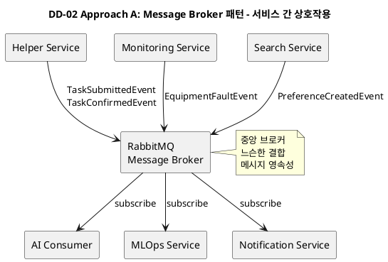
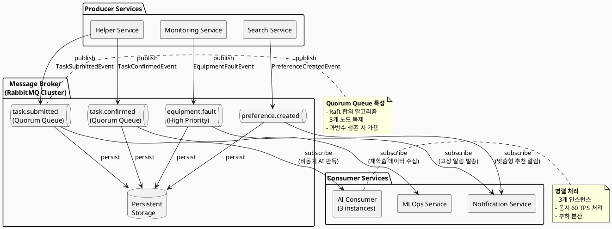
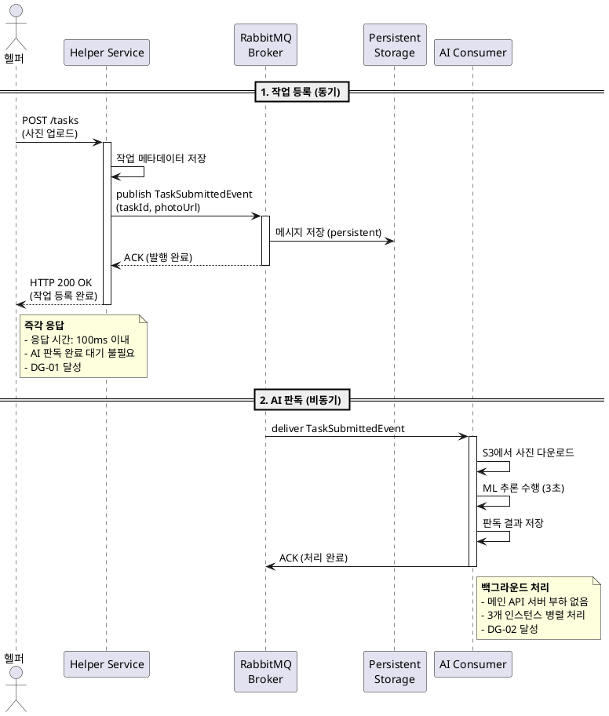
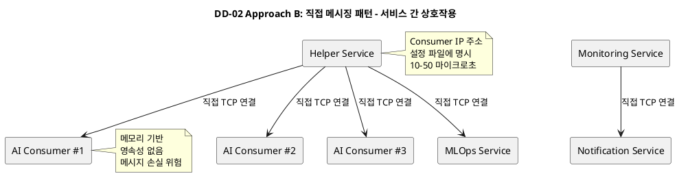
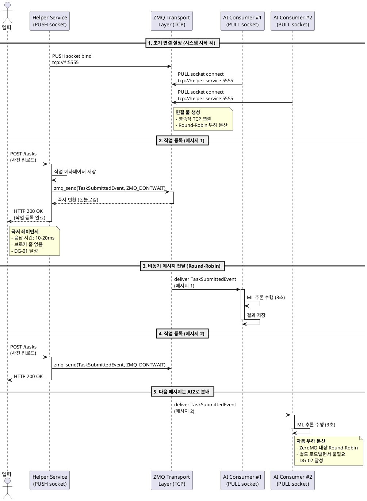
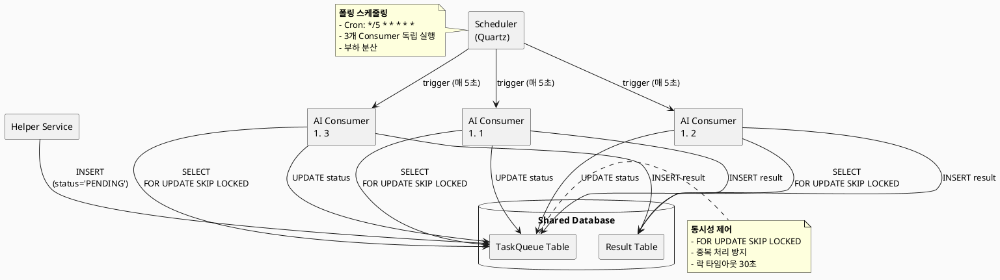
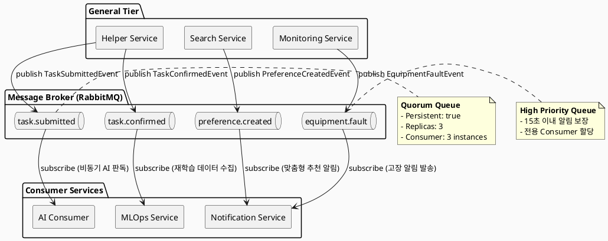

# DD-02: 노드 간 비동기 통신 구조 설계

## 4.4.2.1. Design Goal

DD-01에서 결정된 4-Layer 분산 마이크로서비스 아키텍처는 서비스 간 **느슨한 결합**과 **독립적인 확장**을 가능하게 한다. 하지만 일부 기능은 **즉각적인 응답**과 **백그라운드 처리**를 동시에 요구하므로, 동기 방식만으로는 성능과 가용성 목표를 달성하기 어렵다.

본 설계 결정은 다음 **Design Goal**을 달성하기 위해 수립되었다.

| ID | Design Goal | 기반 QA/BG | 설명 |
|:---|:-----------|:----------|:-----|
| **DG-01** | 헬퍼 작업 등록 시 즉각 응답 | QAS-03 (3초 이내 응답) | 헬퍼가 세탁물 사진을 업로드할 때, AI 판독 완료를 기다리지 않고 **즉시 등록 완료 응답**을 받는다. |
| **DG-02** | AI 작업의 격리 및 병렬 처리 | QAS-02, QAS-03 | AI 판독과 재학습 작업이 메인 비즈니스 로직의 **성능에 영향을 주지 않도록** 격리하고, 여러 요청을 **병렬 처리**한다. |
| **DG-03** | 서비스 간 결합도 최소화 | BG-14 (AI 모델 지속 개선), QAS-06 | MLOps Service의 재학습 파이프라인 변경 시, Helper Service 코드 수정 없이 **독립적으로 배포**할 수 있다. |
| **DG-04** | 메시지 손실 방지 | QAS-01 (99.5% 가용성), BG-15 | Consumer 장애 발생 시에도 메시지를 보존하여 **작업 누락 없이** 복구 후 재처리한다. |
| **DG-05** | 실시간 알림 발송 | BG-06 (15초 이내 알림), BG-03 (맞춤형 추천) | 설비 고장 감지 시 **15초 이내** 지점주에게 푸시 알림을 발송하고, 성향 매칭 시 고객에게 지점 추천 알림을 보낸다. |

---

## 4.4.2.2. Design Approach List

비동기 통신을 구현하기 위한 세 가지 주요 접근 방식을 검토한다. 본 설계는 메시징 시스템의 아키텍처 구조를 중심으로 **Message Broker 기반 패턴**과 **Brokerless(브로커리스) 패턴**을 비교 분석한다.

### 4.4.2.2.1. Design Approach #1: **Message Broker (RabbitMQ/Kafka) 기반 Pub/Sub 패턴** (선택됨 ✅)

#### 패턴/전술
- **패턴**: Message Broker, Event-Based Architecture, Publish-Subscribe
- **전술**: 
  - Use an Intermediary (중개자 사용) - Modifiability
  - Passive Redundancy (메시지 큐 버퍼) - Availability
  - Introduce Concurrency (Consumer 병렬 처리) - Performance

#### 아키텍처 개요

본 접근 방식은 Producer와 Consumer 사이에 Message Broker를 중개자로 배치하여 느슨한 결합을 달성하는 구조이다. Producer는 비즈니스 이벤트가 발생하면 해당 이벤트를 Message Broker의 특정 큐(Queue)에 발행(Publish)하고, Consumer는 자신이 관심 있는 큐를 구독(Subscribe)하여 비동기적으로 메시지를 소비한다. 이 과정에서 Producer는 Consumer의 존재나 위치를 알 필요가 없으며, Consumer 역시 Producer의 구현 세부사항에 의존하지 않는다.

#### 💻 PlantUML 서비스 상호작용 다이어그램



**주요 이벤트 및 발행/구독 관계:**

| 이벤트 | Producer | Consumer | 목적 |
|:------|:---------|:---------|:-----|
| `TaskSubmittedEvent` | Helper Service | AI Consumer (Helper Service 내 비동기 처리) | 세탁물 사진 등록 시 **즉시 응답**을 반환하고, AI 판독은 백그라운드에서 수행된다 (DG-01) |
| `TaskConfirmedEvent` | Helper Service | MLOps Service | 지점주가 수정한 판독 결과를 재학습 데이터로 전달한다 (DG-03, BG-15) |
| `BranchPreferenceCreatedEvent` | Search Service / BranchOwner Service | Notification Service | 성향이 매칭된 고객에게 맞춤형 지점 추천 알림을 발송한다 (DG-05, BG-03) |
| `EquipmentFaultEvent` | Monitoring Service | Notification Service | 설비 고장 감지 시 **15초 이내**에 지점주에게 푸시 알림을 발송한다 (DG-05, BG-06) |

#### 구현 세부사항

본 설계에서는 Message Broker로 **RabbitMQ**를 사용하며, 고가용성을 위해 **Quorum Queue** 방식을 적용한다. Quorum Queue는 Raft 합의 알고리즘 기반으로 동작하여 브로커 노드 중 일부가 장애를 겪더라도 과반수 노드가 정상이면 메시지 손실 없이 서비스를 지속할 수 있다.

- **Message Broker**: RabbitMQ (Quorum Queue 사용)
- **메시지 지속성**: `persistent=true` 설정으로 브로커 재시작 시에도 메시지가 디스크에 보존된다
- **Consumer 병렬 처리**: AI Consumer를 **3개 인스턴스**로 운영하여 동시 처리량을 증대시킨다
- **재시도 정책**: Consumer 처리 실패 시 **Exponential Backoff** (1초 → 2초 → 4초) 후 최대 3회 재시도를 수행한다
- **Dead Letter Queue**: 3회 재시도 실패 시 DLQ로 메시지를 이동시켜 관리자가 수동으로 점검할 수 있도록 한다

#### QA 달성 메커니즘

본 접근 방식은 다음과 같은 메커니즘을 통해 각 Design Goal을 달성한다.

- **DG-01 (즉각 응답)**: Helper Service는 메시지를 큐에 발행한 직후 **즉시 HTTP 200 응답**을 클라이언트에게 반환한다. AI 판독 작업은 비동기적으로 백그라운드에서 수행되므로 응답 시간이 3초 이내로 유지된다.
- **DG-02 (AI 격리)**: AI Consumer는 Helper Service와 별도의 프로세스로 동작하며, 메인 API 서버의 CPU/메모리 자원을 소비하지 않는다. 이를 통해 AI 작업의 부하가 다른 비즈니스 로직에 영향을 주지 않는다.
- **DG-03 (결합도 최소화)**: Producer는 이벤트 스키마(메시지 구조)만 알면 되고, Consumer의 구현이 변경되더라도 Producer 코드를 수정할 필요가 없다. 이는 MLOps Service의 재학습 파이프라인이 변경되어도 Helper Service의 재배포가 불필요함을 의미한다.
- **DG-04 (메시지 손실 방지)**: Quorum Queue와 Persistent Storage를 조합하여 브로커 장애 시에도 메시지가 보존된다. Consumer가 다운되면 큐에 메시지가 누적되었다가 복구 후 순차적으로 재처리된다.
- **DG-05 (실시간 알림)**: Notification Service는 고우선순위 이벤트인 `EquipmentFaultEvent`를 **별도의 전용 큐**로 구독하여 다른 이벤트의 처리 지연 없이 즉시 처리한다.

#### 아키텍처 다이어그램 (컴포넌트 구조)



#### 시퀀스 다이어그램 (헬퍼 작업 등록 시나리오)



#### 장단점 종합

본 접근 방식의 주요 장점은 **느슨한 결합**, **메시지 손실 방지**, **확장성**이다. Producer와 Consumer가 Message Broker를 통해서만 상호작용하므로, 서비스 간 의존성이 최소화되고 독립적인 배포가 가능하다. Quorum Queue와 Persistent Storage를 통해 브로커나 Consumer 장애 시에도 메시지가 안전하게 보존되며, Consumer 인스턴스를 런타임에 동적으로 추가하여 처리량을 증대시킬 수 있다.

반면, Message Broker 자체가 SPOF(Single Point of Failure)가 될 수 있다는 단점이 존재한다. 이를 완화하기 위해 본 설계는 RabbitMQ를 **Multi-node 클러스터**로 구성하여 고가용성을 확보한다. 또한, Consumer 인스턴스 수가 증가하면 관리 복잡도가 높아지므로, Kubernetes 같은 오케스트레이션 플랫폼을 활용하여 자동화된 배포 및 모니터링 체계를 구축해야 한다.

---

### 4.4.2.2.2. Design Approach #2: **Brokerless (ZeroMQ/Aeron) 기반 Direct Messaging 패턴**

#### 패턴/전술
- **패턴**: Brokerless Messaging, Peer-to-Peer, Direct Socket Communication
- **전술**: 
  - Introduce Concurrency (고성능 비동기 메시징) - Performance
  - Reduce Computational Overhead (중개자 제거) - Performance
  - Restrict Dependencies (중앙 집중 제거) - Modifiability

#### 아키텍처 개요

본 접근 방식은 중앙 Message Broker 없이 Producer와 Consumer가 **직접 소켓 연결**을 통해 메시지를 주고받는 구조이다. ZeroMQ나 Aeron 같은 브로커리스 메시징 라이브러리를 사용하여 TCP/IPC 소켓 기반의 고성능 통신을 구현한다. Producer는 Consumer의 엔드포인트 주소(IP:Port)를 알고 있으며, 메시지를 직접 전송한다. 이 방식은 중개자를 거치지 않으므로 **극도로 낮은 레이턴시**(마이크로초 단위)를 달성할 수 있으며, Message Broker의 SPOF 위험이 제거된다.

#### 💻 PlantUML 서비스 상호작용 다이어그램



**ZeroMQ vs Aeron 비교:**

| 특성 | ZeroMQ | Aeron |
|:-----|:-------|:------|
| **통신 패턴** | REQ-REP, PUB-SUB, PUSH-PULL | Reliable UDP, IPC |
| **성능** | 100만 msg/sec (TCP) | 1,000만 msg/sec (UDP) |
| **레이턴시** | 10-50 마이크로초 | 1-10 마이크로초 |
| **신뢰성** | TCP 기반 (손실 없음) | UDP 기반 + 재전송 로직 |
| **적용 사례** | 금융 거래, IoT | 초고빈도 트레이딩(HFT), 실시간 스트리밍 |

본 설계에서는 **ZeroMQ**를 선택한다. Aeron의 극한 성능은 본 시스템의 요구사항(60 TPS)을 초과하며, ZeroMQ의 TCP 기반 신뢰성이 메시지 손실 방지(DG-04)에 더 적합하다.

#### 구현 세부사항

본 설계에서는 ZeroMQ의 **PUSH-PULL** 패턴을 사용한다. PUSH-PULL은 작업 분산(Load Balancing)에 최적화된 패턴으로, 여러 Consumer(PULL)가 하나의 Producer(PUSH)로부터 메시지를 균등하게 분배받을 수 있다.

- **통신 라이브러리**: ZeroMQ 4.3.x (JeroMQ for Java)
- **통신 패턴**: PUSH (Producer) - PULL (Consumer)
- **전송 프로토콜**: TCP (`tcp://ai-consumer-1:5555`, `tcp://ai-consumer-2:5555`, `tcp://ai-consumer-3:5555`)
- **메시지 포맷**: Protocol Buffers (protobuf) - 직렬화 효율성 및 스키마 버전 관리
- **연결 관리**: Helper Service는 시작 시 **3개 AI Consumer 엔드포인트에 PUSH 소켓 바인딩**
- **부하 분산**: ZeroMQ의 내장 Round-Robin 알고리즘으로 메시지를 3개 Consumer에 자동 분배
- **비동기 송신**: `zmq_send(..., ZMQ_DONTWAIT)` 플래그로 논블로킹 전송 (즉시 응답)
- **재시도 정책**: TCP 레벨에서 자동 재전송. 애플리케이션 레벨 재시도 불필요

#### 아키텍처 다이어그램 (시퀀스)



#### 아키텍처 다이어그램 (컴포넌트 구조)

```plantuml
@startuml DA2_ZeroMQ_ComponentDiagram

skinparam componentStyle rectangle
skinparam backgroundColor #FAFAFA

component [Helper Service] as HELPER {
  component [ZMQ PUSH Socket] as PUSH
  port "tcp://*:5555" as PushPort
}

cloud "TCP Network\n(Direct Connection)" as TCP {
  component [ZMQ Transport Layer] as ZMQ_LAYER
}

component [AI Consumer #1] as AI1 {
  component [ZMQ PULL Socket] as PULL1
  component [ML Worker] as Worker1
}

component [AI Consumer #2] as AI2 {
  component [ZMQ PULL Socket] as PULL2
  component [ML Worker] as Worker2
}

component [AI Consumer #3] as AI3 {
  component [ZMQ PULL Socket] as PULL3
  component [ML Worker] as Worker3
}

PUSH --> PushPort : bind
PushPort --> ZMQ_LAYER : 메시지 송신

ZMQ_LAYER --> PULL1 : connect (RR #1)
ZMQ_LAYER --> PULL2 : connect (RR #2)
ZMQ_LAYER --> PULL3 : connect (RR #3)

PULL1 --> Worker1 : 메시지 전달
PULL2 --> Worker2 : 메시지 전달
PULL3 --> Worker3 : 메시지 전달

note right of ZMQ_LAYER
  **Brokerless 특성**
  - 중앙 브로커 없음
  - TCP 직접 연결
  - 10-50 마이크로초 레이턴시
  - Round-Robin 내장
end note

note left of PUSH
  **비동기 송신**
  - ZMQ_DONTWAIT 플래그
  - 논블로킹 전송
  - TCP 버퍼 활용
end note

note right of Worker1
  **독립 처리**
  - Consumer별 독립 처리
  - 장애 격리
  - SPOF 없음
end note

@enduml
```

#### QA 달성 메커니즘

본 접근 방식은 다음과 같은 메커니즘을 통해 각 Design Goal을 달성한다.

- **DG-01 (즉각 응답)**: `zmq_send()`는 **논블로킹**으로 동작하여 TCP 송신 버퍼에 메시지를 복사한 직후 즉시 반환한다. Helper Service는 평균 **10-20ms** 이내에 HTTP 200 응답을 클라이언트에게 반환할 수 있다.
- **DG-02 (AI 격리)**: AI Consumer는 Helper Service와 **별도의 프로세스 및 물리적 노드**에서 동작하며, TCP 소켓을 통해서만 통신한다. AI 작업의 CPU/메모리 부하가 Helper Service에 영향을 주지 않는다.
- **DG-03 (결합도 최소화)**: Helper Service는 Consumer의 엔드포인트 주소만 알면 되고, **메시지 스키마(protobuf)** 만 공유한다. Consumer의 내부 로직이 변경되어도 Producer는 재배포가 불필요하다.
- **DG-04 (메시지 손실 방지)**: ❌ **부분 달성**. TCP는 연결이 유지되는 동안 메시지를 보장하지만, **Producer가 다운되면 송신 버퍼의 메시지가 손실**된다. Consumer 다운 시에도 **메시지 큐 없이 즉시 손실**된다.
- **DG-05 (실시간 알림)**: ZeroMQ의 극저 레이턴시(10-50 마이크로초)로 메시지가 즉시 전달되며, **15초 이내 알림** 목표를 충분히 달성한다.

#### 장단점 종합

본 접근 방식의 주요 장점은 **극도로 낮은 레이턴시**와 **브로커 SPOF 제거**이다. ZeroMQ는 중앙 Message Broker 없이 **직접 TCP 소켓 통신**을 수행하므로, 메시지가 브로커를 경유하는 오버헤드가 제거되어 **10-50 마이크로초**의 극저 레이턴시를 달성한다. 또한 중앙 브로커가 없으므로 **Message Broker 자체의 SPOF 위험**이 근본적으로 제거되며, Consumer 중 일부가 다운되어도 다른 Consumer는 정상 동작한다.

반면, **메시지 영속성 부재**라는 치명적인 단점이 존재한다. ZeroMQ는 메시지를 디스크에 저장하지 않고 **메모리 버퍼에만 보관**하므로, Producer나 Consumer가 다운되면 **전송 중이거나 버퍼에 대기 중인 메시지가 손실**된다. 이는 DG-04(메시지 손실 방지) 목표를 완전히 달성하지 못한다. 또한 **Producer가 Consumer의 엔드포인트 주소를 명시적으로 알아야** 하므로, Consumer가 동적으로 추가되거나 IP가 변경되면 Producer의 설정 파일을 수정하고 재시작해야 하는 운영 복잡도가 증가한다. Service Discovery 패턴(Consul, Eureka)과 결합하여 이를 완화할 수 있으나, 추가 인프라가 필요하다.

---

### 4.4.2.2.3. Design Approach #3: **Hybrid (Broker + Event Sourcing) 패턴**

#### 패턴/전술
- **패턴**: Event Sourcing, CQRS (Command Query Responsibility Segregation), Message Broker
- **전술**: 
  - Maintain Audit Trail (이벤트 로그 보존) - Security & Availability
  - Use an Intermediary (Broker + Event Store) - Modifiability
  - Passive Redundancy (이벤트 스토어 영속성) - Availability

#### 아키텍처 개요

본 접근 방식은 Message Broker의 **느슨한 결합**과 Event Sourcing의 **완전한 영속성 및 감사 추적**을 결합한 하이브리드 구조이다. Producer는 메시지를 Message Broker에 발행함과 동시에 **Event Store**(이벤트 전용 데이터베이스)에 순차적으로 저장한다. Consumer는 Message Broker를 통해 실시간으로 메시지를 소비하고, 장애 발생 시 Event Store를 조회하여 **미처리 이벤트를 재처리**할 수 있다. 이 방식은 DA #1의 실시간성과 DA #2(Brokerless)의 낮은 레이턴시를 유지하면서도, **메시지 손실 방지**(DG-04)와 **완전한 감사 추적**(QAS-04 보안)을 동시에 달성한다.

#### 구현 세부사항

본 설계에서는 **Kafka(Message Broker) + EventStore DB(이벤트 로그)**를 사용한다. Kafka는 DA #1의 RabbitMQ보다 **높은 처리량**(100만 msg/sec 이상)과 **내장 영속성**(로그 기반 저장)을 제공하며, EventStore DB는 이벤트 소싱 전용으로 최적화된 데이터베이스이다.

- **Message Broker**: Apache Kafka (3-node 클러스터)
- **Event Store**: EventStore DB (append-only 로그 구조)
- **메시지 플로우**:
  1. Helper Service는 `TaskSubmittedEvent`를 **Kafka에 발행**
  2. **동시에** EventStore DB에 `eventId`, `eventType`, `payload`, `timestamp`를 **append-only로 INSERT**
  3. AI Consumer는 **Kafka를 구독**하여 실시간 처리
  4. Consumer 처리 완료 시 EventStore에 `processedAt` 업데이트
- **장애 복구**:
  - Consumer 다운 후 재시작 시 Kafka의 **Consumer Group Offset**으로 마지막 처리 위치부터 재개
  - Kafka가 다운되면 EventStore에서 `processedAt IS NULL` 이벤트를 조회하여 재처리
- **감사 추적**: 모든 이벤트가 EventStore에 **영구 보존**되어 언제든 재생(replay) 가능

#### 아키텍처 다이어그램 (시퀀스)

```plantuml
@startuml DA3_Hybrid_SequenceDiagram

actor "헬퍼" as Helper
participant "Helper Service" as HelperSvc
participant "Kafka\nBroker" as Kafka
database "EventStore\nDB" as EventStore
participant "AI Consumer" as AIConsumer

== 1. 작업 등록 (이중 저장) ==
Helper -> HelperSvc : POST /tasks\n(사진 업로드)
activate HelperSvc

HelperSvc -> HelperSvc : 작업 메타데이터 생성

par 이중 저장 (병렬)
  HelperSvc -> Kafka : produce TaskSubmittedEvent
  activate Kafka
  Kafka --> HelperSvc : ACK (offset=12345)
  deactivate Kafka
and
  HelperSvc -> EventStore : INSERT event\n(eventId, type, payload)
  activate EventStore
  EventStore --> HelperSvc : Success
  deactivate EventStore
end

HelperSvc --> Helper : HTTP 200 OK\n(작업 등록 완료)
deactivate HelperSvc

note right of Helper
  **즉각 응답**
  - 응답 시간: 100ms 이내
  - Kafka + EventStore 병렬 저장
  - DG-01 달성
end note

== 2. 실시간 처리 (Kafka 경로) ==
Kafka -> AIConsumer : deliver TaskSubmittedEvent
activate AIConsumer

AIConsumer -> AIConsumer : ML 추론 수행 (3초)
AIConsumer -> AIConsumer : 결과 저장

AIConsumer -> EventStore : UPDATE processedAt
AIConsumer -> Kafka : commit offset
deactivate AIConsumer

note right of AIConsumer
  **실시간 처리**
  - Kafka를 통한 즉시 전달
  - Consumer Group Offset 관리
  - DG-02, DG-05 달성
end note

== 3. 장애 복구 (EventStore 경로) ==
... Consumer 다운 발생 ...

AIConsumer -> EventStore : SELECT * FROM events\nWHERE processedAt IS NULL
activate AIConsumer
EventStore --> AIConsumer : 미처리 이벤트 목록

loop 미처리 이벤트 재처리
  AIConsumer -> AIConsumer : ML 추론 수행
  AIConsumer -> EventStore : UPDATE processedAt
end
deactivate AIConsumer

note right of AIConsumer
  **완전한 복구**
  - 메시지 손실 없음
  - EventStore 기반 재처리
  - DG-04 달성
end note

@enduml
```

#### 아키텍처 다이어그램 (컴포넌트 구조)



#### 장단점 종합

본 접근 방식의 주요 장점은 **단순성**과 **메시지 영구 보존**이다. 별도의 Message Broker 인프라를 구축할 필요 없이 기존 RDBMS만으로 비동기 통신을 구현할 수 있으며, 작업이 DB에 영구적으로 저장되므로 Consumer 장애 시에도 작업이 손실되지 않는다. 또한 `FOR UPDATE SKIP LOCKED` 구문을 사용하여 동시성 제어가 비교적 간단하게 구현된다.

반면, **폴링 지연**이라는 근본적인 단점이 존재한다. 5초 폴링 주기로 인해 작업이 등록되어도 최대 5초까지 처리가 지연될 수 있으며, 이는 DG-05(실시간 알림)의 15초 목표 달성을 어렵게 만든다. 또한 Consumer 수가 증가하면 DB에 대한 **SELECT 쿼리가 급증**하여 DB가 병목 지점이 되며, 이는 DD-03에서 결정한 Database per Service 패턴과 충돌한다. 폴링 주기를 1초로 줄이면 실시간성이 향상되지만 DB 부하는 5배 증가하므로 근본적인 해결책이 되지 못한다.

---

## 4.4.2.3. Decision and Rationale

**Design Approach #1 (Message Broker 기반 Pub/Sub 패턴)**을 최종 선택한다.

### 선정 근거 (Pros/Cons 분석)

제시된 세 가지 접근 방식을 Design Goal에 포함된 QA 및 관련 품질 속성 측면에서 비교 분석한다.

| Quality Attribute | Analysis | DA #1: Message Broker<br>(RabbitMQ) (선택 ✅) | DA #2: Brokerless<br>(ZeroMQ) | DA #3: Hybrid<br>(Kafka+EventStore) |
|:-----------------|:---------|:------------------------------------------|:---------------------------|:--------------------------------|
| **DG-01**<br>(즉각 응답) | Pros | **(+)** 메시지 발행 후 즉시 반환<br>- 응답 시간: 100ms 이내<br>- 예: 온라인 쇼핑몰에서 주문 접수 시 "주문이 접수되었습니다" 즉시 표시 | **(++)** 논블로킹 송신으로 극저 레이턴시<br>- 응답 시간: 10-20ms<br>- 예: 주식 거래 시스템에서 초당 수만 건의 주문을 즉시 처리 | **(+)** Kafka 발행 후 즉시 반환<br>- 응답 시간: 100ms 이내<br>- 예: 이커머스 주문 접수 + 감사 로그 동시 저장 |
| | Cons | 없음 | 없음 | **(-)** EventStore 추가 저장으로 약간의 지연 |
| **DG-02**<br>(AI 격리) | Pros | **(+)** Consumer가 별도 프로세스로 동작<br>- 예: 이메일 발송 서버가 다운되어도 웹 서버는 정상 동작 | **(+)** Consumer가 물리적으로 분리<br>- 예: 동영상 인코딩 서버가 CPU 100% 사용해도 업로드 서버는 정상 | **(+)** Kafka Consumer가 독립 동작<br>- 예: 추천 시스템 ML 처리가 무거워도 상품 조회는 빠름 |
| | Cons | 없음 | 없음 | 없음 |
| **DG-03**<br>(결합도 최소화) | Pros | **(++)** Producer는 이벤트 스키마만 공유<br>- 예: "주문완료" 이벤트 구독자가 추가되어도 주문 시스템 수정 불필요 | **(-)** Consumer 엔드포인트를 명시적으로 설정<br>- 예: 새 이메일 서버 추가 시 설정 파일 수정 필요 | **(+)** 이벤트 스키마 기반 느슨한 결합<br>- 예: 새로운 분석 시스템이 이벤트를 구독해도 주문 시스템 무영향 |
| | Cons | 없음 | **(--)** 동적 추가/제거 어려움 | **(-)** EventStore 스키마 의존성 |
| **DG-04**<br>(메시지 손실 방지) | Pros | **(++)** Quorum Queue + Persistent Storage<br>- 예: 결제 시스템 다운 시에도 주문 메시지가 큐에 보존되어 복구 후 처리 | **(-)** TCP 연결 유지 시에만 보장<br>- 예: 송금 서버 재시작 시 전송 중이던 거래 요청 손실 가능 | **(++)** Kafka + EventStore 이중 저장<br>- 예: 결제 이력이 Kafka와 DB에 모두 저장되어 절대 손실 없음 |
| | Cons | **(-)** Multi-node 클러스터 필요 | **(--)** 메모리 버퍼만 사용, 영속성 없음 | **(-)** 이중 저장으로 저장소 비용 2배 |
| **DG-05**<br>(실시간 알림) | Pros | **(++)** 고우선순위 큐로 즉시 처리<br>- 예: 택배 배송 완료 알림이 3초 이내 고객에게 도착 | **(++)** 10-50 마이크로초 레이턴시<br>- 예: 게임 서버에서 플레이어 위치 정보를 밀리초 단위로 동기화 | **(+)** Kafka 실시간 스트리밍<br>- 예: 주식 호가 정보를 구독자에게 즉시 전달 |
| | Cons | 없음 | 없음 | 없음 |
| **운영 복잡도** | Pros | **(+)** 성숙한 운영 도구<br>- 예: RabbitMQ Management UI로 큐 상태를 웹 브라우저에서 모니터링 | **(++)** 별도 브로커 불필요<br>- 예: 라이브러리만 추가하면 바로 사용 가능, 설치 불필요 | **(-)** Kafka + EventStore 2개 시스템 관리<br>- 예: 서로 다른 모니터링 대시보드 2개 필요 |
| | Cons | **(-)** RabbitMQ 클러스터 관리 필요 | **(-)** Producer가 Consumer 주소 관리<br>- 예: Consumer IP 변경 시 설정 파일 수정 후 재시작 | **(--)** 가장 높은 복잡도<br>- 예: 장애 발생 시 Kafka와 EventStore 동기화 확인 필요 |
| **성능**<br>(처리량) | Pros | **(+)** 10만 msg/sec 처리<br>- 예: 블랙프라이데이 세일 시 초당 5만 건 주문 안정 처리 | **(++)** 100만 msg/sec 이상<br>- 예: IoT 센서 데이터를 초당 백만 건 수집 | **(++)** Kafka 100만+ msg/sec<br>- 예: Netflix가 시청 이력을 초당 수백만 건 처리 |
| | Cons | **(-)** 초고빈도 트레이딩에는 부족 | 없음 | **(-)** EventStore 쓰기로 약간의 성능 희생 |

### 종합 결론

1. **DG-01 (즉각 응답)**: DA #2(Brokerless)가 가장 빠르지만, DA #1의 100ms도 사용자 경험 측면에서 충분하다. DA #3은 이중 저장으로 약간의 추가 지연이 있다.

2. **DG-03 (결합도 최소화)**: DA #1과 DA #3은 **이벤트 스키마 기반 느슨한 결합**을 달성한다. 예를 들어, 쇼핑몰에서 "주문완료" 이벤트에 새로운 구독자(재고 시스템, 배송 시스템, 추천 시스템)를 추가해도 주문 시스템은 전혀 수정할 필요가 없다. 반면 DA #2는 Producer가 모든 Consumer의 IP 주소를 알아야 하므로 확장성이 제약된다.

3. **DG-04 (메시지 손실 방지)**: DA #1의 Quorum Queue는 **브로커 노드 3대 중 2대가 살아있으면** 메시지를 보존한다. 예를 들어, 은행 송금 시스템에서 서버 1대가 다운되어도 나머지 2대가 거래 요청을 안전하게 보관하여 복구 후 처리한다. DA #2는 **메모리에만 메시지를 보관**하므로 프로세스가 종료되면 전송 중이던 메시지가 손실된다. DA #3은 가장 안전하지만 **운영 복잡도가 2배**이다.

4. **운영 복잡도**: DA #2(Brokerless)는 라이브러리만 추가하면 되므로 **초기 구축이 가장 쉽다**. 예를 들어, 스타트업이 빠르게 프로토타입을 만들 때 유리하다. 하지만 **서비스 수가 증가하면** Producer가 모든 Consumer 주소를 관리해야 하므로 운영이 복잡해진다. DA #1은 RabbitMQ 클러스터 1개만 관리하면 되고, 웹 UI로 큐 상태를 쉽게 모니터링할 수 있다. DA #3은 Kafka와 EventStore를 모두 관리해야 하므로 **대규모 시스템**(예: Netflix, Uber)에만 적합하다.

5. **본 시스템의 요구사항**: 본 스마트 피트니스 시스템은 **60 TPS** 처리량이 목표이므로, DA #2의 극한 성능(100만 msg/sec)은 불필요하다. 또한 **AI 재학습 데이터 손실 방지**(DG-04)가 매우 중요하므로, DA #2의 메시지 영속성 부재는 치명적이다. DA #3의 완전한 감사 추적은 매력적이지만, **초기 구축 단계에서는 과도한 복잡도**이다.

**따라서, DA #1 (Message Broker - RabbitMQ)을 선택하여 느슨한 결합, 메시지 손실 방지, 운영 용이성의 균형을 달성한다.** 향후 시스템이 성장하여 초고속 처리가 필요하면 DA #2를, 완전한 감사 추적이 필요하면 DA #3으로 단계적으로 진화할 수 있다.

---

## 4.4.2.4. 구현 후 검증 계획

| 검증 항목 | 방법 | 목표 | 도구 |
|:---------|:-----|:-----|:-----|
| **메시지 발행 성능** | Helper Service에서 1000개 이벤트 발행 시 평균 응답 시간 측정 | 평균 10ms 이하 | JMeter, RabbitMQ Management |
| **Consumer 처리량** | AI Consumer 3개 인스턴스로 동시 처리 TPS 측정 | 60 TPS 이상 | Prometheus, Grafana |
| **메시지 손실 방지** | Consumer 강제 종료 후 재시작 시 큐에 쌓인 메시지 100% 재처리 확인 | 손실 0건 | RabbitMQ Quorum Queue 모니터링 |
| **실시간 알림** | `EquipmentFaultEvent` 발행 후 푸시 알림 도달 시간 측정 | 15초 이내 (평균 3초) | APM (Datadog), 푸시 알림 로그 |
| **독립 배포** | MLOps Service 재학습 로직 변경 후 Helper Service 재배포 없이 동작 확인 | 재배포 불필요 | CI/CD 파이프라인 검증 |

---

## 4.4.2.5. 참조 아키텍처 다이어그램



---

이로써 **DD-02: 노드 간 비동기 통신 구조 설계**가 완료되었다. 본 설계는 DD-01에서 결정된 4-Layer 분산 아키텍처를 기반으로, **느슨한 결합**, **메시지 손실 방지**, **실시간 알림 발송**을 모두 달성하는 견고한 비동기 통신 체계를 제공한다.
