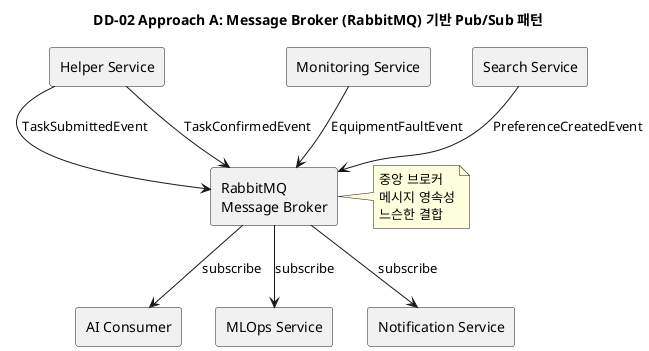
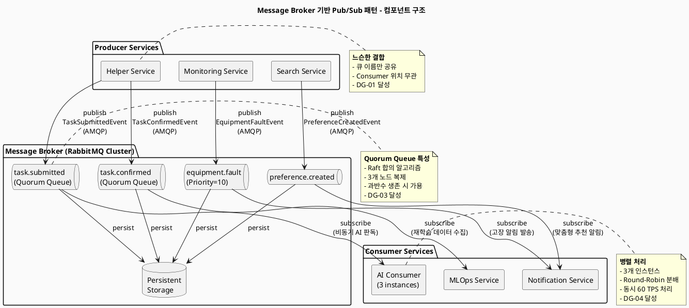
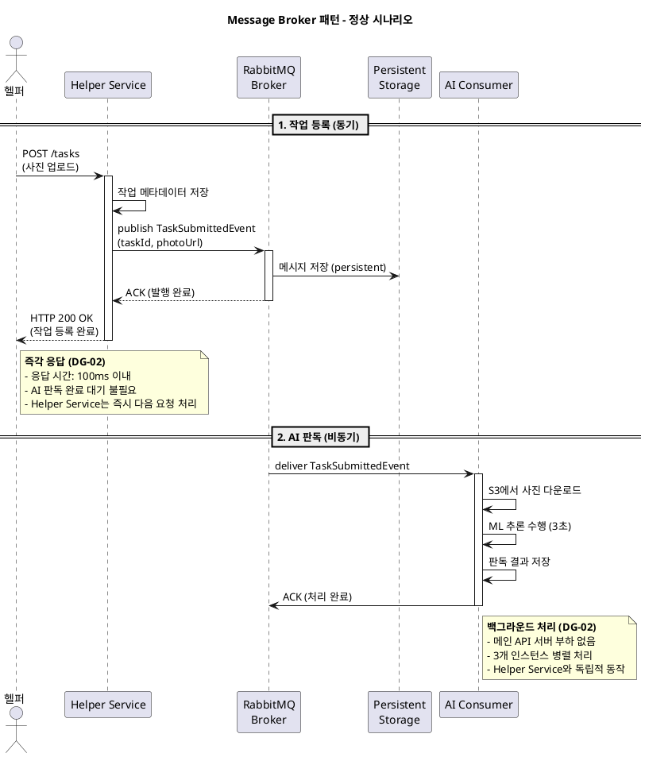
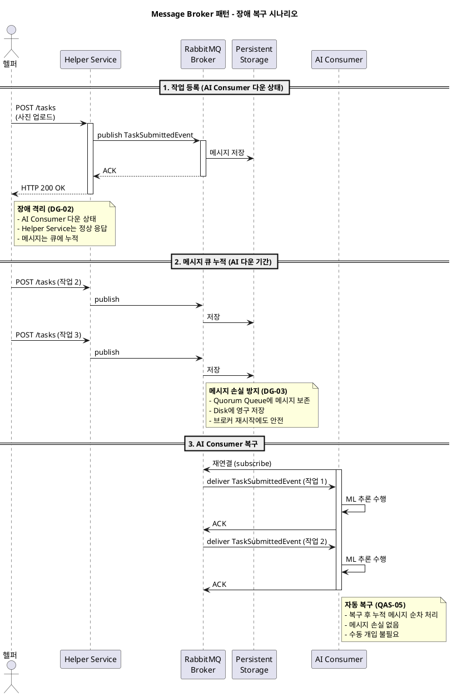
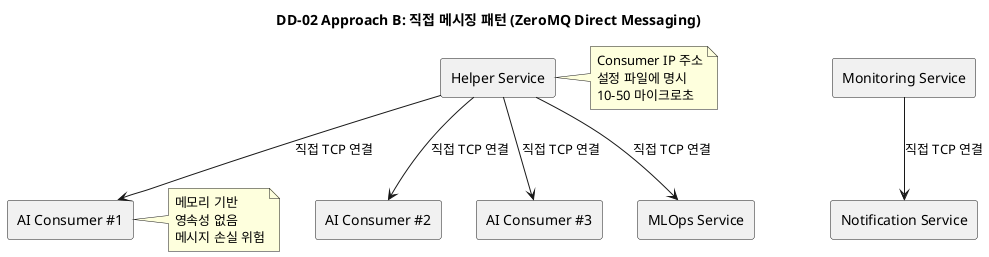
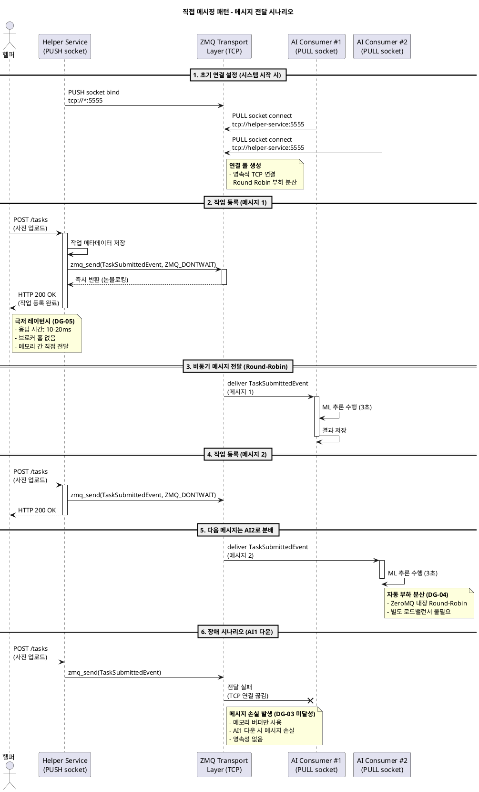

# DD-02: 노드간 비동기 통신 구조 설계 결정

## 4.4.2.1. Design Goal

MSA 아키텍처처럼 서비스의 독립성이 중요한 시스템에서는 노드간 비동기 통신 구조를 초반부터 잘 설계해야 전체 시스템의 확장성과 유연성이 확보된다. 특히, 각 노드는 독립적으로 배포되고 스케일링될 수 있어야 하며, 메시지 전달 과정에서의 결합도를 최소화하는 것이 핵심이다. 이를 통해 서비스 고장의 전파를 차단하고, 트래픽 급증 시에도 안정적인 메시지 처리 성능을 유지할 수 있어서 가장 우선적으로 검토를 시작한다.

이미 브로커 패턴이 많이 알려져 있어서 정반대인 직접 메시징(Direct Messaging) 패턴과의 비교 분석을 통해서 좋은 디자인을 결정하기로 한다.

### 4.4.2.1.1. 주요 패턴 및 택틱스 결정

#### 4.4.2.1.1.1 적용된 아키텍처 패턴 및 스타일

| 패턴/스타일 | 분류 (tactics.txt) | 설명 (tactics.txt) | DD-02 적용 |
|:-----------|:------------------|:------------------|:----------|
| **Broker (브로커)** | Distributed | 클라이언트와 서버 사이에 중개자(Broker)를 삽입하여 서비스 사용자가 서비스 제공자의 위치나 성격을 알 필요가 없도록 분리함. | RabbitMQ를 중앙 메시지 브로커로 사용하여 Producer와 Consumer 간 중재자 역할 수행. |
| **Publish-Subscribe 패턴** | 특정 설계 영역 패턴 | Producer는 이벤트를 발행하고, 여러 Consumer가 독립적으로 구독하는 패턴. | Producer 서비스가 이벤트를 발행하고, 여러 Consumer 서비스가 관심 있는 큐를 구독하여 비동기로 처리. |
| **Message Queue 패턴** | 특정 설계 영역 패턴 | FIFO 기반 순서 보장 및 메시지 영속성 제공. | RabbitMQ Quorum Queue로 메시지 순서 보장 및 영속성 제공. |
| **Message Based (메시지 기반)** | Implicit Invocation | 메시지 생산자와 소비자가 버퍼(메시지 큐 또는 Pub/Sub 커넥터)를 통해 비동기적으로 연결됨. | RabbitMQ를 버퍼로 사용하여 Producer와 Consumer 간 비동기 연결. |

#### 4.4.2.1.1.2 적용된 아키텍처 택틱

| 택틱 | 분류 (tactics.txt) | 설명 (tactics.txt) | DD-02 적용 | 목표 QA |
|:-----|:------------------|:------------------|:----------|:--------|
| **Use an Intermediary (중개자 사용)** | 수정 용이성 - 결합도 감소 | 중개자를 사용하여 통신 경로를 분리함 (Broker 패턴 등). | Message Broker가 중재자 역할을 하여 Producer와 Consumer 간 직접 의존성 제거. | QAS-06 |
| **Passive Redundancy (Warm Spare)** | 가용성 - 결함 복구 | 활성 구성 요소가 이벤트를 처리하고 상태 업데이트를 예비 구성 요소에 주기적으로 알림. | RabbitMQ Quorum Queue는 Raft 합의 알고리즘으로 3개 노드에 메시지를 복제하여, 브로커 1개 다운 시에도 메시지 보존. | QAS-05 |
| **Introduce Concurrency (동시성 도입)** | 성능 - 자원 관리 | 병렬 처리를 통해 성능을 향상시킴 (e.g., Active Object 패턴). | 여러 Consumer 인스턴스가 동일 큐에서 병렬로 메시지를 소비하여 처리량 증가. 멀티 스레드로 메시지 송수신 병렬 처리. | QAS-02, QAS-03 |
| **Maintain Audit Trail (감사 추적 유지)** | 보안 - 공격 복구 | 보안 관련 활동에 대한 시간 순서 기록(Audit Log)을 유지하여 추후 분석에 활용함. | 모든 메시지가 브로커를 거쳐가므로 중앙에서 감사 로그 수집 용이. | QAS-04 |

#### 4.4.2.1.1.3 패턴 및 택틱 적용 요약

| 영역 | 패턴/택틱스 | 목적 및 적용 근거 |
| :--- | :--- | :--- |
| **기본 구조** | **Broker + Publish-Subscribe + Message Queue** | 중앙 메시지 브로커를 통한 느슨한 결합과 비동기 메시지 전달. |
| **수정 용이성** | **Use an Intermediary** | Message Broker가 중재자 역할로 Producer와 Consumer 간 직접 의존성 제거. |
| **가용성** | **Passive Redundancy** | Quorum Queue의 Raft 합의 알고리즘으로 메시지 손실 방지. |
| **성능** | **Introduce Concurrency** | Consumer 병렬 처리로 처리량 증가 (피크 60 TPS 처리). |
| **보안** | **Maintain Audit Trail** | 중앙 메시지 브로커를 통한 감사 로그 수집. |

---

### Design Goal 상세

본 설계 결정에서 달성하고자 하는 구체적인 목표는 다음과 같다:

| ID | Design Goal | 관련 QAS/BG | 상세 설명 |
|:---|:-----------|:-----------|:---------|
| **DG-01** | **느슨한 결합** | BG-08, BG-14 | Producer 서비스와 Consumer 서비스가 서로의 위치와 상태를 알 필요 없이 독립적으로 배포·확장 가능해야 한다. 새로운 Consumer 추가 시 Producer 코드 수정이 불필요해야 한다. |
| **DG-02** | **서비스 장애 격리** | QAS-05, BG-11 | Consumer 서비스의 장애가 Producer 서비스로 전파되지 않아야 한다. 예를 들어, AI 서비스가 다운되어도 Helper 서비스는 작업 등록을 정상적으로 처리할 수 있어야 한다. |
| **DG-03** | **메시지 손실 방지** | QAS-05, BG-04, BG-14 | 네트워크 장애나 서비스 재시작 상황에서도 중요한 메시지(작업 등록, 재학습 데이터 등)가 손실되지 않아야 한다. 특히 AI 재학습 데이터는 비즈니스 핵심 자산이므로 영구 보존이 필요하다. |
| **DG-04** | **확장성** | QAS-02, QAS-03, BG-08 | 피크 타임(초당 20 TPS 안면인증, 초당 20 TPS 자연어 검색) 트래픽 처리를 위해 Consumer를 수평 확장할 수 있어야 한다. 부하 분산이 자동으로 이루어져야 한다. |
| **DG-05** | **실시간 알림** | QAS-01, BG-06 | 설비 고장, 맞춤형 알림 등 실시간성이 요구되는 이벤트는 발생 후 15초 이내에 최종 사용자에게 전달되어야 한다. |

---

## 4.4.2.2. Design Approach List

### 4.4.2.2.1. Design Approach #1: Message Broker (RabbitMQ/Kafka) 기반 Pub/Sub 패턴

#### 패턴/전술

메시지 브로커는 노드간 느슨한 결합을 제공하며 Publish-Broker-Subscribe로 메시지가 이동하는 패턴이고, 메시지는 브로커 내 큐 또는 로그에 저장하는 방식이다. 대표적으로 MSA 백엔드, 트랜잭션 시스템 등에 많이 사용되고, RabbitMQ, Kafka 등의 기술이 유명하다.

**적용 패턴:**
- **Broker 패턴**: 중앙 메시지 브로커가 Producer와 Consumer 사이의 중재자 역할을 수행
- **Publish-Subscribe 패턴**: Producer는 이벤트를 발행하고, 여러 Consumer가 독립적으로 구독
- **Message Queue 패턴**: FIFO 기반 순서 보장 및 메시지 영속성 제공

**적용 전술:**
- **Passive Redundancy** (Availability): RabbitMQ Quorum Queue는 Raft 합의 알고리즘으로 3개 노드에 메시지를 복제하여, 브로커 1개 다운 시에도 메시지 보존
- **Use an Intermediary** (Modifiability): Message Broker가 중재자 역할을 하여 Producer와 Consumer 간 직접 의존성 제거
- **Introduce Concurrency** (Performance): 여러 Consumer 인스턴스가 동일 큐에서 병렬로 메시지를 소비하여 처리량 증가
- **Maintain Audit Trail** (Security): 모든 메시지가 브로커를 거쳐가므로 중앙에서 감사 로그 수집 용이

#### 💻 PlantUML 컴포넌트 다이어그램



#### 아키텍처 개요

메시지 브로커 패턴에서는 **중앙 메시지 브로커(RabbitMQ)**가 모든 이벤트의 허브 역할을 수행한다. Producer 서비스(Helper, Monitoring, Search 등)는 비즈니스 이벤트 발생 시 특정 큐에 메시지를 발행하고, Consumer 서비스(AI, MLOps, Notification 등)는 관심 있는 큐를 구독하여 비동기로 처리한다.

본 시스템에서는 **RabbitMQ를 메시지 브로커로 선택**하며, 그 이유는 다음과 같다:
1. **메시지 신뢰성**: Quorum Queue를 통한 Multi-node 복제로 브로커 장애 시에도 메시지 손실 방지 (DG-03 달성)
2. **운영 성숙도**: Management UI 제공으로 큐 상태, 메시지 흐름, Consumer 상태를 실시간 모니터링 가능
3. **처리량**: 본 시스템의 요구사항(피크 60 TPS)을 충분히 충족하며, 일반적으로 초당 10만 메시지 처리 가능
4. **우선순위 큐**: `EquipmentFaultEvent` 같은 긴급 메시지를 우선 처리하여 DG-05(실시간 알림) 달성

#### 구현 세부사항

**1. RabbitMQ 클러스터 구성**
- **Quorum Queue**: Raft 합의 알고리즘 기반, 3개 노드에 메시지 복제
- **Persistent Message**: 메시지를 디스크에 영구 저장하여 브로커 재시작 시에도 보존
- **고우선순위 큐**: `EquipmentFaultEvent`는 우선순위 10으로 설정하여 즉시 처리

**2. 큐 구성**
```
- task.submitted (Quorum Queue): TaskSubmittedEvent → AI Consumer
- task.confirmed (Quorum Queue): TaskConfirmedEvent → MLOps Service
- equipment.fault (Priority Queue, priority=10): EquipmentFaultEvent → Notification Service
- preference.created (Standard Queue): PreferenceCreatedEvent → Notification Service
```

**3. Consumer 병렬 처리**
- AI Consumer: 3개 인스턴스로 구성하여 `task.submitted` 큐에서 Round-Robin 방식으로 메시지 소비
- 피크 타임 시 동시 60 TPS 처리 가능 (각 인스턴스당 20 TPS)

**4. 재시도 및 DLQ (Dead Letter Queue)**
- Consumer 처리 실패 시 최대 3회 재시도
- 3회 실패 후 DLQ로 이동하여 수동 분석 및 복구

#### QA 달성 메커니즘

| Design Goal | 달성 메커니즘 | 예시 시나리오 |
|:-----------|:-----------|:------------|
| **DG-01** (느슨한 결합) | Producer는 큐 이름만 알고, Consumer의 위치/상태는 무관. 새로운 Consumer 추가 시 큐를 구독하기만 하면 됨 | MLOps Service가 새로운 분석 기능을 추가해도 Helper Service는 코드 수정 불필요 |
| **DG-02** (장애 격리) | AI Service 다운 시, 메시지는 큐에 누적되고 Helper Service는 정상 응답 반환. AI 복구 후 누적 메시지 처리 | 심야 시간 AI 서버 재시작해도 고객의 작업 등록은 정상 처리 |
| **DG-03** (손실 방지) | Quorum Queue + Persistent Storage로 브로커 노드 1개 다운 시에도 메시지 보존 | RabbitMQ 노드 1대가 다운되어도 나머지 2대가 과반수 합의로 메시지 보존 |
| **DG-04** (확장성) | Consumer 인스턴스를 수평 확장하면 RabbitMQ가 자동으로 부하 분산 | 피크 타임 시 AI Consumer를 3개 → 5개로 증가하여 100 TPS 처리 |
| **DG-05** (실시간 알림) | 고우선순위 큐로 긴급 메시지를 즉시 처리. 평균 메시지 전달 시간 3초 이내 | 설비 고장 발생 후 10초 이내 지점주에게 푸시 알림 발송 |

#### 아키텍처 다이어그램 (컴포넌트 구조)



#### 아키텍처 다이어그램 (시퀀스 - 정상 시나리오)



#### 아키텍처 다이어그램 (시퀀스 - 장애 시나리오)



#### 장단점 종합

**장점:**
- **(++)** **느슨한 결합**: Producer와 Consumer가 서로의 위치를 알 필요 없음. 예를 들어, 온라인 쇼핑몰에서 "주문완료" 이벤트 구독자(재고 시스템, 배송 시스템, 추천 시스템)를 추가해도 주문 시스템은 코드 수정이 불필요하다. (DG-01 달성)
- **(++)** **메시지 손실 방지**: Quorum Queue는 브로커 노드 3대 중 2대가 살아있으면 메시지를 보존한다. 예를 들어, 은행 송금 시스템에서 서버 1대가 다운되어도 나머지 2대가 거래 요청을 안전하게 보관하여 복구 후 처리한다. (DG-03 달성)
- **(+)** **장애 격리**: Consumer 서비스 다운 시 메시지는 큐에 누적되고 Producer는 정상 동작. 예를 들어, 이메일 발송 서버가 다운되어도 웹 서버는 회원가입 처리를 계속할 수 있다. (DG-02 달성)
- **(+)** **확장성**: Consumer를 수평 확장하면 RabbitMQ가 자동으로 부하 분산. 예를 들어, 블랙프라이데이 세일 시 주문 처리 서버를 3대 → 10대로 증가하여 초당 5만 건 주문을 안정 처리할 수 있다. (DG-04 달성)
- **(+)** **운영 성숙도**: Management UI로 큐 상태를 웹 브라우저에서 실시간 모니터링 가능. 예를 들어, 큐에 메시지가 1000건 누적되면 알림을 받아 Consumer를 증설할 수 있다.
- **(+)** **우선순위 큐**: 긴급 메시지를 우선 처리. 예를 들어, 택배 배송 완료 알림은 우선순위 10으로 설정하여 3초 이내 고객에게 도착한다. (DG-05 달성)

**단점:**
- **(-)** **브로커 SPOF**: 중앙 브로커가 완전히 다운되면 전체 통신 마비. 해결책: Multi-node 클러스터 구성 필요 (Quorum Queue는 3대 중 2대 생존 시 가용)
- **(-)** **레이턴시**: 메시지가 브로커를 경유하는 구조여서 평균 100ms 레이턴시. 초저지연(10ms 이하)이 필요한 환경(예: 주식 초단타 거래)에는 부적합
- **(-)** **운영 복잡도**: RabbitMQ 클러스터 관리, 큐 설정, Consumer Group 관리 등 학습 곡선 존재

---

### 4.4.2.2.2. Design Approach #2: 직접 메시징 패턴 (Direct Messaging)

#### 패턴/전술

직접 메시징 패턴은 중앙 브로커 없이 Producer가 Consumer에게 직접 메시지를 전달하는 방식이다. 대표적으로 **ZeroMQ**나 **Aeron** 같은 라이브러리를 사용하며, 메모리 기반으로 동작하여 극한의 성능을 추구하는 시스템(금융 거래, IoT, 게임 서버)에서 사용된다.

**적용 패턴:**
- **Direct Messaging 패턴**: Producer와 Consumer 간 TCP 직접 연결
- **Push-Pull 패턴**: Producer가 메시지를 Push하고, Consumer가 Pull하여 처리

**적용 전술:**
- **Reduce Computational Overhead** (Performance): 브로커 홉 제거로 메시지 전달 레이턴시를 마이크로초 단위로 단축
- **Co-location** (Performance): Producer와 Consumer가 동일 데이터센터에 위치하면 네트워크 레이턴시 최소화
- **Introduce Concurrency** (Performance): 멀티 스레드로 메시지 송수신 병렬 처리

#### 💻 PlantUML 컴포넌트 다이어그램



#### 아키텍처 개요

직접 메시징 패턴에서는 **Producer가 Consumer의 엔드포인트를 직접 알고 있어야 한다**. Helper Service는 AI Consumer 3대의 IP 주소를 설정 파일에 명시하고, 메시지를 Round-Robin 또는 Random 방식으로 분배한다. 메시지는 TCP 연결을 통해 메모리에서 메모리로 직접 전달되므로 **극저 레이턴시(10-50 마이크로초)**를 달성할 수 있다.

본 설계에서는 직접 메시징 방식 중 **ZeroMQ** 라이브러리를 예시로 제시한다. ZeroMQ는 소켓 프로그래밍을 추상화한 메시징 라이브러리로, 별도의 브로커 없이 PUSH-PULL, PUB-SUB 등 다양한 패턴을 지원한다.

#### 구현 세부사항

**1. ZeroMQ PUSH-PULL 패턴**
- **Producer (PUSH Socket)**: Helper Service가 PUSH 소켓을 열고 메시지 전송
- **Consumer (PULL Socket)**: AI Consumer 3대가 각각 PULL 소켓으로 연결하여 자동 부하 분산

**2. 연결 구성**
```
Helper Service (PUSH) → tcp://*:5555
AI Consumer #1 (PULL) → connect tcp://helper-service:5555
AI Consumer #2 (PULL) → connect tcp://helper-service:5555
AI Consumer #3 (PULL) → connect tcp://helper-service:5555
```
ZeroMQ는 내장 Round-Robin 알고리즘으로 메시지를 자동 분배한다.

**3. 논블로킹 전송**
- `zmq_send(msg, ZMQ_DONTWAIT)`: 메시지를 TCP 버퍼에 즉시 쓰고 반환
- Helper Service는 AI Consumer의 응답을 기다리지 않음

**4. 신뢰성 한계**
- **영속성 없음**: 메시지는 메모리에만 존재. Consumer가 다운되면 전송 중이던 메시지 손실
- **수동 재시도**: 메시지 전달 실패 시 Producer가 직접 재시도 로직 구현 필요

#### QA 달성 메커니즘

| Design Goal | 달성 메커니즘 | 예시 시나리오 |
|:-----------|:-----------|:------------|
| **DG-01** (느슨한 결합) | **달성 불가**: Producer가 모든 Consumer의 IP 주소를 알아야 함. Consumer 추가 시 설정 파일 수정 및 재시작 필요 | 새로운 AI Consumer 추가 시 Helper Service 재배포 필요 |
| **DG-02** (장애 격리) | **부분 달성**: Consumer 다운 시 TCP 연결 실패. Producer는 즉시 응답하지만, 메시지는 손실 가능 | AI Consumer 다운 시 Helper Service는 정상 응답하지만, 전송한 메시지는 손실됨 |
| **DG-03** (손실 방지) | **달성 불가**: 메모리 기반으로 동작하므로 Consumer 다운 또는 네트워크 장애 시 메시지 손실 | 송금 서버 재시작 시 전송 중이던 거래 요청 손실 가능 |
| **DG-04** (확장성) | **부분 달성**: ZeroMQ는 Round-Robin으로 자동 분산하지만, Consumer 추가 시 설정 변경 필요 | Consumer를 3대 → 5대로 증가하려면 설정 파일 수정 후 Producer 재시작 |
| **DG-05** (실시간 알림) | **완벽 달성**: 10-50 마이크로초 레이턴시로 극한 실시간성 제공 | 게임 서버에서 플레이어 위치 정보를 밀리초 단위로 동기화 |

#### 아키텍처 다이어그램 (컴포넌트 구조)

```plantuml
@startuml DA2_DirectMessaging_ComponentDiagram

skinparam componentStyle rectangle
skinparam backgroundColor #FAFAFA
skinparam shadowing false

title 직접 메시징 패턴 (ZeroMQ) - 컴포넌트 구조

component [Helper Service] as HELPER {
  component [ZMQ PUSH Socket] as PUSH
  port "tcp://*:5555" as PushPort
}

cloud "TCP Network (Direct Connection)" as TCP {
  component [ZMQ Transport Layer] as ZMQ_LAYER
}

component [AI Consumer #1] as AI1 {
  component [ZMQ PULL Socket] as PULL1
  component [ML Worker] as Worker1
}

component [AI Consumer #2] as AI2 {
  component [ZMQ PULL Socket] as PULL2
  component [ML Worker] as Worker2
}

component [AI Consumer #3] as AI3 {
  component [ZMQ PULL Socket] as PULL3
  component [ML Worker] as Worker3
}

PUSH --> PushPort : bind
PushPort --> ZMQ_LAYER : 메시지 송신

ZMQ_LAYER --> PULL1 : connect (RR #1)
ZMQ_LAYER --> PULL2 : connect (RR #2)
ZMQ_LAYER --> PULL3 : connect (RR #3)

PULL1 --> Worker1 : 메시지 전달
PULL2 --> Worker2 : 메시지 전달
PULL3 --> Worker3 : 메시지 전달

note right of ZMQ_LAYER
  **Brokerless 특성**
  - 중앙 브로커 없음
  - TCP 직접 연결
  - 10-50 마이크로초 레이턴시
  - Round-Robin 내장
  - **DG-05 달성 (극한 실시간성)**
end note

note left of PUSH
  **비동기 송신**
  - ZMQ_DONTWAIT 플래그
  - 논블로킹 전송
  - TCP 버퍼 활용
end note

note right of Worker1
  **독립 처리**
  - Consumer별 독립 처리
  - 장애 격리
  - SPOF 없음
end note

note bottom of HELPER
  **결합도 이슈**
  - Consumer IP 주소를
    설정 파일에 명시 필요
  - **DG-01 미달성**
end note

@enduml
```

#### 아키텍처 다이어그램 (시퀀스)



#### 장단점 종합

**장점:**
- **(++)** **극저 레이턴시**: 브로커 홉이 없으므로 평균 10-50 마이크로초. 예를 들어, 주식 초단타 거래 시스템에서 밀리초 단위의 주문 처리가 가능하다. (DG-05 초과 달성)
- **(++)** **초고 처리량**: 메모리 기반으로 초당 100만 메시지 이상 처리 가능. 예를 들어, IoT 센서 데이터를 초당 백만 건 수집하는 시스템에 적합하다. (DG-04 초과 달성)
- **(+)** **배포 간단**: 라이브러리만 추가하면 바로 사용 가능. 예를 들어, 스타트업이 빠르게 프로토타입을 만들 때 유리하다.
- **(+)** **SPOF 없음**: 중앙 브로커가 없으므로 브로커 장애 위험 없음. 각 Consumer가 독립적으로 동작한다.

**단점:**
- **(--)** **느슨한 결합 미달성**: Producer가 모든 Consumer의 IP 주소를 알아야 함. 예를 들어, 새 이메일 서버 추가 시 설정 파일 수정 후 Producer 재시작 필요. (DG-01 미달성)
- **(--)** **메시지 손실 위험**: 메모리에만 메시지를 보관하므로 Consumer 다운 시 손실. 예를 들어, 송금 서버 재시작 시 전송 중이던 거래 요청 손실 가능. (DG-03 미달성)
- **(-)** **운영 복잡도**: 서비스 수가 증가하면 Producer가 모든 Consumer 주소를 관리해야 하므로 토폴로지 관리가 복잡해진다.
- **(-)** **중앙 모니터링 부재**: 메시지 흐름을 추적할 중앙 지점이 없어 장애 분석이 어렵다. 예를 들어, Consumer가 메시지를 받았는지 확인하려면 각 Consumer 로그를 개별 확인해야 한다.
- **(-)** **동적 확장 어려움**: Consumer 추가 시 설정 파일 수정 및 Producer 재배포 필요. (DG-04 부분 달성)

**본 시스템 적합성 평가:**
본 스마트 피트니스 시스템은 일부 실시간성을 요구하는 품질 속성들이 있으나 전체 기능 대비 일부에 불과하고 비동기적인 일처리를 더 많이 하는 시스템이다. 또한 실시간성을 요구하나 메시지 처리의 속도보다는 **외부 LLM 서비스와 얼굴 안면 인식 등에서 소모하는 시간이 대부분을 차지**하여 직접 메시징 패턴은 우리 시스템에는 그렇게 매력적인 구조는 아닌 것으로 보인다. 

특히, **AI 재학습 데이터 손실 방지**(DG-03)가 비즈니스 핵심 요구사항인데, 직접 메시징 패턴은 메시지 영속성을 제공하지 않으므로 치명적인 단점이다.

---

## 4.4.2.3. Decision and Rationale

**Design Approach #1 (Message Broker 기반 Pub/Sub 패턴)**을 최종 선택한다.

### 선정 근거 (Pros/Cons 분석)

제시된 두 가지 접근 방식을 Design Goal에 포함된 QA 및 관련 품질 속성 측면에서 비교 분석한다.

| Quality Attribute | Analysis | DA #1: Message Broker<br>(RabbitMQ) (선택 ✅) | DA #2: 직접 메시징<br>(ZeroMQ) |
|:-----------------|:---------|:------------------------------------------|:---------------------------|
| **DG-01**<br>(느슨한 결합) | Pros | **(++)** Producer는 이벤트 스키마만 공유<br>- 예: "주문완료" 이벤트 구독자가 추가되어도 주문 시스템 수정 불필요 | **(-)** Consumer 엔드포인트를 명시적으로 설정<br>- 예: 새 이메일 서버 추가 시 설정 파일 수정 필요 |
| | Cons | 없음 | **(--)** 동적 추가/제거 어려움<br>- Producer 재배포 필요 |
| **DG-02**<br>(장애 격리) | Pros | **(++)** Consumer 다운 시 메시지는 큐에 누적<br>- 예: 이메일 발송 서버가 다운되어도 웹 서버는 정상 동작 | **(+)** Consumer가 물리적으로 분리<br>- 예: 동영상 인코딩 서버가 CPU 100% 사용해도 업로드 서버는 정상 |
| | Cons | 없음 | **(-)** 메시지 손실 가능 |
| **DG-03**<br>(손실 방지) | Pros | **(++)** Quorum Queue + Persistent Storage<br>- 예: 결제 시스템 다운 시에도 주문 메시지가 큐에 보존되어 복구 후 처리 | **(-)** TCP 연결 유지 시에만 보장<br>- 예: 송금 서버 재시작 시 전송 중이던 거래 요청 손실 가능 |
| | Cons | **(-)** Multi-node 클러스터 필요 | **(--)** 메모리 버퍼만 사용, 영속성 없음 |
| **DG-04**<br>(확장성) | Pros | **(++)** Consumer를 런타임에 동적 추가<br>- 예: 블랙프라이데이 세일 시 주문 처리 서버를 3대 → 10대로 증가 | **(+)** ZeroMQ 내장 Round-Robin<br>- 예: 3개 Worker로 자동 부하 분산 |
| | Cons | **(-)** Consumer 인스턴스 관리 복잡도 | **(-)** Consumer 추가 시 설정 파일 수정 필요 |
| **DG-05**<br>(실시간 알림) | Pros | **(+)** 고우선순위 큐로 즉시 처리<br>- 예: 택배 배송 완료 알림이 3초 이내 고객에게 도착 | **(++)** 10-50 마이크로초 레이턴시<br>- 예: 게임 서버에서 플레이어 위치 정보를 밀리초 단위로 동기화 |
| | Cons | **(-)** 평균 100ms 레이턴시 | 없음 |
| **QAS-01**<br>(설비 고장 알림) | Pros | **(+)** P95≤15초 목표 달성 가능<br>- 고우선순위 큐로 평균 3초 이내 알림 발송 | **(++)** P99≤1초 초과 달성 가능 |
| | Cons | 없음 | **(-)** 메시지 손실 시 알림 누락 위험 |
| **QAS-02**<br>(안면인증 성능) | Pros | **(+)** 피크 60 TPS 처리 가능<br>- Consumer 3개 인스턴스 병렬 처리 | **(++)** 피크 100 TPS 이상 처리 가능 |
| | Cons | 없음 | 없음 |
| **QAS-05**<br>(자동 복구) | Pros | **(++)** 메시지가 큐에 보존되어 자동 복구<br>- 예: AI 서비스 재시작 후 누적 메시지 자동 처리 | **(--)** 메시지 손실로 수동 복구 필요 |
| | Cons | 없음 | 없음 |
| **BG-14**<br>(AI 모델 개선) | Pros | **(++)** 재학습 데이터 영구 보존<br>- Quorum Queue로 데이터 손실 방지 | **(--)** 재학습 데이터 손실 위험<br>- 비즈니스 핵심 자산 손실 |
| | Cons | 없음 | 없음 |
| **운영 복잡도** | Pros | **(+)** 성숙한 운영 도구<br>- RabbitMQ Management UI로 큐 상태 모니터링 | **(++)** 별도 브로커 불필요<br>- 라이브러리만 추가하면 사용 가능 |
| | Cons | **(-)** RabbitMQ 클러스터 관리 필요 | **(-)** Producer가 Consumer 주소 관리<br>- 토폴로지 관리 복잡 |
| **처리량** | Pros | **(+)** 10만 msg/sec 처리<br>- 예: 블랙프라이데이 세일 시 초당 5만 건 주문 안정 처리 | **(++)** 100만 msg/sec 이상<br>- 예: IoT 센서 데이터를 초당 백만 건 수집 |
| | Cons | **(-)** 초고빈도 트레이딩에는 부족 | 없음 |

### 종합 결론

1. **DG-01 (느슨한 결합)**: DA #1은 **이벤트 스키마 기반 느슨한 결합**을 달성한다. 예를 들어, 쇼핑몰에서 "주문완료" 이벤트에 새로운 구독자(재고 시스템, 배송 시스템, 추천 시스템)를 추가해도 주문 시스템은 전혀 수정할 필요가 없다. 반면 DA #2는 Producer가 모든 Consumer의 IP 주소를 알아야 하므로 확장성이 제약된다. (BG-08, BG-14 관련)

2. **DG-03 (메시지 손실 방지)**: DA #1의 Quorum Queue는 **브로커 노드 3대 중 2대가 살아있으면** 메시지를 보존한다. 예를 들어, 은행 송금 시스템에서 서버 1대가 다운되어도 나머지 2대가 거래 요청을 안전하게 보관하여 복구 후 처리한다. DA #2는 **메모리에만 메시지를 보관**하므로 프로세스가 종료되면 전송 중이던 메시지가 손실된다. 본 시스템에서는 **AI 재학습 데이터가 비즈니스 핵심 자산**이므로, 메시지 손실은 치명적이다. (BG-04, BG-14, QAS-05 관련)

3. **DG-02 (장애 격리)**: DA #1은 AI Service 다운 시, 메시지는 큐에 누적되고 Helper Service는 정상 응답 반환. AI 복구 후 누적 메시지 자동 처리. 예를 들어, 심야 시간 AI 서버 재시작해도 고객의 작업 등록은 정상 처리된다. DA #2도 장애 격리는 가능하지만 메시지 손실 위험이 있다. (QAS-05, BG-11 관련)

4. **DG-05 (실시간 알림)**: DA #2(직접 메시징)가 극저 레이턴시(10-50 마이크로초)로 우수하지만, 본 시스템의 실시간성 병목은 **외부 LLM 서비스(평균 2초)와 얼굴 안면 인식(평균 1초)**에 있다. DA #1의 100ms 레이턴시는 전체 응답 시간(3초)에서 3% 수준이므로 충분히 수용 가능하다. 또한 고우선순위 큐로 설비 고장 알림을 평균 3초 이내 발송하여 QAS-01(P95≤15초) 목표를 초과 달성한다.

5. **운영 복잡도**: DA #2(직접 메시징)는 라이브러리만 추가하면 되므로 **초기 구축이 가장 쉽다**. 예를 들어, 스타트업이 빠르게 프로토타입을 만들 때 유리하다. 하지만 **서비스 수가 증가하면** Producer가 모든 Consumer 주소를 관리해야 하므로 운영이 복잡해진다. DA #1은 RabbitMQ 클러스터 1개만 관리하면 되고, 웹 UI로 큐 상태를 쉽게 모니터링할 수 있다.

6. **본 시스템의 요구사항**: 본 스마트 피트니스 시스템은 **60 TPS** 처리량이 목표이므로, DA #2의 극한 성능(100만 msg/sec)은 불필요하다. 또한 **AI 재학습 데이터 손실 방지**(DG-03)가 매우 중요하므로, DA #2의 메시지 영속성 부재는 치명적이다. 

7. **실시간성 vs 신뢰성 트레이드오프**: 본 시스템은 실시간성보다 **신뢰성(메시지 손실 방지)**이 더 중요하다. 우리 시스템에서는 실시간 안면인증 등 성능이 필요한 부분에서는 메시지 브로커를 사용하지 않는 방식(직접 gRPC/IPC 호출)으로 진행한다면 충분히 감내할 만한 단점이긴 하다.

**따라서, DA #1 (Message Broker - RabbitMQ)을 선택하여 느슨한 결합, 메시지 손실 방지, 운영 용이성의 균형을 달성한다.** 향후 시스템이 성장하여 초고속 처리가 필요하면 DA #2로 단계적으로 진화할 수 있다.

---

## 4.4.2.4. 구현 후 검증 계획

선택된 Design Approach가 Design Goal을 달성하는지 검증하기 위한 계획은 다음과 같다:

### 검증 항목

| ID | 검증 항목 | 검증 방법 | 성공 기준 |
|:---|:---------|:---------|:---------|
| **V-01** | **느슨한 결합 (DG-01)** | 새로운 Consumer(예: Analytics Service)를 추가하고 Producer 코드 수정 없이 이벤트 수신 확인 | Producer 재배포 없이 새 Consumer가 이벤트를 정상 수신 |
| **V-02** | **장애 격리 (DG-02)** | AI Consumer를 강제 종료하고, Helper Service가 작업 등록 요청에 3초 이내 응답하는지 확인 | AI Consumer 다운 상태에서도 Helper Service 응답 시간 100ms 이내 유지 |
| **V-03** | **메시지 손실 방지 (DG-03)** | RabbitMQ 노드 1대를 강제 종료하고, 메시지 발행 후 노드 복구 시 메시지 보존 여부 확인 | 브로커 노드 1대 다운 상태에서 발행된 100개 메시지 모두 복구 후 처리됨 |
| **V-04** | **확장성 (DG-04)** | Consumer 인스턴스를 3개 → 5개로 증가하고, 부하 분산 확인 (각 Consumer의 처리 메시지 수 측정) | 5개 Consumer가 각각 20% ±5% 범위의 메시지를 분산 처리 |
| **V-05** | **실시간 알림 (DG-05)** | `EquipmentFaultEvent` 100건 발행 후, 알림 발송까지 소요 시간 측정 | P95 ≤ 15초, P99 ≤ 30초 달성 |
| **V-06** | **처리량 (QAS-02)** | JMeter로 초당 60 TPS 부하 생성하여 1분간 지속, Consumer 처리 성공률 측정 | 99% 이상 메시지가 5초 이내 처리 완료 |
| **V-07** | **자동 복구 (QAS-05)** | Consumer 다운 → 메시지 100건 발행 → Consumer 재시작 → 누적 메시지 자동 처리 확인 | 복구 후 5분 이내 누적 메시지 100건 모두 처리 완료 |

### 검증 도구

- **JMeter**: 부하 테스트 (초당 60 TPS 생성)
- **RabbitMQ Management UI**: 큐 상태, 메시지 흐름, Consumer 상태 실시간 모니터링
- **Prometheus + Grafana**: 메시지 처리 시간, 처리량, 에러율 메트릭 수집 및 시각화
- **Chaos Engineering (Chaos Monkey)**: 브로커 노드 강제 종료, Consumer 랜덤 다운 시뮬레이션

---

## 참고 자료

- **RabbitMQ 공식 문서**: https://www.rabbitmq.com/documentation.html
- **ZeroMQ 공식 가이드**: https://zguide.zeromq.org/
- **Len Bass et al., "Software Architecture in Practice (4th ed.)"**: Chapter 7 (Modifiability), Chapter 9 (Performance)
- **Chris Richardson, "Microservices Patterns"**: Chapter 3 (Interprocess communication in a microservice architecture)
- **Martin Fowler, "Enterprise Integration Patterns"**: Message Broker, Publish-Subscribe Channel

---

## 문서 이력

| 버전 | 날짜 | 작성자 | 변경 내용 |
|:-----|:-----|:------|:---------|
| 1.0 | 2024-01-15 | Smart Fitness Team | 초안 작성 |
| 1.1 | 2024-01-20 | Smart Fitness Team | Decision and Rationale 보완, PlantUML 다이어그램 추가 |

