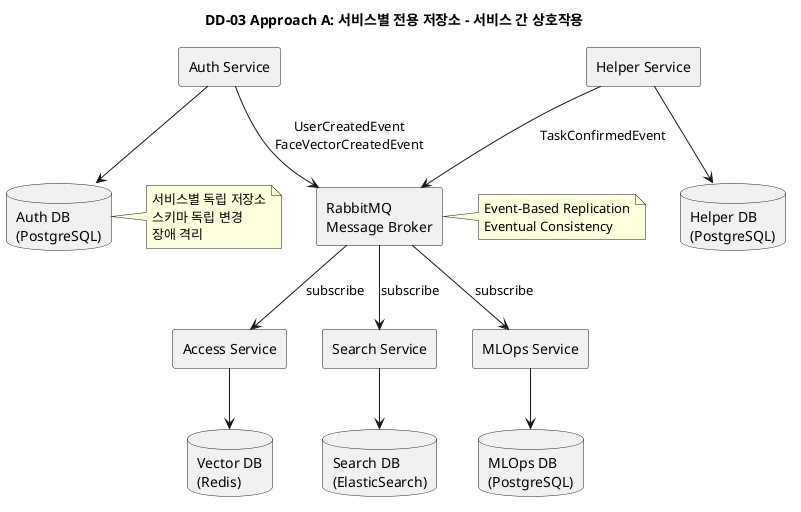
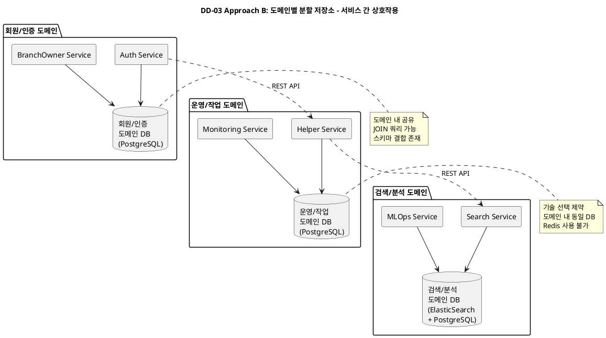
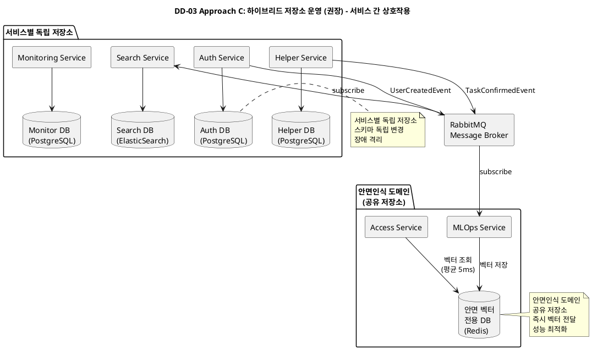

# DD-03: 저장소 구조 설계 결정

## 4.4.3.1. Design Goal

DD-01에서 결정된 4-Layer 분산 마이크로서비스 아키텍처와 DD-02의 Message Broker 기반 비동기 통신은 서비스 간 **느슨한 결합**을 지향한다. 하지만 데이터 저장소가 단일 Shared Repository로 구성될 경우, **데이터 계층에서의 높은 결합도**가 발생하여 MSA의 핵심 이점이 훼손된다.

본 설계 결정은 **QAS-02 (신속한 안면인식 출입 인증)** 요구사항을 충족하기 위해 MSA 아키텍처에서 실시간 안면인증 처리를 지원할 수 있는 데이터 저장소 구조를 정의하는 것을 목표로 한다. 서비스별 독립성과 데이터 일관성·확장성·운영성을 유지하면서, 서비스 간 경계를 지키고 지연과 병목을 최소화하는 저장소 분리 및 연동 방안을 도출한다.

### 4.4.3.1.1. 주요 패턴 및 택틱스 결정

#### 4.4.3.1.1.1 적용된 아키텍처 패턴 및 스타일

| 패턴/스타일 | 분류 (tactics.txt) | 설명 (tactics.txt) | DD-03 적용 |
|:-----------|:------------------|:------------------|:----------|
| **Database per Service** | 특정 설계 영역 패턴 | 각 서비스가 자체 스키마와 저장소를 소유하는 패턴. | 각 서비스가 자체 스키마와 저장소를 소유. 서비스 간 데이터 공유는 API 또는 이벤트 구조로 처리. |
| **Shared Repository (공유 저장소)** | Data Centered | 중앙 집중식 데이터 저장소를 중심으로 모든 소프트웨어 구성 요소가 데이터를 공유하고 조작함. | 접근 방식 비교에서 고려되었으나, MSA의 핵심 이점 훼손으로 인해 미채택. |
| **Event-Based (이벤트 기반)** | Implicit Invocation | 프로시저를 직접 호출하는 대신 이벤트 알림이 다른 모듈의 프로시저 호출을 암묵적으로 유발함. | Event-Based Replication으로 서비스 간 데이터 동기화. |
| **Hybrid Storage** | 특정 설계 영역 패턴 | 일부는 Database per Service, 일부는 도메인별 공유 저장소를 사용하는 하이브리드 방식. | 신속성이 중요한 부분만 도메인으로 분리, 나머지는 서비스별 저장소. |

#### 4.4.3.1.1.2 적용된 아키텍처 택틱

| 택틱 | 분류 (tactics.txt) | 설명 (tactics.txt) | DD-03 적용 | 목표 QA |
|:-----|:------------------|:------------------|:----------|:--------|
| **Restrict Dependencies (의존성 제한)** | 수정 용이성 - 결합도 감소 | 모듈의 가시성 또는 접근을 승인된 모듈로만 제한함 (e.g., 계층화 아키텍처). | 각 서비스가 자신의 데이터 스키마를 독립적으로 변경할 수 있도록 의존성 제한. | QAS-06 |
| **Separate Entities (엔티티 분리)** | 보안 - 공격 방어 | 시스템 내의 다른 엔티티를 물리적/논리적으로 분리함. | 안면 벡터, 계정 정보, 잔고 데이터를 물리적으로 분리하여 보안 침해 시 피해 범위 최소화. | QAS-04 |
| **Use an Intermediary (중개자 사용)** | 수정 용이성 - 결합도 감소 | 중개자를 사용하여 통신 경로를 분리함 (Broker 패턴 등). | Event-Based Replication에서 Message Broker를 중개자로 사용하여 서비스 간 데이터 동기화. | QAS-06 |

#### 4.4.3.1.1.3 패턴 및 택틱 적용 요약

| 영역 | 패턴/택틱스 | 목적 및 적용 근거 |
| :--- | :--- | :--- |
| **기본 구조** | **Database per Service** | 각 서비스가 자신의 데이터 스키마를 독립적으로 변경할 수 있도록 하여 수정 용이성 확보. |
| **수정 용이성** | **Restrict Dependencies, Use an Intermediary** | 서비스 간 데이터 의존성을 제한하고, Event-Based Replication으로 느슨한 결합 달성. |
| **보안** | **Separate Entities** | 민감 정보를 물리적으로 분리하여 보안 침해 시 피해 범위 최소화. |
| **데이터 동기화** | **Event-Based Architecture** | Message Broker를 활용한 Event-Based Replication으로 데이터 일관성 보장. |

---

### Design Goal 상세

본 설계 결정에서 달성하고자 하는 구체적인 목표는 다음과 같다:

| ID | Design Goal | 기반 QA/BG | 설명 |
|:---|:-----------|:----------|:-----|
| **DG-01** | 서비스별 데이터 독립성 확보 | BG-14 (AI 모델 지속 개선), QAS-06 | 각 서비스가 자신의 데이터 스키마를 **독립적으로 변경**할 수 있어야 하며, 다른 서비스에 영향을 주지 않는다. |
| **DG-02** | 데이터 계층 장애 격리 | QAS-01 (99.5% 가용성), BG-11 | 한 서비스의 DB 장애가 다른 서비스의 **핵심 기능(출입 인증)**에 영향을 주지 않도록 격리한다. |
| **DG-03** | 민감 정보 물리적 분리 | QAS-04 (개인정보 보호) | 안면 벡터, 계정 정보, 잔고 데이터를 **물리적으로 분리**하여 보안 침해 시 피해 범위를 최소화한다. |
| **DG-04** | 기술 선택의 자유 | BG-01 (출입 2초 이내), QAS-02 | 서비스별 요구사항에 최적화된 **DB 기술**을 자유롭게 선택한다. (RDBMS, NoSQL, Vector DB 등) |
| **DG-05** | 고성능 데이터 접근 | QAS-02 (3초 이내 인증), QAS-03 | 실시간 출입 인증을 위한 **안면 벡터 조회**는 **10ms 이내** 응답 시간을 보장한다. |

---

## 4.4.3.2. Design Approach List

### 4.4.3.2.1. Design Approach #1: 서비스별 전용 저장소

#### 패턴/전술

**패턴**: Database per Service, Microservice Architecture

**전술**: Restrict Dependencies, Separate Entities

이 방식은 각 서비스가 자체 스키마와 저장소를 독립적으로 소유하는 구조이다. 서비스 간 데이터 공유는 API 호출이나 이벤트 기반 메시지 전달을 통해 처리하며, 직접적인 데이터베이스 접근은 허용하지 않는다. 이는 MSA의 핵심 원칙인 서비스 독립성을 극대화하는 방식이다.

#### 아키텍처 개요

이러한 구조의 장점은 강한 경계와 독립 배포로 장애 격리가 잘되어 안정적인 운영이 가능하다는 것이다. 한 서비스의 데이터 구조 변경이 다른 서비스에 영향을 미치지 않으며, 이를 통해 전체 시스템의 유지보수성과 민첩성이 강화된다. 또한 서비스별로 요구사항에 최적화된 DB 기술을 자유롭게 선택할 수 있다는 점도 큰 매력이다. 예를 들어, 실시간 출입 인증을 위해 Redis 같은 In-Memory DB를 사용하거나, 자연어 검색을 위해 ElasticSearch 같은 전문 검색 엔진을 도입할 수 있다.

그러나 모든 데이터가 단일 DB에 존재하지 않기 때문에, 필연적으로 데이터의 동기화 전략 또한 계속 고민해야 한다. 특히 우리 시스템에서는 안면인식 벡터 DB를 학습 배포하는 MLOps 서비스와 안면인식 출입을 처리하는 Access 서비스와의 데이터 전달을 어떻게 구현해야 할지에 대해서 고민이 많이 되는 지점이다. 또한 서비스 간 데이터 조회가 필요한 경우 JOIN 쿼리를 사용할 수 없어서 API 호출이나 별도의 Read Model을 구축해야 하는 복잡도도 존재한다.

#### 💻 PlantUML 서비스 상호작용 다이어그램

#### 구현 세부사항

**1. 서비스별 독립 저장소 구성**
- Auth Service: PostgreSQL (계정 정보, 안면 벡터 메타데이터)
- Access Service: Redis Vector DB (안면 벡터 실시간 조회)
- Helper Service: PostgreSQL (작업 정보, 보상 잔고)
- Search Service: ElasticSearch (지점 정보, 리뷰 인덱스)
- MLOps Service: PostgreSQL (재학습 데이터)

**2. Event-Based 데이터 동기화**
- `UserCreatedEvent`: Auth → Search (회원 정보 복제)
- `FaceVectorCreatedEvent`: Auth → Access (벡터 캐싱)
- `TaskConfirmedEvent`: Helper → MLOps (재학습 데이터)

**3. 기술 선택의 자유**
- Access Service는 Redis를 사용하여 평균 5ms 응답 시간 달성
- Search Service는 ElasticSearch를 사용하여 자연어 검색 최적화

#### QA 달성 메커니즘

| Design Goal | 달성 메커니즘 | 예시 시나리오 |
|:-----------|:-----------|:------------|
| **DG-01** (독립성) | 각 서비스가 독립 스키마 소유 | MLOps Service 스키마 변경 시 다른 서비스 영향 없음 |
| **DG-02** (장애 격리) | DB 장애가 다른 서비스로 전파 안 됨 | Helper DB 다운 시에도 Access Service 정상 동작 |
| **DG-03** (민감정보 분리) | 물리적 완전 분리 | 안면 벡터 DB 침해 시에도 계정 정보 DB 안전 |
| **DG-04** (기술 선택) | 서비스별 최적 DB 자유 선택 | Access는 Redis, Search는 ElasticSearch |
| **DG-05** (고성능) | Redis Vector DB로 평균 5ms | 실시간 출입 인증 2초 이내 달성 |

#### 장단점 종합

**장점:**
- **(++)** **독립성**: 각 서비스가 스키마를 독립 변경 가능. 예를 들어, 온라인 쇼핑몰에서 주문 DB 테이블 변경 시 회원 서비스는 영향 없음. (DG-01 달성)
- **(++)** **장애 격리**: DB 장애가 다른 서비스로 전파 안 됨. 예를 들어, 은행 대출 시스템 DB 다운 시에도 ATM 출금은 정상 동작. (DG-02 달성)
- **(++)** **기술 최적화**: 서비스별 최적 DB 자유 선택. 예를 들어, 실시간 채팅은 Redis, 주문 내역은 PostgreSQL, 상품 검색은 ElasticSearch. (DG-04 달성)
- **(++)** **고성능**: Redis Vector DB로 평균 5ms 응답. 예를 들어, 게임 캐릭터 정보를 Redis에서 초고속 조회. (DG-05 달성)

**단점:**
- **(--)** **동기화 복잡도**: Event-Based Replication 구현 필요. Eventual Consistency 관리 복잡. 예를 들어, 회원가입 후 검색 서비스에 반영되기까지 1-3초 지연.
- **(-)** **JOIN 불가**: 여러 서비스 데이터 조회 시 API 호출 필요. 성능 저하 가능.

---

### 4.4.3.2.2. Design Approach #2: 도메인별 분할 저장소

#### 패턴/전술

**패턴**: Hybrid Storage, Domain-Driven Design

**전술**: Separate Entities, Restrict Dependencies

이 방식은 서비스별로 완전히 독립된 저장소를 운영하는 것이 아니라, **비즈니스 도메인 단위로 저장소를 묶는 방식**이다. 즉, 유사한 업무 영역을 담당하는 여러 서비스가 하나의 저장소를 공유하되, 도메인 간에는 물리적으로 분리되는 구조이다.

#### 아키텍처 개요

이 방식의 장점은 DA #1(서비스별 전용 저장소)보다는 데이터 동기화 복잡도가 낮고, 도메인 내 서비스 간에는 JOIN 쿼리를 사용할 수 있어서 개발이 단순하다는 점이다. 예를 들어, Auth Service와 BranchOwner Service가 모두 "회원/인증 도메인"에 속한다면, 두 서비스가 동일한 DB를 공유하여 회원 정보와 지점주 정보를 JOIN으로 조회할 수 있다. 또한 도메인별로 물리적 격리가 이루어지므로, 민감한 회원/인증 도메인과 운영/작업 도메인을 분리하여 보안을 강화할 수 있다.

그러나 도메인 내 서비스 간에는 여전히 스키마 결합이 존재한다는 단점이 있다. Auth Service가 users 테이블 스키마를 변경하면 BranchOwner Service도 영향을 받을 수 있다. 또한 도메인 내 모든 서비스가 동일한 DB 기술을 사용해야 하므로, 서비스별 최적화에 제약이 있다. 예를 들어, Access Service가 Redis를 사용하고 싶어도 도메인 내 다른 서비스가 PostgreSQL을 사용하면 기술 선택의 자유가 제한된다.

우리 시스템에 적용해보면, **회원/인증 도메인** (Auth, BranchOwner), **운영/작업 도메인** (Helper, Monitoring), **검색/분석 도메인** (Search, MLOps) 정도로 분할할 수 있을 것이다. 하지만 Access Service의 경우 실시간 출입 인증을 위해 Redis 같은 초고속 DB가 필수인데, 도메인별 묶음으로는 이러한 기술 선택이 어려워질 수 있다.

#### 💻 PlantUML 서비스 상호작용 다이어그램

#### 구현 세부사항

**1. 도메인 분할 기준**
- **회원/인증 도메인**: 사용자 계정, 로그인, 지점주 관리 등 신원 확인 관련 기능
- **운영/작업 도메인**: 헬퍼 작업, 보상 지급, 설비 모니터링 등 지점 운영 관련 기능
- **검색/분석 도메인**: 자연어 검색, 리뷰 인덱싱, AI 모델 재학습 등 데이터 분석 기능

**2. 도메인 내 데이터 공유**
- 도메인 내 서비스 간 JOIN 쿼리 사용 가능
- 예: Auth Service와 BranchOwner Service가 users 테이블과 branches 테이블을 JOIN

**3. 도메인 간 통신**
- REST API를 통한 데이터 조회
- 이벤트 기반 비동기 통신

#### QA 달성 메커니즘

| Design Goal | 달성 메커니즘 | 예시 시나리오 |
|:-----------|:-----------|:------------|
| **DG-01** (독립성) | 도메인 단위 독립 변경 | 회원/인증 도메인 변경 시 운영 도메인 영향 없음 |
| **DG-02** (장애 격리) | 도메인별 장애 격리 | 검색 DB 장애 시 출입 인증 정상 |
| **DG-03** (민감정보 분리) | 도메인 단위 격리 | 회원/인증 도메인만 물리적 분리 |
| **DG-04** (기술 선택) | 도메인 내 동일 기술만 가능 | 회원/인증 도메인은 모두 PostgreSQL |
| **DG-05** (고성능) | 도메인 공유 DB로 평균 50ms | 다른 서비스 부하에 영향받음 |

#### 장단점 종합

**장점:**
- **(++)** **개발 단순성**: 도메인 내 JOIN 쿼리 사용 가능. 예를 들어, 회원 정보와 지점주 정보를 JOIN으로 조회. (DG-01 부분 달성)
- **(+)** **동기화 단순**: 도메인 내 데이터 공유로 동기화 복잡도 감소.
- **(+)** **도메인별 격리**: 도메인 간 물리적 분리로 보안 강화. (DG-03 부분 달성)

**단점:**
- **(--)** **스키마 결합**: 도메인 내 서비스 간 스키마 결합 존재. 예를 들어, Auth 스키마 변경 시 BranchOwner 영향받음. (DG-01 부분 미달성)
- **(--)** **기술 제약**: 도메인 내 동일 DB 기술만 가능. 예를 들어, Access Service가 Redis 사용 불가. (DG-04 미달성)
- **(--)** **성능 저하**: 도메인 공유 DB로 평균 50ms. 실시간 출입 인증 목표 미달성. (DG-05 미달성)

---

### 4.4.3.2.3. Design Approach #3: 하이브리드 저장소 운영 (권장)

#### 패턴/전술

**패턴**: Hybrid Storage, Database per Service, Domain-Driven Design

**전술**: Restrict Dependencies, Separate Entities, Use an Intermediary

이 방식은 신속성이 중요한 부분을 도메인으로 분리하여 해당 부분만 독립적인 저장소를 운영하는 방법이다. 그 외 나머지는 서비스별 저장소 원칙을 지킨다.

#### 아키텍처 개요

본 시스템에서 가장 중요한 성능 요구사항은 **실시간 안면인식 출입 인증 2초 이내** (BG-01)이다. 이를 달성하기 위해서는 Access Service가 Redis Vector DB를 사용하여 평균 5ms 응답 시간을 보장해야 한다. 하지만 MLOps Service와 Access Service 간의 데이터 전달이 이벤트 기반으로 이루어지면, 벡터 동기화 지연이 발생할 수 있다.

하이브리드 저장소 운영 방식은 **안면인식 도메인**만 별도의 공유 저장소로 운영하고, 나머지 서비스는 Database per Service 원칙을 지킨다. 안면인식 도메인에는 MLOps Service와 Access Service가 포함되며, 이들은 **안면 벡터 전용 저장소**를 공유한다. 이렇게 하면 MLOps Service가 학습한 벡터를 Access Service에 즉시 전달할 수 있어 지연을 최소화할 수 있다.

나머지 서비스(Auth, Helper, Search, Monitoring)는 각각 독립적인 저장소를 소유하여 서비스 독립성을 유지한다. 이들은 Event-Based Replication을 통해 필요한 데이터를 동기화한다.

#### 💻 PlantUML 서비스 상호작용 다이어그램

#### 구현 세부사항

**1. 안면인식 도메인 공유 저장소**
- **MLOps Service**: 학습한 안면 벡터를 Redis Vector DB에 직접 저장
- **Access Service**: Redis Vector DB에서 벡터를 직접 조회 (평균 5ms)
- **장점**: 이벤트 기반 동기화 지연 없이 즉시 벡터 전달 가능

**2. 나머지 서비스별 독립 저장소**
- Auth Service: PostgreSQL (계정 정보)
- Helper Service: PostgreSQL (작업 정보, 보상 잔고)
- Search Service: ElasticSearch (지점 정보, 리뷰 인덱스)
- Monitoring Service: PostgreSQL (설비 상태)

**3. Event-Based 데이터 동기화**
- `UserCreatedEvent`: Auth → Search (회원 정보 복제)
- `TaskConfirmedEvent`: Helper → MLOps (재학습 데이터)
- 안면 벡터는 도메인 내 공유 저장소로 동기화 불필요

#### QA 달성 메커니즘

| Design Goal | 달성 메커니즘 | 예시 시나리오 |
|:-----------|:-----------|:------------|
| **DG-01** (독립성) | 대부분 서비스는 독립 저장소, 안면인식 도메인만 공유 | Auth, Helper, Search는 독립 스키마 변경 가능 |
| **DG-02** (장애 격리) | 안면인식 도메인과 다른 서비스 간 장애 격리 | Helper DB 다운 시에도 Access Service 정상 동작 |
| **DG-03** (민감정보 분리) | 안면 벡터는 별도 저장소, 나머지는 서비스별 분리 | 안면 벡터 DB 침해 시에도 계정 정보 DB 안전 |
| **DG-04** (기술 선택) | 안면인식 도메인은 Redis, 나머지는 서비스별 선택 | Access는 Redis, Search는 ElasticSearch |
| **DG-05** (고성능) | Redis Vector DB 직접 접근으로 평균 5ms | 실시간 출입 인증 2초 이내 달성 |

#### 장단점 종합

**장점:**
- **(++)** **성능 최적화**: 안면인식 도메인 공유 저장소로 벡터 전달 지연 최소화. 예를 들어, MLOps가 학습한 벡터를 Access Service에 즉시 전달하여 평균 5ms 응답 시간 달성. (DG-05 달성)
- **(++)** **대부분 독립성 유지**: 나머지 서비스는 Database per Service 원칙 유지. 예를 들어, Auth, Helper, Search는 독립 스키마 변경 가능. (DG-01 부분 달성)
- **(+)** **기술 최적화**: 안면인식 도메인은 Redis, 나머지는 서비스별 최적 DB 선택. (DG-04 달성)
- **(+)** **장애 격리**: 안면인식 도메인과 다른 서비스 간 장애 격리. (DG-02 달성)

**단점:**
- **(-)** **안면인식 도메인 내 결합**: MLOps와 Access 간 스키마 결합 존재. 예를 들어, 벡터 스키마 변경 시 두 서비스 모두 영향받음.
- **(-)** **운영 복잡도**: 일부는 공유 저장소, 일부는 독립 저장소로 운영 복잡도 증가.

---

## 4.4.3.3. Decision and Rationale

**Design Approach #3 (하이브리드 저장소 운영)**를 최종 선택한다.

### 선정 근거 (Pros/Cons 분석)

제시된 세 가지 접근 방식을 Design Goal에 포함된 QA 및 관련 품질 속성 측면에서 비교 분석한다.

| Quality Attribute | Analysis | DA #1: 서비스별 전용 저장소 | DA #2: 도메인별 분할 저장소 | DA #3: 하이브리드 (선택 ✅) |
|:-----------------|:---------|:---------------------------|:---------------------------|:---------------------------|
| **DG-01** (독립성) | Pros | **(++)** 모든 서비스 독립 스키마 | **(+)** 도메인 단위 독립 | **(+)** 대부분 서비스 독립, 안면인식 도메인만 공유 |
| | Cons | 없음 | **(-)** 도메인 내 스키마 결합 | **(-)** 안면인식 도메인 내 결합 |
| **DG-02** (장애 격리) | Pros | **(++)** 완전한 장애 격리 | **(+)** 도메인별 장애 격리 | **(+)** 안면인식 도메인과 다른 서비스 간 격리 |
| | Cons | 없음 | **(-)** 도메인 내 장애 공유 | **(-)** 안면인식 도메인 내 장애 공유 |
| **DG-03** (민감정보 분리) | Pros | **(++)** 물리적 완전 분리 | **(+)** 도메인 단위 격리 | **(+)** 안면 벡터 별도 저장소, 나머지 서비스별 분리 |
| | Cons | 없음 | **(-)** 도메인 내 데이터 공유 | 없음 |
| **DG-04** (기술 선택) | Pros | **(++)** 서비스별 최적 DB 자유 선택 | **(-)** 도메인 내 동일 기술만 가능 | **(+)** 안면인식 도메인은 Redis, 나머지는 서비스별 선택 |
| | Cons | 없음 | **(--)** Access Service Redis 사용 불가 | 없음 |
| **DG-05** (고성능) | Pros | **(+)** Redis Vector DB 평균 5ms | **(-)** 도메인 공유 DB 평균 50ms | **(++)** Redis 직접 접근 평균 5ms, 동기화 지연 없음 |
| | Cons | **(-)** 이벤트 동기화 지연 가능 | **(--)** 실시간 출입 인증 목표 미달성 | 없음 |
| **BG-01** (출입 2초 이내) | Pros | **(+)** Redis 사용 가능 | **(--)** Redis 사용 불가 | **(++)** Redis 직접 접근으로 즉시 벡터 전달 |
| | Cons | **(-)** 벡터 동기화 지연 위험 | **(--)** 성능 목표 미달성 | 없음 |

### 종합 결론

1. **DG-05와 BG-01 (고성능 및 출입 2초 이내)**: 우리 시스템에서 가장 중요한 요구사항은 **실시간 안면인식 출입 인증 2초 이내** (BG-01)이다. DA #3은 안면인식 도메인을 공유 저장소로 운영하여 MLOps가 학습한 벡터를 Access Service에 즉시 전달할 수 있어, 이벤트 동기화 지연 없이 평균 5ms 응답 시간을 달성한다. DA #1은 이벤트 기반 동기화로 인해 벡터 전달 지연이 발생할 수 있고, DA #2는 Redis 사용이 불가하여 성능 목표를 달성할 수 없다.

2. **DG-01 (독립성)**: DA #3은 대부분의 서비스(Auth, Helper, Search, Monitoring)가 독립 저장소를 소유하므로 서비스 독립성을 유지한다. 안면인식 도메인만 공유 저장소를 사용하지만, 이는 성능 요구사항을 달성하기 위한 필수적인 트레이드오프이다. DA #1은 완전한 독립성을 제공하나 성능 지연 위험이 있고, DA #2는 도메인 내 스키마 결합이 존재한다.

3. **DG-04 (기술 선택)**: DA #3은 안면인식 도메인은 Redis를 사용하고, 나머지 서비스는 각각 최적의 DB 기술을 선택할 수 있다. DA #1도 기술 선택의 자유가 있으나 동기화 지연 위험이 있고, DA #2는 도메인 내 동일 기술만 가능하여 Redis 사용이 불가하다.

4. **DG-02 (장애 격리)**: DA #3은 안면인식 도메인과 다른 서비스 간 장애 격리가 가능하다. Helper DB 다운 시에도 Access Service는 정상 동작한다. DA #1은 완전한 장애 격리를 제공하나, DA #2는 도메인 내 장애 공유 위험이 있다.

5. **운영 복잡도**: DA #3은 일부는 공유 저장소, 일부는 독립 저장소로 운영 복잡도가 약간 증가하지만, 성능 목표 달성을 위한 필수적인 복잡도이다. DA #1은 동기화 복잡도가 높고, DA #2는 도메인 관리 복잡도가 있다.

**따라서, DA #3 (하이브리드 저장소 운영)을 선택하여 성능 목표를 달성하면서도 대부분의 서비스 독립성을 유지한다.** 안면인식 도메인만 공유 저장소를 사용하는 것은 실시간 출입 인증 2초 이내라는 핵심 요구사항을 달성하기 위한 최적의 트레이드오프이다.

---

## 4.4.3.4. 구현 후 검증 계획

| 검증 항목 | 방법 | 목표 | 도구 |
|:---------|:-----|:-----|:-----|
| **독립 배포** | Helper Service 스키마 변경 후 다른 서비스 재배포 없이 동작 확인 | 재배포 불필요 | CI/CD 파이프라인 |
| **장애 격리** | Helper DB 강제 종료 후 Access Service 출입 인증 정상 동작 확인 | 99.5% 가용성 유지 | DB 모니터링, APM |
| **벡터 전달 성능** | MLOps가 벡터 저장 후 Access Service 조회 시간 측정 | 평균 5ms 이내 | Redis 모니터링, APM |
| **데이터 동기화** | Auth Service에서 회원가입 후 Search Service DB에 1초 이내 반영 확인 | 1초 이내 동기화 | RabbitMQ 모니터링, DB 쿼리 |
| **보안** | 안면 벡터 DB 침해 시뮬레이션 후 계정 정보 DB 접근 불가 확인 | 물리적 격리 검증 | 침투 테스트 |

---

## 참고 자료

- **QAS-02**: 신속한 안면인식 출입 인증 (3초 이내)
- **BG-01**: 출입 소요시간 95% 2초 이내
- **DD-02**: 노드간 비동기 통신 구조 설계 결정 (Message Broker 활용)
- **Martin Fowler, "Microservices Resource Guide"**: https://martinfowler.com/microservices/
- **Chris Richardson, "Microservices Patterns"**: Chapter 4 (Managing transactions with sagas)
