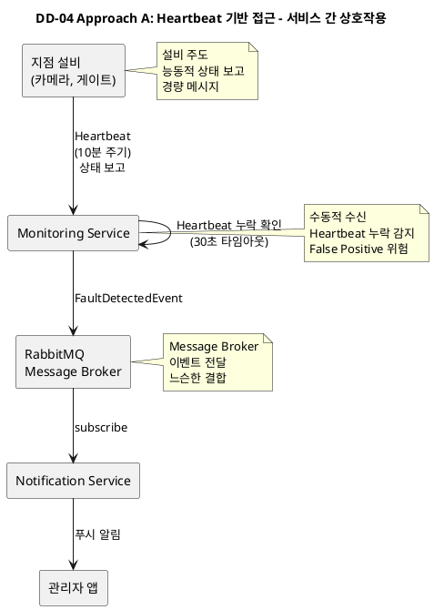
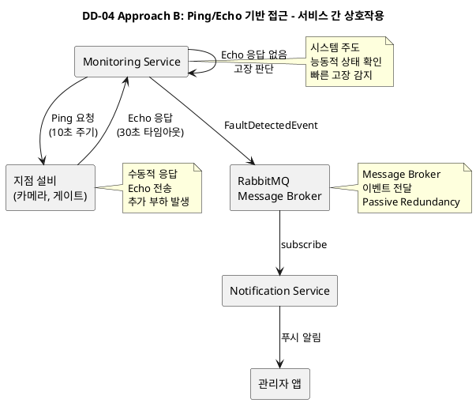
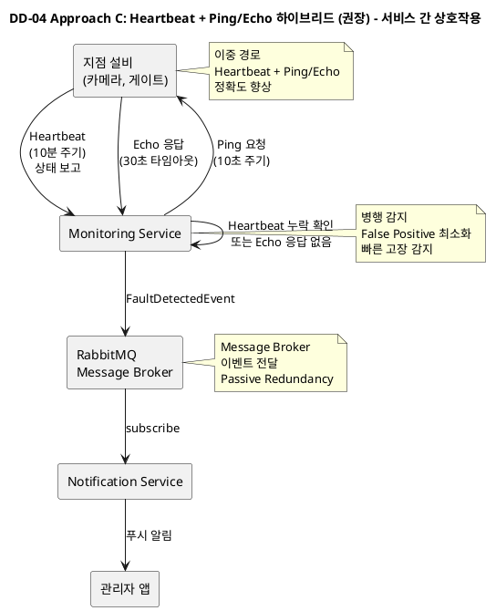

# DD-04: 고장 감지 및 실시간 알림 체계 구조 설계 결정

## 4.4.4.1. Design Goal

본 설계 결정은 **QAS-01 (설비 고장 감지 및 실시간 알림)** 요구사항을 충족하기 위해 카메라·게이트 등 지점 설비의 고장을 자동 감지하고 관리자에게 즉시 전파하는 장애 인지·알림 체계를 정의하는 것을 목표로 한다. 24×7 무인 운영 환경에서 고장 포착부터 관리자 앱 알림 도달까지의 지연을 **P95 15초, P99 30초 이하**로 유지할 수 있는 구조를 지향한다.

### 4.4.4.1.1. 주요 패턴 및 택틱스 결정

#### 4.4.4.1.1.1 적용된 아키텍처 패턴 및 스타일

| 패턴/스타일 | 분류 (tactics.txt) | 설명 (tactics.txt) | DD-04 적용 |
|:-----------|:------------------|:------------------|:----------|
| **Process Control (프로세스 제어)** | Data Flow | 데이터 흐름이 연속적인 변환 과정을 거치며, 제어 로직이 데이터 처리 흐름을 관리함. | 고장 감지 프로세스가 설비 상태를 지속적으로 모니터링하고 제어함. |
| **Message Based (메시지 기반)** | Implicit Invocation | 메시지 생산자와 소비자가 버퍼(메시지 큐 또는 Pub/Sub 커넥터)를 통해 비동기적으로 연결됨. | 고장 감지 이벤트를 Message Broker를 통해 알림 Consumer로 전달. |

#### 4.4.4.1.1.2 적용된 아키텍처 택틱

| 택틱 | 분류 (tactics.txt) | 설명 (tactics.txt) | DD-04 적용 | 목표 QA |
|:-----|:------------------|:------------------|:----------|:--------|
| **Heartbeat (하트비트)** | 가용성 - 결함 감지 | 한 구성 요소가 주기적으로 I'm alive(살아있음) 메시지를 보냄. | 지점 설비가 10분 주기로 Monitoring Service에 상태 보고. | QAS-01 |
| **Ping/echo (핑/에코)** | 가용성 - 결함 감지 | 한 구성 요소가 Ping을 발행하고 Echo를 받아 생존 상태를 확인함. | Monitoring Service가 10초 주기로 설비에 Ping 요청, 30초 타임아웃 내 Echo 확인. | QAS-01 |
| **Passive Redundancy (Warm Spare)** | 가용성 - 결함 복구 | 활성 구성 요소가 이벤트를 처리하고 상태 업데이트를 예비 구성 요소에 주기적으로 알림. | Message Broker의 Durable Queue로 고장 이벤트 보존, 알림 실패 시 재시도 가능. | QAS-05 |
| **Use an Intermediary (중개자 사용)** | 수정 용이성 - 결합도 감소 | 중개자를 사용하여 통신 경로를 분리함 (Broker 패턴 등). | Message Broker를 통해 Monitoring Service와 Notification Service 간 느슨한 결합. | QAS-06 |
| **Maintain Audit Trail (감사 추적 유지)** | 보안 - 공격 복구 | 보안 관련 활동에 대한 시간 순서 기록(Audit Log)을 유지하여 추후 분석에 활용함. | 모든 고장 감지 및 알림 발송 이벤트를 Audit Log로 기록. | QAS-04 |

#### 4.4.4.1.1.3 패턴 및 택틱 적용 요약

| 영역 | 패턴/택틱스 | 목적 및 적용 근거 |
| :--- | :--- | :--- |
| **기본 구조** | **Process Control + Message Based** | 고장 감지 프로세스 제어와 메시지 기반 알림 전달 구조. |
| **결함 감지** | **Heartbeat, Ping/echo** | 이중 경로로 고장을 빠르고 정확하게 감지. |
| **가용성** | **Passive Redundancy** | Message Broker를 통한 메시지 보존으로 알림 실패 시 재시도 가능. |
| **수정 용이성** | **Use an Intermediary** | Message Broker를 중개자로 사용하여 느슨한 결합 달성. |
| **보안** | **Maintain Audit Trail** | 고장 감지 및 알림 이벤트의 감사 추적. |

---

### Design Goal 상세

본 설계 결정에서 달성하고자 하는 구체적인 목표는 다음과 같다:

| ID | Design Goal | 관련 QAS/BG | 상세 설명 |
|:---|:-----------|:-----------|:---------|
| **DG-01** | 고장 감지 정확도 | QAS-01 | 네트워크 지연으로 인한 False Positive를 최소화하여 실제 고장만을 정확하게 감지한다. |
| **DG-02** | 실시간 알림 전달 | QAS-01, BG-06 | 고장 감지부터 관리자 앱 알림 도달까지 P95 15초, P99 30초 이내를 달성한다. |
| **DG-03** | 시스템 부하 최소화 | QAS-02, QAS-03 | 고장 감지 프로세스가 다른 핵심 기능(출입 인증, 검색)의 성능에 영향을 주지 않도록 한다. |
| **DG-04** | 운영 복잡도 관리 | QAS-06 | 고장 감지 설정 변경 시 시스템 전반에 걸친 복잡한 재배포가 불필요하도록 한다. |
| **DG-05** | 장애 격리 | QAS-05, BG-11 | 설비 고장이나 Monitoring Service 장애가 다른 서비스에 영향을 주지 않도록 격리한다. |

---

## 4.4.4.2. Design Approach List

### 4.4.4.2.1. Design Approach #1: Heartbeat 기반 접근

#### 패턴/전술

**패턴**: Process Control, Implicit Invocation

**전술**: Heartbeat

이 방식은 각 지점 설비가 주기적으로 자신의 생존 상태와 요약된 건강 정보를 전송하는 Heartbeat 기반 감지 방식이다.

#### 아키텍처 개요

설비는 설정된 주기(예: 10분)에 맞추어 "정상" 또는 "고장"과 같은 상태를 Monitoring Service에 보고하며, Monitoring Service는 가장 최근 Heartbeat의 타임스탬프와 상태 코드를 통해 설비가 정상 범위 내에서 동작하고 있는지 여부를 지속적으로 평가한다.

설비가 일정 시간 동안 Heartbeat를 전송하지 않으면, Monitoring Service는 해당 설비를 고장으로 간주하고 관리자에게 알림을 발송한다. 이 접근은 설비가 평상시에는 경량의 보고만 수행함으로써 불필요한 네트워크와 CPU 부하를 야기하지 않으며, 전원 차단이나 네트워크 단절과 같이 설비가 아예 응답하지 못하는 유형의 장애를 빠르게 드러낸다는 장점이 있다.

#### 💻 PlantUML 서비스 상호작용 다이어그램

#### 구현 세부사항

**1. Heartbeat 메시지 구조**
- 설비 ID, 타임스탬프, 상태 코드(정상/고장), 건강 정보(CPU 사용률, 메모리 사용률 등)
- 평균 메시지 크기: 200 bytes 이하

**2. Monitoring Service 처리**
- 최근 Heartbeat 타임스탬프를 메모리 캐시에 저장
- 30초 이내 Heartbeat가 없으면 고장으로 판단
- 고장 감지 시 `FaultDetectedEvent`를 Message Broker에 발행

**3. 알림 발송**
- Notification Service가 `FaultDetectedEvent`를 구독
- 관리자 앱으로 푸시 알림 전송

#### QA 달성 메커니즘

| Design Goal | 달성 메커니즘 | 예시 시나리오 |
|:-----------|:-----------|:------------|
| **DG-01** (정확도) | Heartbeat 주기와 타임아웃 조정으로 False Positive 최소화 | 네트워크 지연 시 타임아웃을 30초로 설정하여 일시적 지연과 실제 고장 구분 |
| **DG-02** (실시간 알림) | Heartbeat 누락 즉시 감지하여 알림 발송 | 설비 전원 차단 시 30초 이내 고장 감지, 15초 이내 알림 도달 |
| **DG-03** (부하 최소화) | 경량 Heartbeat 메시지로 네트워크 부하 최소화 | 100개 설비가 10분 주기로 Heartbeat 전송 시 평균 0.17 TPS |
| **DG-04** (운영 복잡도) | 설비별 Heartbeat 주기 설정 가능 | 중요한 설비는 5분, 일반 설비는 10분 주기로 설정 |

#### 장단점 종합

**장점:**
- **(++)** **부하 최소화**: 설비가 경량 메시지만 전송하므로 네트워크 및 CPU 부하가 낮다. 예를 들어, 100개 설비가 10분 주기로 Heartbeat를 전송하면 평균 0.17 TPS로 매우 낮은 부하이다. (DG-03 달성)
- **(+)** **구조 단순**: Monitoring Service는 Heartbeat를 수신하기만 하면 되어 구현이 단순하다.
- **(+)** **유연한 설정**: 설비별 Heartbeat 주기를 유연하게 설정할 수 있어, 중요한 설비는 짧은 주기로, 일반 설비는 긴 주기로 구성 가능하다.

**단점:**
- **(--)** **False Positive 위험**: 일시적 네트워크 지연으로 인해 Heartbeat가 누락된 경우, 이를 실제 고장으로 오인할 수 있다. 예를 들어, 네트워크가 35초 동안 일시적으로 불안정하면 실제로는 정상인 설비를 고장으로 판단한다. (DG-01 미달성)
- **(-)** **운영 복잡도**: Heartbeat 주기를 변경할 경우, 설비와 Monitoring Service 양쪽 모두 설정을 수정해야 하므로 운영 복잡성이 증가한다. (DG-04 부분 미달성)
- **(-)** **감지 지연**: Heartbeat 주기가 길 경우(예: 10분), 고장 감지 시간이 늦어질 수 있다. 예를 들어, Heartbeat 직후 고장이 발생하면 최대 10분 후에야 감지된다. (DG-02 위험)

---

### 4.4.4.2.2. Design Approach #2: Ping/Echo 기반 접근

#### 패턴/전술

**패턴**: Process Control, Implicit Invocation

**전술**: Ping/Echo, Passive Redundancy

이 방식은 중앙 스케줄러가 주기적으로 Monitoring Service를 트리거하여 설비에 Ping 요청을 능동적으로 발송하고, 이에 대한 Echo 응답을 관찰함으로써 설비의 실시간 상태를 직접 확인하는 방식이다.

#### 아키텍처 개요

Monitoring Service는 설정된 주기(예: 10초)마다 설비에 Ping을 전송하고, 설정된 타임아웃(예: 30초) 내에 Echo 응답이 없으면 해당 설비를 고장으로 간주한다.

이 접근은 Heartbeat가 누락된 경우에도 설비가 실제로 동작 불능 상태인지, 혹은 단순 네트워크 지연인지 확인할 수 있다는 장점이 있다. Monitoring Service가 능동적으로 설비 상태를 확인하므로, 설비의 Heartbeat 전송 실패를 즉시 감지할 수 있다. 또한 Ping 주기를 중앙에서 유연하게 조정할 수 있어, 중요한 설비는 짧은 주기로, 일반 설비는 긴 주기로 확인하도록 구성할 수 있다.

#### 💻 PlantUML 서비스 상호작용 다이어그램

#### 구현 세부사항

**1. Ping/Echo 프로토콜**
- Monitoring Service가 10초 주기로 모든 설비에 Ping 요청
- 설비는 Ping 수신 시 즉시 Echo 응답
- 타임아웃: 30초 (Echo 응답 대기 시간)

**2. 고장 감지 로직**
- 30초 타임아웃 내 Echo 응답이 없으면 고장으로 판단
- 고장 감지 시 `FaultDetectedEvent`를 Message Broker에 발행

**3. 부하 분산**
- 설비 수가 많을 경우 Ping 요청을 시간대별로 분산하여 순간 부하 최소화
- 예: 100개 설비를 10개 그룹으로 나누어 순차적으로 Ping

#### QA 달성 메커니즘

| Design Goal | 달성 메커니즘 | 예시 시나리오 |
|:-----------|:-----------|:------------|
| **DG-01** (정확도) | Ping/Echo로 실제 고장 여부 확인 | 네트워크 지연 시에도 Ping으로 실제 응답 가능 여부 확인하여 False Positive 최소화 |
| **DG-02** (실시간 알림) | 10초 주기 Ping으로 빠른 고장 감지 | 설비 고장 시 최대 10초 + 30초 = 40초 이내 고장 감지, 15초 이내 알림 도달 |
| **DG-03** (부하 최소화) | Ping 요청 분산으로 순간 부하 최소화 | 100개 설비를 10개 그룹으로 나누어 순차 Ping으로 부하 분산 |
| **DG-04** (운영 복잡도) | 중앙에서 Ping 주기 조정 가능 | Monitoring Service 설정만 변경하여 모든 설비의 Ping 주기 조정 |

#### 장단점 종합

**장점:**
- **(++)** **빠른 고장 감지**: 10초 주기 Ping으로 최대 40초 이내 고장 감지 가능. 예를 들어, 설비가 고장나면 다음 Ping 주기(최대 10초) + 타임아웃(30초) 내에 감지된다. (DG-02 달성)
- **(++)** **정확도 향상**: Ping/Echo로 실제 고장 여부를 확인할 수 있어 False Positive를 최소화한다. 예를 들어, 네트워크 지연으로 Heartbeat가 누락되어도 Ping으로 실제 응답 가능 여부를 확인할 수 있다. (DG-01 달성)
- **(+)** **중앙 제어**: Ping 주기를 중앙에서 유연하게 조정할 수 있어 운영이 편리하다. (DG-04 달성)

**단점:**
- **(--)** **네트워크 부하**: Ping이 본질적으로 설비에 추가 요청을 전송하므로 일정 수준의 네트워크 및 CPU 부하가 발생한다. 예를 들어, 100개 설비에 10초 주기로 Ping을 전송하면 초당 10 TPS의 부하가 발생한다. (DG-03 위험)
- **(-)** **Monitoring Service 부하**: 설비 수가 많을 경우 동시 Ping으로 인한 순간 부하가 증가할 위험이 있으며, Monitoring Service의 CPU 사용률이 높아진다.
- **(-)** **타임아웃 오인**: 네트워크 지연으로 인해 Echo 응답이 타임아웃을 초과하는 경우, 이를 고장으로 오인할 수 있다.

---

### 4.4.4.2.3. Design Approach #3: Heartbeat + Ping/Echo 하이브리드 (권장)

#### 패턴/전술

**패턴**: Process Control, Message Based

**전술**: Heartbeat, Ping/Echo, Passive Redundancy, Use an Intermediary

이 방식은 Heartbeat와 Ping/Echo를 결합하여 두 접근 방식의 장점을 모두 활용하는 하이브리드 구조이다.

#### 아키텍처 개요

고장 감지는 **두 경로**로 병행 수행되며, 중앙 제어는 **MONITOR Service**가 담당한다.

**경로 A – Heartbeat 기반**: 설비가 정기적으로 MONITOR Service에 정상/고장 상태를 보고한다. 정상 시 기록만 저장하고, 고장 보고 시 'Fault Detected' 이벤트를 발행한다.

**경로 B – Ping / Echo 기반**: 타이머가 10초 간격으로 MONITOR Service를 트리거한다. 최근 보고 기록이 30초 이내인지 점검하고, 누락 설비를 식별한다. 해당 설비에 Ping을 발송하여 응답이 없을 경우 'Fault Detected' 이벤트를 생성한다.

**알림 발송 단계**: MONITOR Service가 메시지 브로커에 고장 이벤트를 발행한다. 알림 Consumer가 이벤트를 구독하여 관리자 앱으로 푸시 알림을 전송한다.

#### 💻 PlantUML 서비스 상호작용 다이어그램

#### 구현 세부사항

**1. 이중 감지 경로**

**경로 A (Heartbeat)**:
- 설비가 10분 주기로 상태 보고
- 정상 시: 기록만 저장
- 고장 보고 시: 즉시 `FaultDetectedEvent` 발행

**경로 B (Ping/Echo)**:
- 타이머가 10초 간격으로 Monitoring Service 트리거
- 최근 Heartbeat 기록이 30초 이내인지 점검
- 30초 이내 기록이 없는 설비에 Ping 발송
- 30초 타임아웃 내 Echo 응답 없으면 `FaultDetectedEvent` 발행

**2. 고장 판단 로직**
- Heartbeat에서 고장 보고 수신 시 즉시 고장 판단
- Heartbeat 누락 + Ping/Echo 실패 시 고장 판단
- 단순 Heartbeat 누락만으로는 고장 판단하지 않음 (False Positive 방지)

**3. 알림 발송**
- `FaultDetectedEvent`를 Message Broker에 발행
- Notification Service가 구독하여 관리자 앱으로 푸시 알림
- Message Broker의 Durable Queue로 알림 실패 시 재시도 가능

#### QA 달성 메커니즘

| Design Goal | 달성 메커니즘 | 예시 시나리오 |
|:-----------|:-----------|:------------|
| **DG-01** (정확도) | 이중 경로로 False Positive 최소화 | Heartbeat 누락 시 Ping/Echo로 실제 고장 여부 확인하여 오인 방지 |
| **DG-02** (실시간 알림) | 10초 주기 Ping으로 빠른 감지, Heartbeat로 즉시 감지 | 설비 고장 시 최대 10초 + 30초 = 40초 이내 감지, 15초 이내 알림 도달 |
| **DG-03** (부하 최소화) | Heartbeat로 평상시 부하 최소화, Ping은 보조적 | 평상시 Heartbeat만으로 부하 최소화, Ping은 Heartbeat 누락 시에만 사용 |
| **DG-04** (운영 복잡도) | 중앙에서 Ping 주기 조정, Heartbeat는 설비별 설정 | Monitoring Service 설정만 변경하여 Ping 주기 조정 가능 |
| **DG-05** (장애 격리) | Message Broker를 통한 느슨한 결합 | Monitoring Service 장애 시에도 Message Broker에 이벤트 보존 |

#### 장단점 종합

**장점:**
- **(++)** **정확도 향상**: 이중 경로로 False Positive를 최소화한다. 예를 들어, 네트워크 지연으로 Heartbeat가 누락되어도 Ping/Echo로 실제 고장 여부를 확인할 수 있다. (DG-01 달성)
- **(++)** **빠른 고장 감지**: 10초 주기 Ping으로 최대 40초 이내 고장 감지 가능. Heartbeat에서 고장 보고 시 즉시 감지. (DG-02 달성)
- **(+)** **부하 최소화**: 평상시 Heartbeat만으로 부하를 최소화하고, Ping은 Heartbeat 누락 시에만 사용하여 부하를 절감한다. (DG-03 달성)
- **(+)** **운영 유연성**: 중앙에서 Ping 주기를 조정할 수 있고, Heartbeat는 설비별로 설정 가능하다. (DG-04 달성)
- **(+)** **장애 격리**: Message Broker를 통한 느슨한 결합으로 Monitoring Service 장애 시에도 이벤트가 보존된다. (DG-05 달성)

**단점:**
- **(-)** **구현 복잡도**: 두 경로를 병행 처리해야 하므로 구현 복잡도가 증가한다.
- **(-)** **설정 관리**: Heartbeat와 Ping/Echo 두 가지 설정을 관리해야 하므로 운영 복잡도가 약간 증가한다.

---

## 4.4.4.3. Decision and Rationale

**Design Approach #3 (Heartbeat + Ping/Echo 하이브리드)**를 최종 선택한다.

### 선정 근거 (Pros/Cons 분석)

제시된 세 가지 접근 방식을 Design Goal에 포함된 QA 및 관련 품질 속성 측면에서 비교 분석한다.

| Quality Attribute | Analysis | DA #1: Heartbeat 기반 | DA #2: Ping/Echo 기반 | DA #3: 하이브리드 (선택 ✅) |
|:-----------------|:---------|:------------------------|:------------------------|:---------------------------|
| **DG-01** (정확도) | Pros | **(+)** 경량 메시지로 부하 낮음 | **(++)** Ping/Echo로 실제 고장 확인 | **(++)** 이중 경로로 False Positive 최소화 |
| | Cons | **(--)** 네트워크 지연 시 False Positive | **(-)** 타임아웃 오인 가능 | 없음 |
| **DG-02** (실시간 알림) | Pros | **(+)** Heartbeat 누락 즉시 감지 | **(++)** 10초 주기로 빠른 감지 | **(++)** 10초 주기 Ping + 즉시 Heartbeat 감지 |
| | Cons | **(-)** Heartbeat 주기 길면 감지 지연 | 없음 | 없음 |
| **DG-03** (부하 최소화) | Pros | **(++)** 경량 Heartbeat로 부하 최소 | **(-)** Ping 요청으로 부하 발생 | **(+)** 평상시 Heartbeat, 필요 시 Ping |
| | Cons | 없음 | **(--)** 100개 설비 시 10 TPS 부하 | **(-)** 두 경로 병행으로 약간 증가 |
| **DG-04** (운영 복잡도) | Pros | **(+)** 구조 단순 | **(++)** 중앙에서 Ping 주기 조정 | **(+)** 중앙 제어 + 설비별 설정 |
| | Cons | **(-)** 설비와 서비스 양쪽 설정 변경 | 없음 | **(-)** 두 가지 설정 관리 |
| **DG-05** (장애 격리) | Pros | **(+)** Message Broker 활용 | **(+)** Message Broker 활용 | **(++)** Message Broker로 완전 격리 |
| | Cons | 없음 | 없음 | 없음 |
| **QAS-01** (P95 15초) | Pros | **(+)** Heartbeat 누락 즉시 감지 | **(++)** 10초 주기로 빠른 감지 | **(++)** 이중 경로로 빠른 감지 |
| | Cons | **(-)** Heartbeat 주기 길면 지연 | 없음 | 없음 |

### 종합 결론

1. **DG-01 (정확도)**: DA #3의 이중 경로 구조가 False Positive를 최소화한다. 예를 들어, 네트워크 지연으로 Heartbeat가 누락되어도 Ping/Echo로 실제 고장 여부를 확인할 수 있어 오인을 방지한다. DA #1은 네트워크 지연 시 False Positive 위험이 있고, DA #2는 타임아웃 오인 가능성이 있다.

2. **DG-02 (실시간 알림)**: DA #3은 10초 주기 Ping으로 최대 40초 이내 고장 감지가 가능하고, Heartbeat에서 고장 보고 시 즉시 감지할 수 있어 P95 15초 목표를 달성한다. DA #1은 Heartbeat 주기가 길면 감지 지연이 발생하고, DA #2는 빠른 감지가 가능하나 False Positive 위험이 있다.

3. **DG-03 (부하 최소화)**: DA #3은 평상시 Heartbeat만으로 부하를 최소화하고, Ping은 Heartbeat 누락 시에만 사용하여 부하를 절감한다. DA #1은 부하가 가장 낮지만 감지 지연이 있고, DA #2는 부하가 높다.

4. **DG-04 (운영 복잡도)**: DA #3은 중앙에서 Ping 주기를 조정할 수 있고, Heartbeat는 설비별로 설정 가능하여 운영 유연성이 높다. DA #1은 설비와 서비스 양쪽 설정 변경이 필요하고, DA #2는 중앙 제어가 가능하다.

5. **DG-05 (장애 격리)**: 세 접근 방식 모두 Message Broker를 활용하나, DA #3은 이중 경로로 더욱 견고한 장애 격리를 제공한다.

**따라서, DA #3 (Heartbeat + Ping/Echo 하이브리드)을 선택하여 정확도, 실시간성, 부하 최소화의 최적 균형을 달성한다.**

---

## 4.4.4.4. 구현 후 검증 계획

| 검증 항목 | 방법 | 목표 | 도구 |
|:---------|:-----|:-----|:-----|
| **고장 감지 정확도** | 네트워크 지연 시뮬레이션 후 False Positive 발생률 측정 | False Positive 5% 이하 | 네트워크 시뮬레이터, 모니터링 대시보드 |
| **실시간 알림** | 설비 고장 시뮬레이션 후 알림 도달 시간 측정 | P95 ≤ 15초, P99 ≤ 30초 | APM, 알림 로그 |
| **시스템 부하** | 100개 설비 환경에서 Heartbeat + Ping 부하 측정 | 평균 CPU 사용률 5% 이하 | 시스템 모니터링, 부하 테스트 |
| **장애 격리** | Monitoring Service 강제 종료 후 다른 서비스 영향 확인 | 다른 서비스 정상 동작 | Chaos Engineering |

---

## 참고 자료

- **QAS-01**: 설비 고장 감지 및 실시간 알림 (P95 15초, P99 30초)
- **BG-06**: 실시간 알림 (15초 이내 알림)
- **DD-02**: 노드간 비동기 통신 구조 설계 결정 (Message Broker 활용)
- **Len Bass et al., "Software Architecture in Practice (4th ed.)"**: Chapter 8 (Availability)
