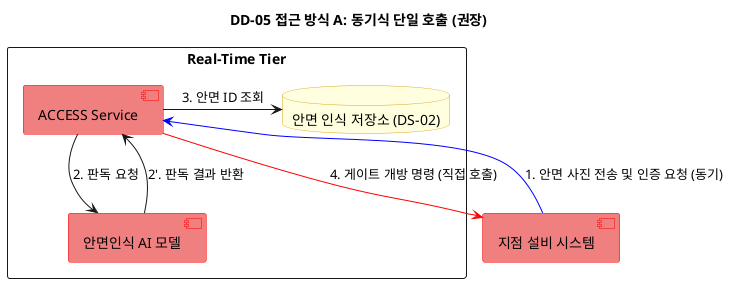
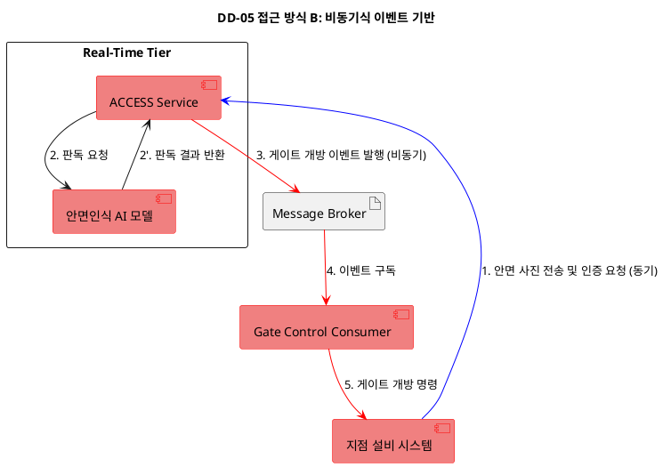
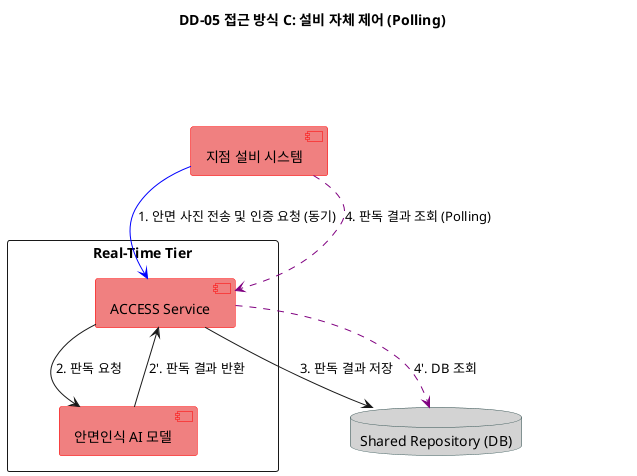
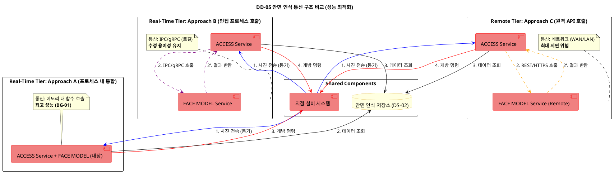
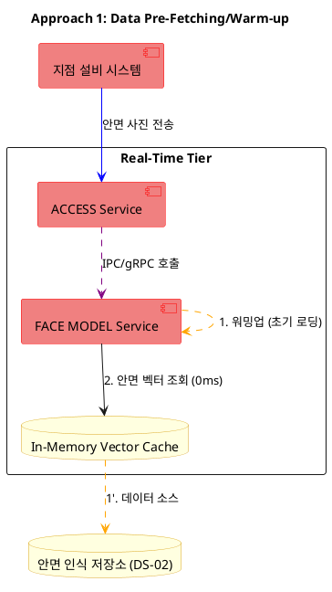
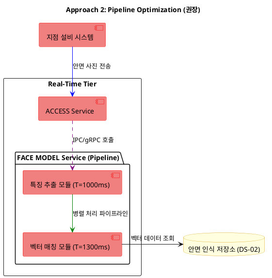
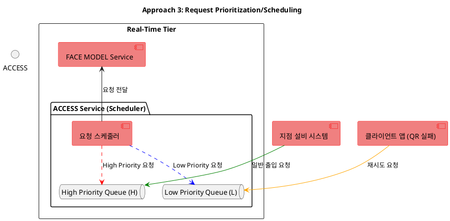

네, DD-04의 권장안을 적용하는 것으로 확정하겠습니다.

이제 **DD-05 안면 인식 판독 후 게이트 개방 구조 설계**를 검토하겠습니다. 이 설계 결정은 **Real-Time Tier**의 핵심 기능이며, **신속하고 정확한 안면인식 출입 인증 (QAS-02)** 및 **출입 소요시간 95% 2초 이내 (BG-01)** 목표 달성에 직접적으로 영향을 미칩니다.

세 가지 디자인 접근 방식을 제시하고 비교 검토하겠습니다.

-----

## 🏗️ DD-05 안면 인식 판독 후 게이트 개방 구조 설계

이 기능은 **UC-07 안면인식 출입 인증**을 담당하며, \*\*Performance (성능)\*\*와 **Availability (가용성)** 품질 속성이 가장 중요합니다.

### 1. 주요 패턴 및 택틱스 결정

#### 1.1 적용된 아키텍처 패턴 및 스타일

| 패턴/스타일 | 분류 (tactics.txt) | 설명 (tactics.txt) | DD-05 적용 |
|:-----------|:------------------|:------------------|:----------|
| **Process Control (프로세스 제어)** | Data Flow | 환경 변수를 제어하기 위한 루프 구조(폐쇄 루프 제어)를 사용하며, 안정적인 수준에서 출력을 유지해야 하는 시스템에 적합함. | ACCESS Service가 '감지(판독)'부터 '제어(개방)'까지 단일 책임을 가지는 폐쇄 루프 구조. |
| **Client-Server (클라이언트-서버)** | Distributed | 시스템을 클라이언트(요청자)와 서버(서비스 제공자)의 두 프로그램으로 분리함. | 지점 설비(클라이언트)가 ACCESS Service(서버)에 안면 사진을 전송하고 게이트 개방 명령을 수신. |
| **Message Based (메시지 기반)** | Implicit Invocation | 메시지 생산자와 소비자가 버퍼(메시지 큐 또는 Pub/Sub 커넥터)를 통해 비동기적으로 연결됨. | 접근 방식 B에서 고려되었으나, 성능 목표 달성을 위해 채택되지 않음. |

#### 1.2 적용된 아키텍처 택틱

| 택틱 | 분류 (tactics.txt) | 설명 (tactics.txt) | DD-05 적용 | 목표 QA |
|:-----|:------------------|:------------------|:----------|:--------|
| **Introduce Concurrency (동시성 도입)** | 성능 - 자원 관리 | 병렬 처리를 통해 성능을 향상시킴 (e.g., Active Object 패턴). | ACCESS Service와 FACE_MODEL Service에 병렬 처리 적용하여 초당 20건의 동시 요청(20 TPS) 처리. Pipeline Optimization에서 특징 추출과 벡터 매칭을 병렬 파이프라인으로 처리. | QAS-02, BG-01 |
| **Active Redundancy (Hot Spare)** | 가용성 - 결함 복구 | 활성 구성 요소가 이벤트를 처리하고 상태 변경을 모든 예비 구성 요소에 동기적으로 알림. | ACCESS Service에 Active Redundancy 적용하여 고가용성 보장. | QAS-05 |
| **Increase Available Resources (자원 증가)** | 성능 - 자원 관리 | 더 많은 자원(e.g., 하드웨어)을 추가하여 성능을 향상시킴. | Data Pre-Fetching 접근 방식에서 인메모리 캐시를 도입하여 메모리 자원을 활용한 성능 개선. | QAS-02 |
| **Scheduling Policy (자원 스케줄링)** | 성능 - 자원 관리 | 자원 사용의 효율성을 높이기 위해 스케줄링 정책을 구현함. | Request Prioritization 접근 방식에서 High Priority Queue와 Low Priority Queue를 분리하여 중요한 요청을 우선 처리. | QAS-02 |

#### 1.3 패턴 및 택틱 적용 요약

| 영역 | 패턴/택틱스 | 목적 및 적용 근거 |
| :--- | :--- | :--- |
| **기본 구조** | **Process Control (프로세스 제어)** | ACCESS Service가 '감지(판독)'부터 '제어(개방)'까지 단일 책임을 가지는 폐쇄 루프 구조로 가장 단순하고 빠른 통신 경로 확보. |
| **성능 최적화** | **Introduce Concurrency (동시성 도입)** | ACCESS Service와 FACE_MODEL Service에 병렬 처리 적용. Pipeline Optimization에서 특징 추출과 벡터 매칭을 병렬 파이프라인으로 처리하여 전체 처리 시간 단축(2,500ms → 1,500ms). |
| **가용성 보장** | **Active Redundancy (Hot Spare)** | ACCESS Service에 Active Redundancy 적용하여 고가용성 보장. |
| **자원 최적화** | **Increase Available Resources (자원 증가)** | Data Pre-Fetching 접근 방식에서 인메모리 캐시를 활용한 성능 개선. |
| **요청 관리** | **Scheduling Policy (자원 스케줄링)** | Request Prioritization 접근 방식에서 우선순위 큐를 통한 요청 스케줄링. |

---

### 2\. 전제 조건 및 목표

  * [cite\_start]**성능 목표:** 안면 인증 판독과 게이트 개방 실행을 3초 이내에 완료[cite: 470, 474]. [cite\_start]게이트 개방은 판독 성공 후 1초 이내[cite: 471].
  * [cite\_start]**아키텍처:** **Real-Time Tier**에 **ACCESS Service**와 **FACE\_MODEL**이 격리되어 존재[cite: 308].
  * [cite\_start]**제약:** 지점 설비는 자체 안면인식 분석 구조 적용이 불가능하며, 사진 촬영/전송 및 게이트 제어만 가능함[cite: 483].

-----

### 2\. 디자인 접근 방식 3가지 비교

| 접근 방식 | 게이트 개방 통신 | 안면인식 처리 순서 | 장점 | 단점 |
| :--- | :--- | :--- | :--- | :--- |
| **A. 동기식 단일 호출** (권장) | **ACCESS Service** $\to$ **EQUIPMENT** (직접 호출) | 설비가 **사진 전송** $\to$ **ACCESS**가 판독 $\to$ **ACCESS**가 **개방 명령** | **최저 지연 시간**: 가장 빠르고 단순한 통신 경로로 **BG-01** 달성에 가장 유리함. | **ACCESS Service의 부하**: 판독과 개방 제어 책임이 모두 **ACCESS Service**에 집중됨. |
| **B. 비동기식 이벤트 기반** | **ACCESS Service** $\to$ **Message Broker** $\to$ **Gate Control Consumer** $\to$ **EQUIPMENT** | 설비가 **사진 전송** $\to$ **ACCESS**가 판독 $\to$ **ACCESS**가 **개방 이벤트 발행** | **높은 가용성**: 게이트 제어 실패 시 **Message Broker**에서 재시도 가능. | **지연 시간 증가**: 브로커와 추가 Consumer를 거치므로 **BG-01**의 2초 목표 달성이 어려울 수 있음. |
| **C. 설비 자체 제어 (Polling)** | **EQUIPMENT** $\to$ **ACCESS Service** (상태 조회) | 설비가 **사진 전송** $\to$ **ACCESS**가 **판독 결과 저장** $\to$ **설비**가 주기적으로 **결과 조회(Polling)** $\to$ 설비가 **자체 개방** | **ACCESS Service 독립성**: 개방 책임이 설비로 분리됨. | **비효율적이고 느림**: 설비의 주기적 조회(Polling)로 인해 **지연 시간**이 길어지고, 서버 및 네트워크 **트래픽 부하** 증가. |

-----

### 3\. PlantUML 컴포넌트 다이어그램

#### 1\. 접근 방식 A: 동기식 단일 호출 (권장)

#### 2\. 접근 방식 B: 비동기식 이벤트 기반

#### 3\. 접근 방식 C: 설비 자체 제어 (Polling)

### 4\. 최종 디자인 결정: 접근 방식 A (동기식 단일 호출)

**접근 방식 A**를 채택합니다.

  * **성능 최적화:** 안면 인식은 **2초 이내** 응답을 목표로 하는 **초저지연** 기능입니다. **단일 동기식 호출**은 불필요한 중개자(Message Broker, Consumer)나 지연(Polling)을 제거하여 **가장 짧은 통신 경로**를 확보합니다.
  * **Simple Control Flow:** **Process Control** 스타일(Data Flow 분류)의 폐쇄 루프에서 **ACCESS Service**가 '감지(판독)'부터 '제어(개방)'까지 **단일 책임**을 가지는 것이 가장 단순하고 빠릅니다.
  * **택틱 활용:** **ACCESS Service**에 **Introduce Concurrency** 택틱(성능 - 자원 관리)을 적용하여 요청을 병렬 처리하고, **Active Redundancy** 택틱(가용성 - 결함 복구)을 적용하여 **ACCESS Service**의 고가용성을 보장함으로써, **Approach B**의 가용성 이점을 상회하는 안정성을 확보할 수 있습니다.

  DD-05 **안면 인식 판독 후 게이트 개방 구조 설계**는 \*\*신속성 (BG-01)\*\*이 최우선인 디자인 결정입니다. 현재 설계대로 **Real-Time Tier**에 **ACCESS Service**와 **FACE\_MODEL**이 함께 존재하는 것은 성능을 극대화하는 좋은 구조입니다. 하지만, '초저지연' 목표를 달성하기 위해 **FACE\_MODEL**의 통합 방식을 중심으로 세 가지 디자인 접근 방식을 검토하여, 노드 구조 변경 필요성을 판단하겠습니다.

-----

## 🏗️ DD-05 안면 인식 및 게이트 개방 구조 설계 (성능 최적화)

이 설계의 핵심은 **ACCESS Service**와 **FACE\_MODEL** 간의 통신 지연을 최소화하는 것입니다.

### 1\. 접근 방식 A: 동기식 프로세스 내 통합 (권장)

| 설명 | 구조 변경 | 장점 | 단점 |
| :--- | :--- | :--- | :--- |
| **ACCESS Service**와 **FACE\_MODEL**을 **단일 프로세스**로 통합합니다. 통신은 **메모리 내 함수 호출**로 처리됩니다. | **FACE\_MODEL**을 **ACCESS Service**의 라이브러리/모듈로 내장하여 **Real-Time Tier** 내의 단일 컨테이너/VM으로 구성. | **최저 지연 시간**: 네트워크 통신 및 직렬화/역직렬화 오버헤드가 제거되어 **BG-01 (2초 이내)** 달성 가능성이 가장 높습니다. | **수정 용이성 저해**: 모델 업데이트(재학습) 시 **ACCESS Service** 전체를 재배포해야 하므로 **MLOPS Tier**와의 독립성이 일부 훼손됩니다. |

### 2\. 접근 방식 B: 동기식 인접 프로세스 호출 (현재 설계 유지)

| 설명 | 구조 변경 | 장점 | 단점 |
| :--- | :--- | :--- | :--- |
| **ACCESS Service**와 **FACE\_MODEL**을 **독립된 프로세스**로 분리하되, **동일한 물리적 노드 (VM/서버)** 내에 배포하고 **초고속 내부 통신**을 사용합니다. | 현재 설계 유지 (ACCESS Service $\leftrightarrow$ FACE\_MODEL). **Real-Time Tier** 내에서 **IPC(Inter-Process Communication)** 또는 **gRPC**와 같은 고성능 프로토콜 사용. | **독립성 유지**: 모델 업데이트 시 **FACE\_MODEL**만 재시작/교체되어 **수정 용이성**을 확보합니다. | **미세한 지연 발생**: 프로세스 경계를 넘는 호출과 데이터 직렬화로 인해 **Approach A** 대비 약간의 통신 오버헤드가 발생합니다. |

### 3\. 접근 방식 C: 원격 API 호출 (원칙적 분리)

| 설명 | 구조 변경 | 장점 | 단점 |
| :--- | :--- | :--- | :--- |
| **FACE\_MODEL**을 원격 서버(다른 VM/클러스터)에 두고, **ACCESS Service**가 \*\*네트워크 API(HTTPS/REST)\*\*를 통해 호출합니다. | 없음 (General Tier 또는 다른 클러스터에 모델 배치) | **자원 관리 용이**: 모델이 필요로 하는 고가 GPU 자원을 ACCESS Service와 분리하여 운영할 수 있습니다. | **최대 지연 시간**: 네트워크 지연이 발생하며, 이는 안면인식 처리 시간(3초)을 초과할 위험이 가장 높습니다. **Performance 택틱** 목표 달성이 어렵습니다. |

-----

## 💻 PlantUML 컴포넌트 다이어그램 비교

아래 다이어그램은 **Real-Time Tier** 내부에서 **ACCESS Service**와 **FACE\_MODEL**을 통합하는 세 가지 방식을 보여줍니다.

### 4\. 최종 디자인 결정: 접근 방식 B (동기식 인접 프로세스 호출)

**접근 방식 B**를 최종 디자인으로 결정합니다.

  * **최적의 Trade-off 선택:** **Approach A**가 이론상 가장 빠르지만, **FACE\_MODEL**의 \*\*지속적인 재학습 및 업데이트 (SF-15, QAS-06)\*\*가 필수적이므로, 모델 변경 시 **ACCESS Service**까지 재배포해야 하는 위험(수정 용이성 저해)이 너무 큽니다.
  * **성능 목표 달성 가능성:** **Approach B**는 **FACE\_MODEL**을 **ACCESS Service**와 동일한 물리적 노드에 배치하고 **IPC/gRPC**와 같은 초고속 통신을 사용합니다. 이는 네트워크 지연을 최소화하면서도 **MLOPS Tier**의 **독립성**과 **ACCESS Service**의 **수정 용이성**을 유지하는 최적의 균형점입니다.
  * **적용 택틱:** **Introduce Concurrency** 택틱(성능 - 자원 관리)을 **ACCESS Service**와 **FACE\_MODEL Service** 두 프로세스 모두에 적용하여, 초당 20건의 동시 요청(20 TPS)을 효과적으로 병렬 처리할 수 있도록 설계합니다.

  DD-05의 최종 결정인 **접근 방식 B (동기식 인접 프로세스 호출)** 구조는 **ACCESS Service**와 **FACE MODEL Service**를 동일 물리적 노드에 배치하여 IPC/gRPC로 통신하는 방식입니다. 이 구조는 성능과 수정 용이성의 좋은 균형점이지만, 성능(BG-01: 2초 이내)을 더욱 개선하기 위해 다음과 같은 세 가지 구조적 개선안을 제안합니다.

---

## 🚀 DD-05 성능 개선을 위한 구조적 접근 3가지

### 1. **Data Pre-Fetching/Warm-up** (미리 로딩)

이 개선안은 **FACE MODEL Service**가 안면 인식을 위해 필요한 **안면 특징 정보(벡터)**를 미리 메모리에 로딩하여, **DS-02(안면 인식 저장소)**로의 **디스크 I/O 또는 네트워크 지연**을 제거하는 데 중점을 둡니다.

| 구조적 변경 | 성능 개선 택틱 | 적용 방안 |
| :--- | :--- | :--- |
| **저장소 접근 최적화** | **Introduce Concurrency** (성능 - 자원 관리) / **Increase Available Resources** (성능 - 자원 관리) [cite: 466, 468] | **FACE MODEL Service**를 시작할 때, 모든 활성 고객의 안면 벡터 데이터를 **DS-02**에서 가져와 서비스의 **인메모리 캐시**에 상주(Warm-up)시킵니다. |
| **개선 효과** | 안면 사진이 전송되면 디스크나 네트워크를 거치지 않고 **메모리 내에서** 벡터 비교를 즉시 수행하여 **판독 시간**을 획기적으로 단축합니다. |
| **Trade-off** | **메모리 비용 증가**. 활성 고객 수(10,000명)에 비례하여 **Real-Time Tier** 서버의 메모리 용량이 증가해야 합니다. |

---

### 2. **Pipeline/Sequence Optimization** (처리 파이프라인 최적화)

이 개선안은 안면 인식 프로세스에서 시간이 가장 많이 소요되는 두 단계인 **① 안면 특징점 추출**과 **② 벡터 매칭/검색**을 병렬로 처리할 수 있는 구조를 도입하여 전체 지연 시간을 줄입니다.

| 구조적 변경 | 성능 개선 택틱 | 적용 방안 |
| :--- | :--- | :--- |
| **내부 파이프라인 분리** | **Introduce Concurrency** (성능 - 자원 관리) [cite: 468] | **FACE MODEL Service** 내부를 **특징점 추출 모듈**과 **벡터 매칭 모듈**로 분리하고, **특징점 추출**이 완료되자마자 **벡터 매칭**을 시작하도록 **파이프라인화**합니다. |
| **개선 효과** | 두 작업을 순차적으로 기다리지 않고 **동시에 진행**함으로써, 전체 인증 시간을 단축합니다. 이는 특히 **FACE MODEL**의 처리 능력이 병목일 경우 효과적입니다. |
| **Trade-off** | **복잡성 증가**. **FACE MODEL Service** 내부 구조의 복잡도가 증가하며, MLOps 재학습(SF-15) 시 이 파이프라인 구조를 고려해야 합니다. |

---

### 3. **Request Prioritization/Scheduling** (요청 우선순위화)

이 개선안은 **성능 택틱**인 **Scheduling Policy (자원 스케줄링)** (성능 - 자원 관리) [cite: 467]를 적용하여, **ACCESS Service**로 유입되는 요청의 중요도를 구별하고, 중요한 요청을 먼저 처리하도록 자원 사용의 효율성을 높입니다.

| 구조적 변경 | 성능 개선 택틱 | 적용 방안 |
| :--- | :--- | :--- |
| **요청 큐 분리** | **Scheduling Policy (자원 스케줄링)** [cite: 467] | **ACCESS Service**의 요청 처리부에 **High Priority Queue (일반 고객/헬퍼 출입)**와 **Low Priority Queue (QR 코드 수동 출입 실패 후 재시도)**를 두어, High Priority 큐의 요청을 먼저 **FACE MODEL Service**로 전달합니다. |
| **개선 효과** | **순간 최대 부하 (20 TPS)** 조건에서 **핵심 출입 요청**이 자원 대기로 인해 지연되는 것을 방지하고, **BG-01** 목표를 달성하는 확률을 높입니다. |
| **Trade-off** | **공정성 문제**. Low Priority 요청(QR 코드 실패 고객)의 대기 시간이 길어져, 일부 고객의 **사용 용이성(Usability)**이 저해될 수 있습니다. |

요청하신 대로, DD-05 안면 인식 판독 후 게이트 개방 구조 설계의 **성능 개선을 위한 3가지 접근 방식**에 대해 구조 및 동작 시퀀스를 PlantUML로 도식화하고, 정량적인 성능 개선 효과를 계산하여 제시하겠습니다.

**전제:** 현재 구조인 \*\*Approach B (동기식 인접 프로세스 호출)\*\*의 평균 처리 시간을 \*\*기준(Baseline)\*\*으로 설정하고 개선 효과를 비교합니다.

-----

## ⏱️ 안면 인식 성능 개선을 위한 구조적 접근 3가지

### 📊 성능 정량적 기준 설정

| 항목 | 값 | 설명 |
| :--- | :--- | :--- |
| **순간 최대 부하 (TPS)** | [cite\_start]20 TPS (초당 20건) [cite: 125] | [cite\_start]100개 지점에서 5초 이내 동시 출입 발생 시 [cite: 125] |
| **목표 시간** | [cite\_start]P95 $\le$ 2.0초 [cite: 43] | [cite\_start]출입 소요시간 95%가 2초 이내 달성 (BG-01) [cite: 43] |
| **기준 처리 시간 (Baseline)** | 2,500 ms | **Approach B**의 가상 평균 처리 시간으로, \*\*목표 시간(2,000 ms)\*\*을 초과한다고 가정 |
| **네트워크/IPC 지연** | 50 ms | ACCESS $\leftrightarrow$ FACE\_MODEL 간 통신 지연 (Approach B 기준) |
| **DB/디스크 조회 시간** | 150 ms | DS-02 (안면 벡터) 조회 시간 |
| **AI 특징 추출 시간** | 1,000 ms | FACE\_MODEL의 특징 추출에 소요되는 시간 |
| **AI 매칭/검색 시간** | 1,300 ms | FACE\_MODEL의 벡터 매칭/검색에 소요되는 시간 |
| **게이트 제어 시간** | 0 ms | [cite\_start]판독 후 게이트 제어는 1초 이내이므로[cite: 366], 판독 시간만 계산하고 게이트 제어는 별도로 간주. |

> **Baseline (Approach B) 총 처리 시간 (T\_Baseline):**
> $\mathrm{T}_{\text{통신}} + \mathrm{T}_{\text{조회}} + (\mathrm{T}_{\text{특징 추출}} + \mathrm{T}_{\text{매칭}}) \approx 50 + 150 + (1000 + 1300) = **2,500 ms**$

-----
확인했습니다. PlantUML 시퀀스 다이어그램에서 `activate`와 `deactivate` 명령어는 액터나 컴포넌트의 라이프라인 활성화 구간을 제어하며, 이들은 다이어그램 내에서만 작동합니다. 액터나 컴포넌트를 정의할 때 사용하는 `component`, `database`, `actor`, `participant` 등의 키워드를 `activate` 명령어에 직접 사용하면 오류가 발생할 수 있습니다. `activate`의 대상은 **액터/컴포넌트의 이름(Alias) 또는 정의된 이름**이어야 합니다.

제공하신 다이어그램 코드에서 오류가 발생한 부분은 `component [지점 설비] as EQUIPMENT`와 같이 정의된 컴포넌트를 `activate EQUIPMENT`로 호출했기 때문일 가능성이 높습니다. PlantUML은 일반적으로 컴포넌트 이름 자체를 액티베이션의 대상으로 사용합니다.

제가 작성했던 세 가지 접근 방식의 PlantUML 코드를 확인하고, 오류를 수정하여 시퀀스 다이어그램을 다시 제시하겠습니다.

-----

요청하신 대로, DD-05 안면 인식 성능 개선을 위한 세 가지 디자인 접근 방식에 대한 **개별 컴포넌트 다이어그램**을 PlantUML 코드로 작성하여 제시합니다. 이 다이어그램들은 **Real-Time Tier** 내부의 구조적 차이점을 명확히 보여줍니다.

-----

## 🎨 DD-05 성능 개선 구조: 개별 컴포넌트 다이어그램

### 1\. Approach 1: Data Pre-Fetching/Warm-up (미리 로딩)

이 접근 방식은 **FACE MODEL Service** 내부에 **인메모리 캐시**를 도입하여 **DS-02**의 조회 지연을 제거하는 구조를 보여줍니다.

-----

### 2\. Approach 2: Pipeline Optimization (처리 파이프라인 최적화) (권장)

이 접근 방식은 **FACE MODEL Service** 내부의 로직을 **두 개의 독립된 컴포넌트**로 나누고 이를 병렬 파이프라인으로 연결하여 연산 시간을 단축하는 구조를 보여줍니다.

-----

### 3\. Approach 3: Request Prioritization/Scheduling (요청 우선순위화)

이 접근 방식은 **ACCESS Service** 내부에 **우선순위 큐**와 **스케줄러** 컴포넌트를 도입하여, 유입되는 요청을 **Scheduling Policy**에 따라 처리하는 구조를 보여줍니다.

네, DD-05 **안면 인식 판독 후 게이트 개방 구조** 설계를 **Approach 2: Pipeline Optimization (처리 파이프라인 최적화)**로 최종 결정하는 Rationale(선택 근거)를 작성하겠습니다.

이 결정은 **성능(Performance)**과 **수정 용이성(Modifiability)** 두 가지 핵심 품질 속성 간의 최적의 **Trade-off**를 반영합니다.

---

## 🚀 Rationale: Approach 2 (Pipeline Optimization) 채택 근거

### 1. 설계 결정 요약

| 결정 | 내용 | 목표 달성 기여 |
| :--- | :--- | :--- |
| **선택된 접근 방식** | **Approach 2: Pipeline Optimization** | **BG-01** (출입 소요시간 95% 2초 이내) |
| **핵심 구조 변경** | **FACE MODEL Service** 내부의 **특징 추출**과 **벡터 매칭**을 병렬 파이프라인으로 처리. | **성능 택틱: Introduce Concurrency** (성능 - 자원 관리) |
| **통신 방식** | **동일 물리 노드 내 IPC/gRPC 호출** (기존 Approach B 유지) | **수정 용이성** 및 **최저 지연 시간** 확보 |

### 2. 성능 (Performance) 극대화 근거

Pipeline Optimization은 안면 인식 프로세스의 **총 연산 시간**을 직접적으로 단축하여 **BG-01** 목표 달성에 가장 강력한 영향을 미칩니다.

* **Introduce Concurrency 택틱 적용 (성능 - 자원 관리):** 순차적으로 진행되던 연산 중 시간이 오래 걸리는 두 작업(특징 추출: 1,000 ms, 벡터 매칭: 1,300 ms)을 **병렬 처리**하여 전체 지연 시간을 가장 긴 작업 시간으로 통합합니다.
* **정량적 개선 효과:** Baseline 처리 시간 2,500 ms를 **1,500 ms (1.5초)**로 단축합니다. 이는 **40.0%의 성능 개선**을 의미하며, **목표 시간 2.0초**를 안정적으로 달성할 수 있는 마진을 확보합니다.
* **자원 활용 효율:** **FACE MODEL Service** 내부의 GPU/CPU 자원 사용 효율성을 극대화하여, **20 TPS**의 순간 최대 부하에도 연산 처리 병목 현상을 줄입니다.

### 3. 수정 용이성 (Modifiability) 및 Trade-off 관리

이 접근 방식은 가장 빠른 **Approach 1 (프로세스 내 통합)**의 단점인 **수정 용이성 훼손**을 방지하면서 성능을 확보합니다.

| 품질 속성 | Approach 2의 장점 | Trade-off (위험) 및 완화 |
| :--- | :--- | :--- |
| **수정 용이성** | **FACE MODEL Service**를 독립적인 프로세스로 유지하여 **MLOPS Tier**의 **재학습/배포 (SF-15)**가 **ACCESS Service**의 운영에 영향을 미치지 않습니다. | **FACE MODEL Service** 내부 구조의 복잡성이 증가합니다. |
| **성능 (대비)** | **Approach 1** 대비 미세한 **IPC/gRPC 통신 지연(50 ms)**이 존재하지만, **40.0%의 연산 시간 단축** 효과가 이를 압도합니다. | 없음. (성능-수정 용이성 간 최적의 균형점임) |

### 4. 결론

**Approach 2: Pipeline Optimization**은 **Introduce Concurrency** 택틱(성능 - 자원 관리)을 통해 핵심 연산 시간을 획기적으로 단축하여 **2초 이내 출입** 목표를 보장하면서도, **FACE MODEL Service**의 독립성을 유지하여 시스템의 장기적인 **운영 및 유지보수 효율성**을 확보하는 최적의 디자인 결정입니다.