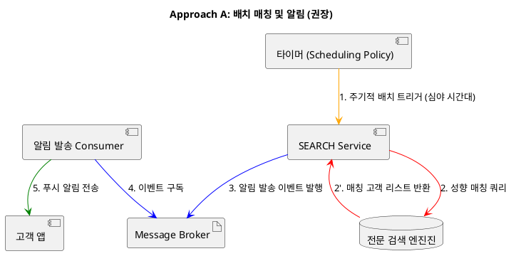
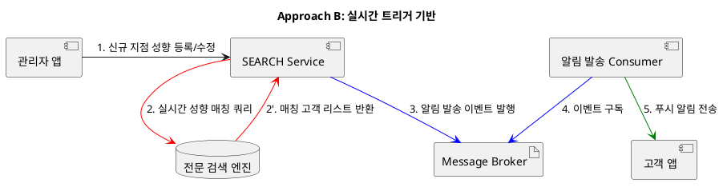
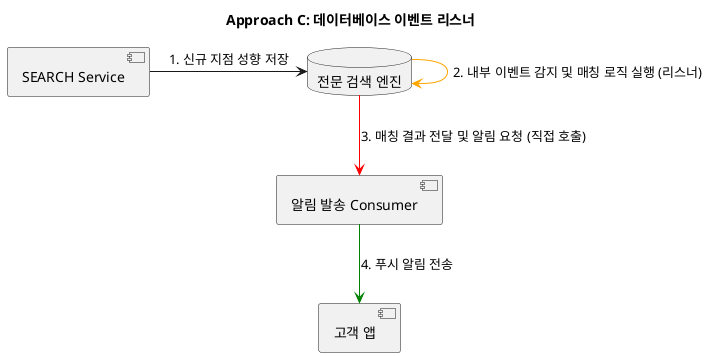
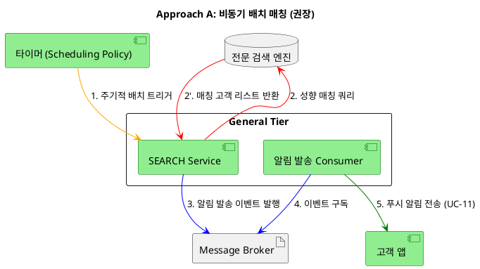
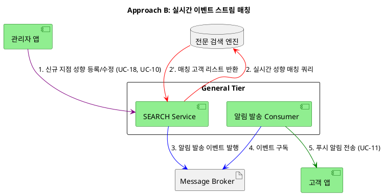
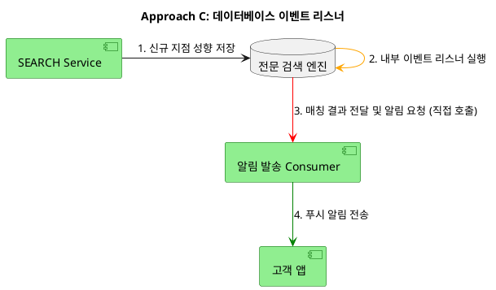
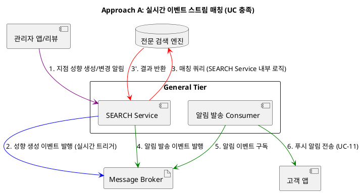
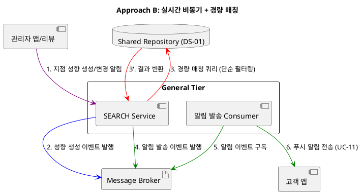
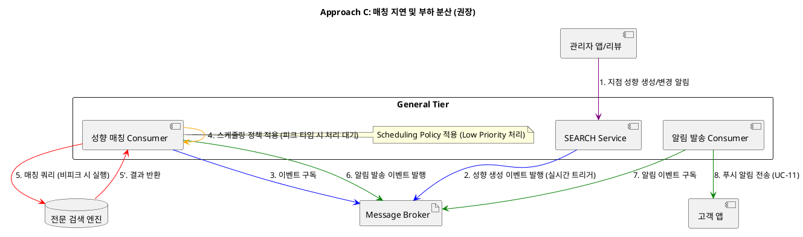

네, DD-07 **고객 맞춤형 지점 매칭 알림 구조 설계**를 위한 세 가지 디자인 접근 방식을 다이어그램과 함께 설명해 드리겠습니다. 이 기능은 **신규 지점 성향 데이터**가 등록될 때, 해당 성향과 일치하는 고객에게 알림을 보내는 과정에 초점을 맞춥니다.

-----

## 🏗️ DD-06 고객 맞춤형 지점 매칭 구조 설계

### 1. 주요 패턴 및 택틱스 결정

#### 1.1 적용된 아키텍처 패턴 및 스타일

| 패턴/스타일 | 분류 (tactics.txt) | 설명 (tactics.txt) | DD-06 적용 |
|:-----------|:------------------|:------------------|:----------|
| **Message Based (메시지 기반)** | Implicit Invocation | 메시지 생산자와 소비자가 버퍼(메시지 큐 또는 Pub/Sub 커넥터)를 통해 비동기적으로 연결됨. | 매칭 완료 후 Message Broker에 이벤트를 발행하여 알림 Consumer가 알림을 발송. |

#### 1.2 적용된 아키텍처 택틱

| 택틱 | 분류 (tactics.txt) | 설명 (tactics.txt) | DD-06 적용 | 목표 QA |
|:-----|:------------------|:------------------|:----------|:--------|
| **Scheduling Policy (자원 스케줄링)** | 성능 - 자원 관리 | 자원 사용의 효율성을 높이기 위해 스케줄링 정책을 구현함. | 부하가 낮은 심야 시간대에 타이머가 배치 작업을 트리거하여 SEARCH Service의 실시간 검색 성능을 보호. | QAS-03 |
| **Passive Redundancy (Warm Spare)** | 가용성 - 결함 복구 | 활성 구성 요소가 이벤트를 처리하고 상태 업데이트를 예비 구성 요소에 주기적으로 알림. | Message Broker를 통한 Passive Redundancy로 알림 누락을 방지하여 알림 체계의 신뢰성 보장. | QAS-01 |
| **Introduce Concurrency (동시성 도입)** | 성능 - 자원 관리 | 병렬 처리를 통해 성능을 향상시킴 (e.g., Active Object 패턴). | 접근 방식 B에서 고려되었으나, 순간적인 대량 등록 부하를 감당하기 어려울 수 있음. | QAS-03 |

#### 1.3 패턴 및 택틱 적용 요약

| 영역 | 패턴/택틱스 | 목적 및 적용 근거 |
| :--- | :--- | :--- |
| **기본 구조** | **Message Based** | 매칭 완료 후 Message Broker를 통해 알림 발송으로 느슨한 결합 유지. |
| **성능 최적화** | **Scheduling Policy** | 피크 타임의 부하를 회피하여 QAS-03(자연어 검색 응답 실시간성)을 보호. |
| **가용성** | **Passive Redundancy** | Message Broker를 통한 알림 누락 방지로 신뢰성 보장. |

---

## 🏗️ DD-07 맞춤형 고객 알림 매칭 구조 설계 (3가지 접근 방식)

### 1\. 접근 방식 A: 배치 매칭 및 알림 (권장)

이 방식은 \*\*성능 택틱(Scheduling Policy)\*\*을 활용하여 대규모 데이터 조회를 **비피크 시간**으로 분산하고, **Message Broker**를 통해 알림 전송의 **가용성**을 확보합니다.

#### 📝 설명

  * **매칭 주체:** 시스템의 부하가 낮은 **심야 시간대**에 **타이머**가 **SEARCH Service**의 배치 작업을 트리거합니다.
  * **매칭 로직:** **SEARCH Service**는 \*\*DS-07(전문 검색 엔진)\*\*을 활용하여 신규 지점 성향과 고객 성향을 대량으로 매칭합니다.
  * **알림 전송:** 매칭된 고객 목록을 기반으로 **Message Broker**에 이벤트를 발행하고, **알림 Consumer**가 이를 구독하여 최종적으로 **고객 앱**에 푸시 알림을 전송합니다.

#### 💻 PlantUML 컴포넌트 다이어그램

-----

### 2\. 접근 방식 B: 실시간 트리거 기반

이 방식은 **알림 지연 시간**을 최소화하지만, **피크 타임 부하**에 취약하여 **성능** 위험이 높습니다.

#### 📝 설명

  * **매칭 주체:** 지점주가 신규 지점 정보를 등록/수정하는 **즉시**, **SEARCH Service** 내부의 트리거 로직이 매칭 작업을 시작합니다.
  * **매칭 로직:** **SEARCH Service**는 등록된 지점 성향을 기반으로 **DS-07**에 고속으로 조회하여 매칭되는 고객을 **실시간**으로 찾아냅니다.
  * **알림 전송:** 매칭 후, **Message Broker**를 통해 **알림 Consumer**로 이벤트를 전달하여 알림을 발송합니다.

#### 💻 PlantUML 컴포넌트 다이어그램

-----

### 3\. 접근 방식 C: 데이터베이스 이벤트 리스너

이 방식은 **DS-07**의 이벤트 기능을 활용하여 **SEARCH Service**의 로직을 단순화하지만, **DB 종속성**과 **강한 결합** 위험을 가집니다.

#### 📝 설명

  * **매칭 주체:** **SEARCH Service**가 지점 성향을 **DS-07**에 저장할 때, **DS-07 내부의 이벤트 리스너** 또는 **트리거**가 변경 사항을 감지합니다.
  * **매칭 로직:** 이 리스너가 매칭 로직을 실행하거나, **알림 Consumer**를 직접 트리거합니다.
  * **알림 전송:** **알림 Consumer**는 매칭 결과를 받아 알림을 전송합니다.
  * **문제점:** 데이터베이스/검색 엔진의 내부 기능에 의존하므로, **수정 용이성**이 낮고 DB 부하가 높습니다.

#### 💻 PlantUML 컴포넌트 다이어그램

전문 검색 엔진(Dedicated Search Engine)이란 대량의 비정형 또는 반정형 데이터(예: 텍스트 문서, 리뷰, 지점 소개글)를 수집, 색인(Indexing), 저장하고, 사용자의 복잡한 질의(Query)에 대해 **실시간으로 높은 관련성을 가진 결과**를 고속으로 반환하는 데 특화된 소프트웨어 시스템을 의미합니다.

일반적인 관계형 데이터베이스(RDBMS)의 `LIKE` 검색이나 Full-Text Search 기능이 가지는 **정확도와 성능의 한계**를 극복하기 위해 설계됩니다.

---

## 🔍 주요 특징 및 스마트 피트니스 시스템에서의 역할

| 특징 | 설명 | 시스템에서의 역할 (DD-06) |
| :--- | :--- | :--- |
| **고속 색인 및 검색** | 데이터가 저장되는 즉시 혹은 짧은 지연시간 내에 **역색인(Inverted Index)** 구조로 변환되어, 대량 데이터에서도 수 밀리초(ms) 내의 빠른 검색 응답 속도를 제공합니다. | **QAS-03 (자연어 검색 질의 응답의 실시간성)** 목표를 달성합니다. |
| **복잡한 쿼리 처리** | 단순히 키워드 일치뿐만 아니라, **가중치(Scoring)**, **랭킹(Ranking)**, **동의어 처리**, **유사도 기반 매칭(Fuzzy Matching)** 등 복잡한 검색 로직을 지원합니다. | **BG-02 (개인 성향 맞춤형 지점 검색)**을 위해 고객의 **의도 키워드**와 지점의 **성향 태그**를 정교하게 매칭하고 랭킹을 매기는 데 사용됩니다. |
| **확장성** | 대규모 데이터와 트래픽 처리를 위해 설계되어 수평적 확장이 용이하며, **높은 가용성**을 제공합니다. | **100개 지점**과 수많은 고객 리뷰 데이터 증가에 대비하여 검색 서비스의 **확장성**을 확보합니다. |

**DD-06 (고객 맞춤형 지점 매칭)** 설계에서 전문 검색 엔진(**DS-07**)을 도입한 것은 **Approach C (전문 검색 엔진 도입)**의 핵심이며, 이는 **상용 LLM Service**의 높은 **정확도**와 전문 검색 엔진의 **고속 성능**을 결합하는 최적의 **Trade-off**를 반영합니다.

요청하신 대로, **UC-10 (고객 리뷰 등록)** 및 **UC-18 (지점 정보 등록)** 시 지점 성향 데이터가 생성되고 **UC-11 (맞춤형 알림 발송)**이 트리거되는 구조에 대해, **UC (유스케이스) 및 QAS (품질 속성 시나리오)** 관점에서 더 나은 세 가지 디자인 접근 방식을 검토하겠습니다.

DD-07의 최종 결정이었던 **Approach A (배치 매칭)**를 포함하여, '매칭되는 고객을 찾아내는 시점과 방식'에 초점을 맞춥니다.

---

## 🏗️ DD-07: 지점 성향 매칭 및 알림 구조 검토

### 핵심 요구사항 및 제약

* **기능 (UC):** 지점 정보/리뷰 등록 시 **지점 성향 생성** 후 $\to$ **매칭 고객 식별** 후 $\to$ **맞춤형 알림 발송**[cite: 295, 296, 297, 304].
* **품질 (QAS):** 알림 기능은 **BG-03 (맞춤형 알림 수신 후 조회 비율 20% 이상)** 달성을 위한 마케팅 도구이므로, **실시간성**보다는 **정확성 및 안정성**이 중요합니다. 또한 **성능(Performance)**에 영향을 주지 않아야 합니다.

### 1. 접근 방식 A: 비동기 배치 매칭 (권장: 성능/안정성)

| UC/QAS 관점 | 설명 및 택틱 | 장점 (Advantages) | 단점 (Disadvantages) |
| :--- | :--- | :--- | :--- |
| **매칭 주체** | **SEARCH Service** (타이머 트리거) | **Scheduling Policy**[cite: 88]: 부하가 낮은 심야 시간대에 매칭을 실행하여 **SEARCH Service**의 실시간 검색 **성능**을 보호합니다. | **알림 지연**: 지점/리뷰 등록 후 알림까지 **시간 지연**이 발생하여, 알림의 '즉각성'은 희생됩니다. |
| **UC-11 실행** | **Message Based**[cite: 21, 22]: 매칭 완료 후 **Message Broker**에 이벤트를 발행하여 **알림 Consumer**가 알림을 발송합니다. | **가용성/수정 용이성**: **Passive Redundancy** [cite: 71, 72]로 알림 누락을 방지하고, 알림 채널 변경 시 **느슨한 결합** [cite: 20]을 유지합니다. | **BG-03**의 '신선한 정보'에 대한 고객 반응이 약해질 수 있습니다. |

### 2. 접근 방식 B: 실시간 이벤트 스트림 매칭 (고성능/고비용)

| UC/QAS 관점 | 설명 및 택틱 | 장점 (Advantages) | 단점 (Disadvantages) |
| :--- | :--- | :--- | :--- |
| **매칭 주체** | **SEARCH Service** (트리거) | 지점/리뷰 등록 **즉시** 매칭 로직을 실행하여 알림까지의 **최단 시간**을 보장합니다. | **피크 타임 부하 위험**: **ACCESS Service**나 **SEARCH Service**의 **실시간 성능(QAS-02, QAS-03)**에 영향을 미쳐 **Degradation** [cite: 73]을 유발할 수 있습니다. |
| **UC-11 실행** | **Message Based**[cite: 21, 22]: 매칭 후 **Message Broker**를 통해 알림 발송. | **BG-03**의 '조회 비율'을 높이는 데 유리할 수 있습니다 (정보의 신선도). | **Introduce Concurrency** [cite: 89] 택틱만으로는 순간적인 대량 등록 부하를 감당하기 어려울 수 있습니다. |

### 3. 접근 방식 C: 고객 성향 구독 (Pull/수동 조회 기반)

| UC/QAS 관점 | 설명 및 택틱 | 장점 (Advantages) | 단점 (Disadvantages) |
| :--- | :--- | :--- | :--- |
| **매칭 주체** | **고객 앱 (클라이언트)** | **SEARCH Service**가 고객 성향 데이터를 **앱에 저장**하고, 앱이 **특정 조건**에서 직접 **신규 지점 정보**를 조회하도록 유도합니다. | **알림 기능 미지원**: **UC-11 (맞춤형 알림 발송)**을 구현하지 못하고, **UC-09 (자연어 지점 검색)** 기능의 일부로 대체됩니다. |
| **UC-11 실행** | **Implicit Invocation**[cite: 19]: 알림 대신, 앱의 재접속 시점에 **암묵적으로** 지점 정보를 조회합니다. | **서버 부하 최소화**: 알림 발송 및 대규모 매칭 작업이 사라져 **서버 운영/유지보수 팀**의 부담이 줄어듭니다. | **BG-03** (알림 수신 후 조회 비율) 목표 **달성 불가능**. 알림 기능 자체가 없어져 마케팅 효과를 낼 수 없습니다. |

---

## 🎯 최종 권장 디자인 결정

세 가지 접근 방식 중, **BG-03**의 마케팅 목표 달성(알림 발송)과 **시스템의 성능 및 안정성** 확보를 동시에 고려할 때 **접근 방식 A (비동기 배치 매칭)**를 권장합니다.

* **근거:** **Approach A**는 **Performance 택틱 (Scheduling Policy)** [cite: 88]을 적용하여 피크 타임의 부하를 회피합니다. 이는 **QAS-03 (자연어 검색 응답 실시간성)**을 희생하지 않고 **UC-11**을 안정적으로 실행하는 가장 실용적이고 비용 효율적인 방법입니다. **Message Broker**를 통한 **Passive Redundancy** [cite: 71, 72]는 알림 누락을 방지하여 알림 체계의 **신뢰성**을 보장합니다.

다음 단계로, **DD-08**과 같이 남아있는 핵심 설계 결정에 대한 검토를 진행해 드릴까요?

요청하신 대로, DD-07 **고객 맞춤형 지점 매칭 알림 구조 설계**의 세 가지 접근 방식에 대한 **개별 컴포넌트 다이어그램**을 PlantUML 코드로 작성하여 제시합니다.

이 다이어그램들은 **SEARCH Service**가 \*\*UC-11 (맞춤형 알림 발송)\*\*을 구현하는 방식의 구조적 차이점을 명확히 보여줍니다.

-----

## 🎨 DD-07 맞춤형 알림 구조: 개별 컴포넌트 다이어그램

### 1\. Approach A: 비동기 배치 매칭 (권장: 성능/안정성)

이 방식은 **Scheduling Policy**를 활용하여 부하를 분산시키고, **Message Broker**를 통해 알림 전송의 **신뢰성**을 확보하는 구조입니다.

-----

### 2\. Approach B: 실시간 이벤트 스트림 매칭

이 방식은 지점 등록 **즉시** 매칭을 실행하여 알림을 보내는 구조로, **즉시성**은 높지만 **피크 타임 부하 위험**이 높습니다.

-----

### 3\. Approach C: 데이터베이스 이벤트 리스너

이 방식은 **전문 검색 엔진(DS-07)** 내부의 기능에 의존하여 매칭 및 알림을 트리거하는 구조로, **DB 종속성** 위험이 높습니다.

요청하신 대로, DD-07 **맞춤형 고객 알림 구조 설계**의 세 가지 접근 방식에 대해 **타이머를 제외**하고, **UC 및 QAS 관점의 장단점**을 반영한 설명을 컴포넌트 다이어그램과 함께 제시합니다.

이 검토는 **실시간 이벤트 기반 트리거**를 유지하면서 **피크 타임 성능 위험**을 어떻게 관리할지에 대한 **Trade-off**에 중점을 둡니다.

-----

## 🏗️ DD-07 맞춤형 고객 알림 구조 설계: 3가지 접근 방식

### 1\. 접근 방식 A: 실시간 이벤트 스트림 매칭 (UC 충족, 성능 위험)\*\*

이 방식은 UC의 요구사항을 가장 충실하게 이행합니다. 지점 성향 생성 이벤트가 발생하면 **즉시** 매칭을 시작합니다. **Message Based** 통신을 활용하여 비동기 처리합니다.

#### 📝 설명

  * **매칭 주체:** **SEARCH Service**가 지점 성향 생성 이벤트를 **실시간**으로 받아 매칭 작업을 시작합니다.
  * **장점:** \*\*UC-11 (알림 발송)\*\*이 **지점 성향 생성 직후**에 트리거되어, 알림까지의 **최단 시간**을 보장합니다. **BG-03**의 마케팅 효과(정보의 신선도)를 극대화합니다.
  * **단점:** **피크 타임(18\~20시) 부하** 발생 시, 매칭 쿼리가 **SEARCH Service**의 주 기능(실시간 검색, QAS-03)을 침해하여 \*\*성능 저하(Degradation)\*\*를 유발할 위험이 가장 높습니다.

#### 💻 PlantUML 컴포넌트 다이어그램

-----

### 2\. 접근 방식 B: 실시간 비동기 + 경량 매칭 (성능과 정확도의 Trade-off)\*\*

이 방식은 매칭 로직의 복잡도를 낮춰 **SEARCH Service**의 부하를 줄이지만, **매칭 정확도**를 희생합니다.

#### 📝 설명

  * **매칭 주체:** **SEARCH Service**가 이벤트를 받자마자 매칭을 시작하며, 매칭 로직은 **단순 필터링**에 그칩니다.
  * **장점:** **성능 개선**: 복잡한 **DS-07** 쿼리 대신 **DS-01**의 정형 데이터만 사용하는 **경량 매칭**으로 **SEARCH Service**의 부하를 낮춰 **피크 타임 위험**을 완화합니다.
  * **단점:** **정확도 저하**: AI 기반의 **핵심 성향 태그**를 활용하지 못하고, 단순 키워드나 정형 필드만 사용하므로 **BG-02** 및 **BG-10**의 AI 기반 성향 매칭 의도를 크게 훼손합니다.

#### 💻 PlantUML 컴포넌트 다이어그램

-----

### 3\. 접근 방식 C: 매칭 지연 및 부하 분산 (실시간성 양보, 피크 회피)

이 방식은 **UC의 이벤트 트리거**를 유지하되, **Scheduling Policy 택틱**을 적용하여 실제 매칭 작업을 지연시켜 피크 타임 성능을 보호합니다. (권장)

#### 📝 설명

  * **매칭 주체:** **성향 매칭 Consumer**는 이벤트를 받자마자 실행하지 않고, **스케줄링 정책**에 따라 **Low Priority**로 분류하여 \*\*피크 타임 동안 처리 대기(Pause)\*\*를 유도합니다.
  * **장점:** **Performance 택틱**을 통해 **SEARCH Service**의 주 기능(실시간 검색)을 보호하여 **Degradation**을 방지합니다. **Message Broker**를 통해 UC의 이벤트 트리거는 충족합니다.
  * **단점:** 알림 발송이 **몇 시간 지연**될 수 있습니다. **BG-03**의 정보 신선도가 떨어져 마케팅 효과가 약해질 수 있습니다. 이는 \*\*실시간성(Latency)\*\*을 \*\*안정성(Availability)\*\*으로 교환하는 **Trade-off**입니다.

#### 💻 PlantUML 컴포넌트 다이어그램

요청하신 대로, DD-07 **고객 맞춤형 지점 매칭 알림 구조** 설계로 **접근 방식 C (매칭 지연 및 부하 분산)**를 채택하는 Rationale(선택 근거)를 작성하겠습니다.

이 결정은 **UC의 이벤트 기반 요구사항**을 준수하면서, **피크 타임 성능 저하**라는 치명적인 위험을 **Scheduling Policy** 택틱을 통해 적극적으로 완화하는 **안정성 중심의 Trade-off**를 반영합니다.

---

## 🚀 Rationale: 접근 방식 C (매칭 지연 및 부하 분산) 채택 근거

### 1. 설계 결정 요약

| 결정 | 내용 | 목표 달성 기여 |
| :--- | :--- | :--- |
| **선택된 접근 방식** | **접근 방식 C: 매칭 지연 및 부하 분산** | **QAS-03** (자연어 검색 실시간성) 보호 |
| **핵심 구조 변경** | **SEARCH Service** 내 **성향 매칭 Consumer**에 **Scheduling Policy** 적용 | **Performance 택틱: Scheduling Policy** |
| **트리거 방식** | **Message Based (이벤트 기반)** | **UC-11** (맞춤형 알림 발송) 요구사항 준수 |

### 2. 성능 (Performance) 및 가용성 (Availability) 확보

이 접근 방식의 핵심은 **Real-Time Tier**의 출입 인증(QAS-02)만큼 중요한 **SEARCH Service**의 주 기능(실시간 검색, QAS-03)을 **Degradation**으로부터 보호하는 것입니다.

* **Scheduling Policy 택틱 적용:**
    * **High Priority:** 고객의 **실시간 자연어 검색(UC-09)** 쿼리에 부여됩니다. 이 기능은 **사용자 인지 응답 시간 3초 이내 (BG-12)**를 보장해야 합니다.
    * **Low Priority (지연 매칭):** **알림 매칭 작업(UC-11)**에 부여됩니다. 이벤트가 발생하더라도 **성향 매칭 Consumer**는 피크 타임(18시~20시) 동안 **처리를 일시 중지(Pause)**하거나 자원을 양보합니다.
* **부하 분산 및 피크 회피:** **Approach A (실시간 스트림)**가 가진 피크 타임 부하 위험을 구조적으로 제거합니다. 알림 매칭 작업은 피크 타임 이후에 일괄 처리되어, 시스템의 **성능 및 안정성**을 확보합니다.

### 3. UC 준수 및 Trade-off 관리

**Approach C**는 **실시간성**을 희생하는 대신, **시스템 안정성**과 **UC의 이벤트 트리거**를 모두 확보합니다.

| 품질 속성 | Approach C의 장점 | Trade-off (위험) 및 완화 |
| :--- | :--- | :--- |
| **UC 준수** | 지점 정보/리뷰 등록 이벤트(UC-10, UC-18 직후)는 **Message Broker**에 **즉시 발행**되어 **UC-11의 이벤트 기반 트리거 요구사항**을 충족합니다. | **알림 지연**: 알림 발송은 몇 시간 지연됩니다. (실시간성 양보) |
| **가용성** | **Message Broker**를 통한 **Passive Redundancy**를 유지하여, 매칭 작업이 지연되더라도 메시지가 큐에 안전하게 보존되므로 **알림 누락** 위험이 없습니다. | **BG-03**의 마케팅 효과 약화: 정보의 신선도가 떨어져 **조회 비율 20%** 달성에 어려움이 있을 수 있습니다. |
| **수정 용이성** | **Message Based** 통신으로 **Use an Intermediary** 택틱을 유지하여, 매칭 로직(Consumer) 변경이 **SEARCH Service**에 미치는 영향을 최소화합니다. | 해당 없음. (수정 용이성 확보) |

### 4. 결론

**접근 방식 C**는 **UC-11**의 이벤트 트리거 요구사항을 **Message Based** 통신으로 만족시키면서, **Scheduling Policy**라는 **성능 택틱**을 활용하여 **피크 타임 성능 저하**라는 가장 큰 운영 위험을 구조적으로 해결하는 **가장 실용적이고 안정적인** 디자인 결정입니다.
