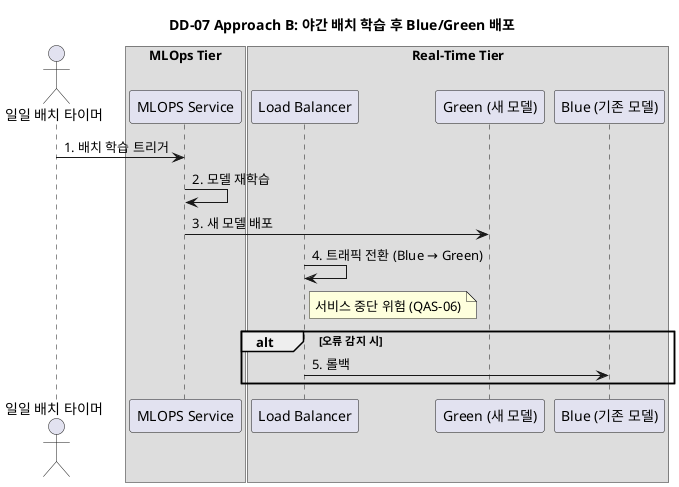
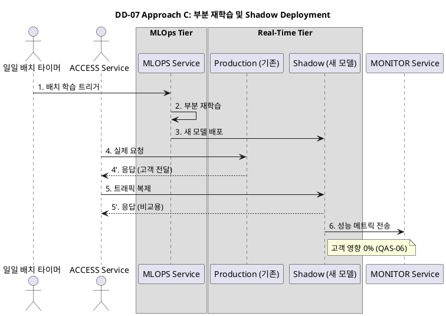
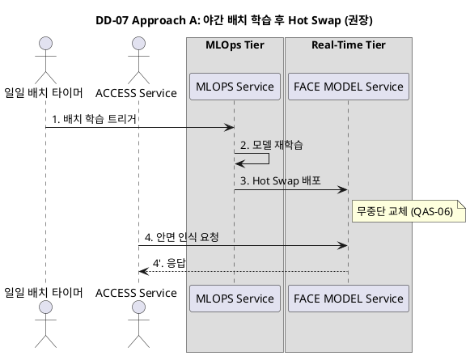

본 설계는 **이용자가 적은 야간 시간**에 **얼굴 인식 데이터**를 모아 재학습하고 모델을 배포하는 방식에 적용할 수 있는 아키텍처 및 택틱스를 검토하여 세 가지 디자인 접근 방식(Approach)을 제안한다.

이 설계는 **일일 배치 학습**을 전제로 하며, **QAS-06 (모델 교체 무중단 적용)** 및 **BG-14 (오판독률 개선)** 목표 달성에 중점을 둔다.

-----

## 🛠️ DD-07 AI 학습 판독 구조 설계

### 1. 주요 패턴 및 택틱스 결정

#### 1.1 적용된 아키텍처 패턴 및 스타일

| 패턴/스타일 | 분류 (tactics.txt) | 설명 (tactics.txt) | DD-07 적용 |
|:-----------|:------------------|:------------------|:----------|
| **Batch Sequential (배치 순차)** | Data Flow | 프로그램들이 순차적으로 실행되며 데이터가 집합체로 전달됨. | 일일 야간 배치 학습으로 MLOPS Tier의 자원 효율성 증대. |
| **Hot Swap** | 특정 설계 영역 패턴 | 무중단 교체 패턴. | 모델을 무중단으로 교체하여 QAS-06 목표 달성. |
| **Blue/Green Deployment** | 특정 설계 영역 패턴 | Load-Balanced Cluster를 활용한 배포 패턴. | 접근 방식 B에서 고려되었으나, 무중단 목표 위반 위험으로 미채택. |
| **Shadow Deployment** | 특정 설계 영역 패턴 | 트래픽 복제를 통한 안전한 배포 패턴. | 접근 방식 C에서 고려되었으나, 운영 복잡도로 인해 미채택. |

#### 1.2 적용된 아키텍처 택틱

| 택틱 | 분류 (tactics.txt) | 설명 (tactics.txt) | DD-07 적용 | 목표 QA |
|:-----|:------------------|:------------------|:----------|:--------|
| **Passive Redundancy (Warm Spare)** | 가용성 - 결함 복구 | 활성 구성 요소가 이벤트를 처리하고 상태 업데이트를 예비 구성 요소에 주기적으로 알림. | FACE MODEL Service에 Passive Redundancy를 적용하여 모델 교체 중에도 요청 처리 신뢰성 유지. | QAS-06 |
| **Rollback** | 가용성 - 결함 복구 | 결함 감지 시 시스템을 이전에 알려진 양호한 상태(체크포인트)로 되돌림. | Hot Swap 방식에서 롤백 및 복구 시간 1분 이내 달성. | QAS-06, BG-11 |
| **Sandbox** | 테스트 용이성 - 시스템 상태 제어 및 관찰 | 격리된 테스트 환경을 제공하여 응용 프로그램, 시스템 또는 플랫폼에 영향을 주지 않고 프로그램을 실행할 수 있도록 함. | MLOps Tier는 학습 파이프라인과 모델 배포 노드를 격리하여 Sandbox 역할 수행. | QAS-06 |

#### 1.3 패턴 및 택틱 적용 요약

| 영역 | 패턴/택틱스 | 목적 및 적용 근거 |
| :--- | :--- | :--- |
| **기본 구조** | **Batch Sequential + Hot Swap** | 일일 야간 배치 학습으로 자원 효율성 증대, Hot Swap으로 무중단 모델 교체. |
| **가용성** | **Passive Redundancy, Rollback** | 모델 교체 중에도 요청 처리 신뢰성 유지, 롤백으로 빠른 복구. |
| **테스트 용이성** | **Sandbox** | MLOps Tier를 격리된 환경으로 운영하여 안전한 모델 검증. |

---

## 🛠️ DD-08 안면 인식 배치 학습 및 배포 구조

### 전제: 일일 야간 배치 학습

| 요소 | 내용 | 근거 |
| :--- | :--- | :--- |
| **학습 트리거** | [cite\_start]일일 **타이머**를 사용한 **심야 배치** 학습[cite: 346, 343]. | **시스템 성능** 보호 및 **MLOPS Tier** 자원 효율성 증대. |
| **재학습 데이터** | [cite\_start]성공적으로 인증된 고객/헬퍼의 안면 사진 및 특징 정보[cite: 347]. | **BG-14 (오판독률 개선)** 목표 달성. |
| **배포 환경** | [cite\_start]**Real-Time Tier**의 **FACE MODEL Service**[cite: 379]. | **QAS-02** (신속한 출입 인증) 목표 달성. |

### 1\. 접근 방식 A: 야간 배치 학습 후 Hot Swap (권장)

이 방식은 학습은 배치로 진행하지만, 배포 단계에서 **Zero-Downtime** 기술을 사용하여 **QAS-06** 목표를 완벽히 충족하는 가장 이상적인 접근 방식이다.

| 아키텍처/택틱 | 내용 | 장점 (QAS/BG) |
| :--- | :--- | :--- |
| **재학습** | [cite\_start]**Batch Sequential (배치 순차)** 패턴[cite: 387]. | **MLOPS Tier**의 **자원 효율성** 향상 및 출입 서비스 영향 최소화. |
| **배포 전략** | **Hot Swap** (무중단 교체). | **QAS-06 (무중단 적용)** 목표 완벽 달성, **롤백 및 복구 시간 1분 이내**. |
| **모델 적용** | **FACE MODEL Service**에 **Passive Redundancy** 적용. | 모델 교체 중 요청 처리 신뢰성 유지, **24시간 무인 운영(BG-05)** 중 심야 시간대 모델 교체 위험 최소화. |

### 2\. 접근 방식 B: 야간 배치 학습 후 Blue/Green 배포

이 방식은 모델의 안정성 검증에 유리하지만, **QAS-06**의 무중단 목표를 위반할 위험을 가진다.

| 아키텍처/택틱 | 내용 | 장점 (QAS/BG) |
| :--- | :--- | :--- |
| **재학습** | [cite\_start]**Batch Sequential (배치 순차)** 패턴[cite: 387]. | **Approach A**와 동일한 **자원 효율성** 확보. |
| **배포 전략** | [cite\_start]**Blue/Green Deployment** (Load-Balanced Cluster [cite: 442] 활용). | **Rollback** 용이, 새 모델 오류 발생 시 이전 모델로 **즉시 복구** 가능, **BG-11** 지원. |
| **단점** | 트래픽 전환 시 \*\*짧은 시간 동안 서비스 중단(Down-Time)\*\* 발생 가능. | **QAS-06**에서 요구하는 **API 요청 실패 1% 미만** 제한 목표 초과 위험. |

#### 💻 PlantUML 시퀀스 다이어그램

#### 📝 다이어그램 설명

**접근 방식 B (Blue/Green 배포)**는 두 개의 독립적인 환경(Blue: 기존 모델, Green: 새 모델)을 동시에 운영하고, 트래픽을 한 번에 전환하는 방식이다.

1. **학습 단계 (1-4)**: Approach A와 동일하게 일일 야간 배치 학습을 수행한다.
2. **Green 환경 배포 (5)**: 새 모델을 Green 환경에 배포하지만, 아직 실제 트래픽은 받지 않는다.
3. **트래픽 전환 (6-7)**: Load Balancer가 트래픽을 Blue에서 Green으로 전환한다. 이 과정에서 **짧은 시간 동안 서비스 중단(Down-Time)**이 발생할 수 있어 **QAS-06** 목표 위반 위험이 있다.
4. **모니터링 및 롤백 (8-9)**: 새 모델의 오류가 감지되면 Load Balancer가 즉시 Blue로 롤백하여 **BG-11 (신속 복구)**을 지원한다.

**장점**: Rollback이 용이하고, 새 모델을 실제 트래픽 없이 사전 검증할 수 있다.  
**단점**: 트래픽 전환 시 서비스 중단 위험이 있어 **QAS-06 (무중단 적용)** 목표를 위반할 수 있다.

### 3\. 접근 방식 C: 부분 재학습 및 Shadow Deployment

이 방식은 새 모델의 안전성을 극한으로 검증하여 **BG-14 (오판독률)** 목표 달성에 대한 신뢰도를 높이지만, **Real-Time Tier**의 자원 소모가 높다.

| 아키텍처/택틱 | 내용 | 장점 (QAS/BG) |
| :--- | :--- | :--- |
| **재학습** | [cite\_start]**Batch Sequential (배치 순차)** 패턴 [cite: 387] 후 **부분 학습 (Incremental Learning)** 진행. | 학습 시간 단축으로 모델 업데이트 주기 단축. |
| **배포 전략** | **Shadow Deployment** (트래픽 복제). | **안전성 최고**. 새 모델의 오류가 고객 출입에 미치는 영향 **0%** 보장, **QAS-06** 목표 달성에 대한 확신. |
| **단점** | **자원 소모 증대**. **Real-Time Tier**의 CPU/GPU 자원 **두 배** 소모 필요. | **Increase Available Resources** 택틱 과도 적용으로 운영 비용 증가. |

#### 💻 PlantUML 시퀀스 다이어그램

#### 📝 다이어그램 설명

**접근 방식 C (Shadow Deployment)**는 새 모델을 실제 트래픽과 동일한 데이터로 검증하되, 고객에게는 기존 모델의 결과만 전달하는 방식이다.

1. **부분 재학습 (1-4)**: 전체 데이터가 아닌 **증분 데이터(Incremental Learning)**만 사용하여 학습 시간을 단축하고 모델 업데이트 주기를 짧게 가져간다.
2. **Shadow 환경 배포 (5)**: 새 모델을 Shadow 환경에 배포하지만, 실제 고객 요청은 처리하지 않고 **트래픽 복제만** 수신한다.
3. **트래픽 복제 (6-7)**: ACCESS Service가 동일한 요청을 Production 모델과 Shadow 모델 모두에 전송한다. Production 모델의 응답만 고객에게 전달하고, Shadow 모델의 응답은 비교 및 모니터링용으로만 사용한다.
4. **모니터링 및 검증 (8-9)**: MONITOR Service가 두 모델의 성능을 비교하여 **BG-14 (오판독률 개선)** 여부를 검증한다.
5. **전환 (10)**: 검증이 성공하면 Shadow 모델을 Production으로 전환할 수 있다.

**장점**: 새 모델의 오류가 고객 출입에 미치는 영향을 **0%**로 보장하여 **QAS-06** 목표 달성에 대한 확신을 준다.  
**단점**: **Real-Time Tier**의 CPU/GPU 자원을 **두 배**로 소모하여 운영 비용이 크게 증가한다.

-----

## 💻 PlantUML 시퀀스 다이어그램

### 접근 방식 A: 야간 배치 학습 후 Hot Swap (권장)

#### 📝 다이어그램 설명

**접근 방식 A (Hot Swap)**는 모델을 기존 프로세스 내에서 즉시(Atomically) 교체하여 **Zero-Downtime**을 달성하는 방식이다.

1. **학습 데이터 수집 및 트리거 (1-2)**: 일일 배치 타이머가 심야 시간대에 MLOPS Service를 트리거하고, 재학습에 필요한 안면 특징 데이터를 DB에서 수집한다.
2. **모델 재학습 (3-4)**: **Batch Sequential 패턴**을 사용하여 MLOPS Tier의 자원 효율성을 높이고, 출입 서비스에 영향을 주지 않는다. 재학습을 통해 **BG-14 (오판독률 개선)** 목표를 달성한다.
3. **Hot Swap 배포 (5)**: 새 모델을 FACE MODEL Service에 **무중단으로 교체**한다. **Passive Redundancy**를 적용하여 모델 교체 중에도 요청 처리 신뢰성을 유지한다.
4. **운영 중 요청 처리 (6)**: 모델 교체 중에도 ACCESS Service의 요청을 계속 처리하여 **QAS-06 (무중단 적용)** 목표를 완벽히 충족한다.

**장점**: **QAS-06** 목표를 완벽히 달성하며, 롤백 및 복구 시간이 1분 이내이다.  
**특징**: 모델 교체 자체는 즉시 이루어지지만, **Canary Release**와 **자동 롤백** 택틱을 결합하여 점진적 검증 및 신속 복구를 보장한다.

---

## 🧐 Hot Swap 방식에서의 모델 검증 (접근 방식 A)

Hot Swap 방식은 **기존 모델을 새 모델로 즉시(Atomically) 교체**하는 것에 중점을 두어 **QAS-06 (무중단 적용)**을 달성한다. 하지만 이 단순한 교체 자체는 운영 환경에서 모델을 '점진적으로' 검증할 기회를 제공하지 않는다.

### 1. 전제: MLOps Tier에서의 사전 검증 (필수)

Hot Swap을 실행하기 전, **MLOPS Tier**에서는 다음과 같은 사전 검증이 **반드시** 완료되어야 한다.

* **자동 검증:** 학습 완료된 새 모델은 **정확도(Accuracy)**, **성능(Latency)** 등 **BG-14** 목표 충족 여부를 **테스트 데이터셋**을 이용해 자동 검증한다.
* **Shadowing 테스트:** **Approach C (Shadow Deployment)** 방식을 MLOps Tier 내의 **격리된 Sandbox 환경**에 적용하여, 실제 운영 환경과 유사한 부하 및 데이터로 최종적인 기능 검증을 진행한다.

### 2. Hot Swap 환경에서의 검증 접근 방식

Hot Swap 적용 후에도 모델의 신뢰도를 높이기 위해 다음과 같은 방법을 사용할 수 있다.

#### 접근 방식 A: Canary Release (점진적 적용)
* **개념:** Hot Swap 자체가 즉시 교체 방식이지만, 이를 **FACE MODEL Service**의 **Load-Balanced Cluster**에 적용하여 **점진적 적용**을 모방할 수 있다.
* **구조:** 총 10개의 **FACE MODEL Service** 인스턴스 중, **1개 인스턴스에만 Hot Swap**으로 새 모델을 적용한다 (Canary).
* **검증:** **ACCESS Service**는 트래픽을 모든 인스턴스에 고르게 분배하며, 운영팀은 Canary 인스턴스에서 발생하는 **오류 로그**와 **오판독률**을 집중 모니터링한다. 문제가 없으면 나머지 9개 인스턴스에도 Hot Swap을 적용한다.
* **장점:** **QAS-06 (무중단)**을 유지하면서, 새 모델을 **실제 트래픽**의 일부에만 노출하여 위험을 최소화한다.

#### 접근 방식 B: 롤백 자동화 (신속 복구)
* **개념:** 모델 교체 후 발생하는 문제를 즉시 감지하고 **BG-11 (신속 복구)** 택틱을 통해 빠르게 대응하는 데 초점을 맞춘다.
* **구조:** 새 모델 적용 직후, **MONITOR Service**는 **FACE MODEL Service**의 **오류율(Error Rate)** 및 **Latency**를 실시간으로 모니터링한다.
* **검증:** 임계치를 초과하는 오류가 감지되면, **자동화된 롤백** 프로세스가 트리거되어 **이전 모델**을 Hot Swap으로 다시 로드한다.
* **장점:** **BG-14 (오판독률 개선)**를 목표로 하되, 오판독이 치명적인 오류로 이어질 경우 **1분 이내 복구 (QAS-06)** 목표를 달성할 수 있도록 안전 장치를 마련한다.

---

**결론적으로,** Hot Swap(1안)은 교체 메커니즘이 단순하기 때문에, **Canary Release (접근 방식 A)**와 **자동 롤백 (접근 방식 B)**을 결합하여 **점진적인 검증 및 신속 복구**를 보장해야 한다.

---

## 🚀 Rationale: 접근 방식 A (야간 배치 학습 후 Hot Swap) 채택 근거

### 1. 설계 결정 요약

| 결정 요소 | 내용 | 목표 달성 기여 |
| :--- | :--- | :--- |
| **재학습 방식** | 일일 **야간 배치 학습** (타이머 트리거) | **MLOPS Tier 자원 효율성** 증대. |
| **배포 전략** | **Hot Swap** (무중단 교체) | **QAS-06** (모델 교체 무중단 적용) 목표 완벽 충족. |
| **모델 적용** | **FACE MODEL Service**에 **Passive Redundancy** 적용. | **24시간 무인 운영(BG-05)** 중 안정성 확보. |

### 2. 품질 속성 달성 근거

접근 방식 A는 **가용성(Availability)**과 **수정 용이성(Modifiability)** 측면에서 가장 강력한 이점을 제공한다.

* **QAS-06 (모델 교체 무중단 적용) 완벽 충족:** **Hot Swap**은 모델을 기존 프로세스 내에서 즉시(Atomically) 교체하여, 트래픽 처리 중에도 **서비스 중단 시간(Down-Time)**을 **제로(Zero)**로 만든다. 이는 **BG-11 (신속 복구)** 목표 달성을 지원하며, **BG-05 (24시간 무인 운영)**의 안정적인 심야 모델 업데이트를 가능하게 한다.
* **MLOPS Tier 자원 효율성:** 일일 **Batch Sequential (배치 순차)** 패턴을 사용하여 학습을 심야 시간으로 분리한다. 이를 통해 **Real-Time Tier** 및 다른 서비스의 피크 타임 부하를 보호하고, **MLOPS Tier**의 고성능 자원(GPU) 활용 효율을 극대화한다.
* **BG-14 (오판독률 개선):** 재학습에 필요한 **새로 등록되거나 성공적으로 인증된 안면 데이터**를 일일 단위로 반영하여, 모델이 사용자의 외모 변화에 주기적으로 대응할 수 있도록 한다[cite: 171].

---

## 🛡️ Hot Swap 환경에서의 모델 검증 및 신뢰도 확보 방안

Hot Swap의 단점은 모델 교체 자체가 **점진적인 검증** 기회를 제공하지 않는다는 것이다. 따라서 다음 두 가지 택틱을 결합하여 운영 환경에서의 신뢰도를 확보해야 한다.

### 1. 배포 전 사전 검증 강화 (Sandbox Test)

* **배포 전제:** **MLOPS Service**는 학습이 완료된 새 모델을 **격리된 Sandbox 환경**에 배포하여 최종 검증을 완료해야 한다.
    * **검증 내용:** **오판독률(BG-14)**, **Latency (성능)**, **기능 테스트** 등을 포함한 자동화된 테스트 파이프라인을 통과해야 한다.
* **적용 택틱:** **Sandbox** (격리된 테스트 환경 제공)를 통해 운영 환경에 영향을 주지 않고 모델의 품질을 사전에 확보한다.

### 2. 운영 환경에서의 점진적 검증 및 롤백 자동화

Hot Swap 실행 후, 모델의 신뢰도를 실시간으로 확인하고 위험을 최소화한다.

* **Canary Release (점진적 적용):**
    * **FACE MODEL Service**를 **Load-Balanced Cluster**로 운영하고, **10% 미만의 인스턴스**에만 새 모델을 Hot Swap으로 적용한다.
    * 운영팀은 해당 **Canary 인스턴스**에서 발생하는 **오류 로그**와 **오판독률**을 집중 모니터링하여 위험을 최소화한다.
* **자동 롤백 (신속 복구):**
    * 새 모델 적용 직후, **MONITOR Service**는 **FACE MODEL Service**의 오류율(Error Rate) 또는 Latency가 **임계치**를 초과하는지 실시간으로 감시한다.
    * 임계치 초과 감지 시 **자동 롤백** 프로세스가 즉시 트리거되어 **이전 모델**을 Hot Swap 방식으로 다시 로드한다. 이는 **장애 발생 시 복구 시간을 5분 이내로 최소화 (BG-11)**하는 핵심 안전 장치이다.