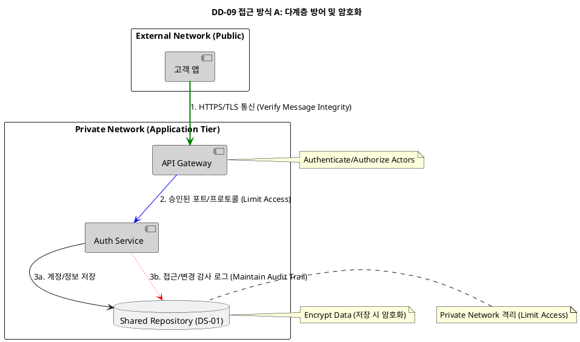
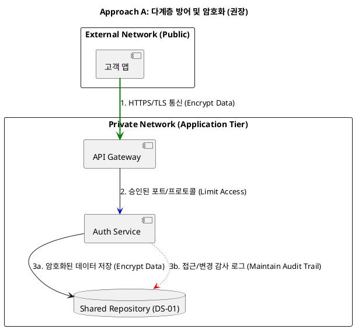
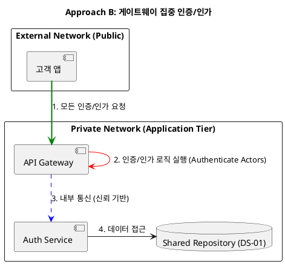
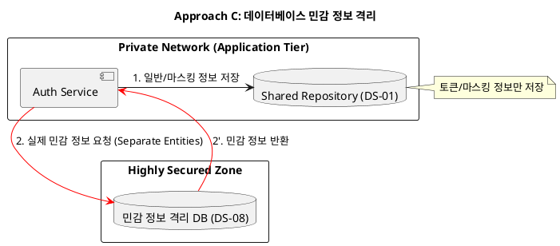

# DD-08: 보안 강화 구조 설계 결정

네, 지금까지의 아키텍처 결정을 바탕으로 시스템의 **보안(Security)** 및 **가용성(Availability)** 품질 속성을 강화하기 위해 **DD-08 보안 강화 구조 설계 결정**을 추가적으로 제안합니다.

이 설계는 고객/헬퍼의 \*\*민감한 개인정보(안면 데이터, 계정 정보)\*\*와 \*\*핵심 서비스(인증/결제)\*\*의 안전성을 보장하는 데 초점을 맞춥니다.

-----

## 4.4.8.1. Design Goal

본 설계 결정은 **QAS-04 (개인정보 및 안면인식 데이터 암호화 보호)**와 **BG-16 (보안 사고 0건 유지)** 목표를 달성하기 위해 분산된 환경에서 보안 택틱스를 적용하는 데 중점을 둡니다.

### 1. 주요 패턴 및 택틱스 결정

#### 1.1 적용된 아키텍처 패턴 및 스타일

| 패턴/스타일 | 분류 (tactics.txt) | 설명 (tactics.txt) | DD-08 적용 |
|:-----------|:------------------|:------------------|:----------|
| **Multi-tier (N-Tier/3-Tier)** | Distributed | 기능을 물리적으로 분리된 계층(Tier)으로 분리하며, 계층화 스타일과 유사하나 물리적 분리에 중점을 둠. | 4-Tier 분리 구조의 이점(네트워크 격리)을 활용한 다단계 방어. |

#### 1.2 적용된 아키텍처 택틱

| 택틱 | 분류 (tactics.txt) | 설명 (tactics.txt) | DD-08 적용 | 목표 QA |
|:-----|:------------------|:------------------|:----------|:--------|
| **Encrypt Data (데이터 암호화)** | 보안 - 공격 방어 | 데이터를 암호화하여 무단 접근으로부터 데이터를 보호함. | 안면 데이터 및 개인 식별 정보를 저장 시(At Rest) 강력하게 암호화. | QAS-04 |
| **Limit Access (접근 제한)** | 보안 - 공격 방어 | DMZ(DeMilitarized Zone)와 같은 메커니즘을 통해 리소스 접근을 제어함. | API Gateway를 Public Network에 배치하고, 나머지 모든 서비스 및 DB는 Private Network에 격리. | QAS-04 |
| **Separate Entities (엔티티 분리)** | 보안 - 공격 방어 | 시스템 내의 다른 엔티티를 물리적/논리적으로 분리함. | 접근 방식 C에서 고려되었으나, 운영 복잡성으로 인해 미채택. | QAS-04 |
| **Authenticate Actors (행위자 인증)** | 보안 - 공격 방어 | 행위자를 인증하여 접근 권한을 확인하고, 무단 접근을 방어함. | API Gateway에서 인증 처리. | QAS-04 |
| **Authorize Actors (행위자 인가)** | 보안 - 공격 방어 | 행위자에게 부여된 접근 권한을 기반으로 리소스 및 서비스에 대한 접근을 승인함. | API Gateway에서 인가 처리. | QAS-04 |
| **Verify Message Integrity (메시지 무결성 검증)** | 보안 - 공격 감지 | 메시지의 무결성을 확인하여 변조를 감지함. | 클라이언트 앱과 API Gateway 간의 모든 통신에 SSL/TLS 암호화 사용. | QAS-04 |
| **Maintain Audit Trail (감사 추적 유지)** | 보안 - 공격 복구 | 보안 관련 활동에 대한 시간 순서 기록(Audit Log)을 유지하여 추후 분석에 활용함. | 모든 인증/인가 시도, 민감 정보 접근 및 주요 데이터 변경에 대한 Audit Log 유지. | QAS-04 |

#### 1.3 패턴 및 택틱 적용 요약

| 영역 | 패턴/택틱스 | 목적 및 적용 근거 |
| :--- | :--- | :--- |
| **기본 구조** | **Multi-tier** | 4-Tier 분리 구조의 네트워크 격리를 활용한 다단계 방어. |
| **공격 방어** | **Encrypt Data, Limit Access, Authenticate Actors, Authorize Actors** | 데이터 암호화, 접근 제한, 인증/인가로 무단 접근 방어. |
| **공격 감지** | **Verify Message Integrity** | SSL/TLS 암호화로 메시지 무결성 검증. |
| **공격 복구** | **Maintain Audit Trail** | Audit Log를 통한 보안 사고 추적 및 분석. |

---

## 4.4.8.2. Design Approach List

### 4.4.8.2.1. 디자인 접근 방식 3가지 비교 (보안 및 접근 제어)

| 접근 방식 | 보안/접근 제어 방식 | 주요 택틱 | 장점 (Advantages) | 단점 (Disadvantages) |
| :--- | :--- | :--- | :--- | :--- |
| **A. 다계층 방어 및 암호화** (권장) | **데이터 전송/저장 전체 암호화** 및 **네트워크/DB 접근 통제**를 결합. | **Encrypt Data**, **Limit Access**, **Maintain Audit Trail** | **최고의 방어**: 외부 공격 및 내부자 위험 모두 방어. **QAS-04/BG-16** 충족. | 암호화/복호화에 따른 **Performance 부하**가 일부 증가. |
| **B. 게이트웨이 집중 인증/인가** | **API Gateway**에서만 **인증/인가**를 처리하고 내부 서비스는 신뢰함. | **Authenticate Actors**, **Authorize Actors** | **단순성**: 보안 로직을 한 곳에 집중하여 개발 및 관리가 용이함. | **내부 위험 취약**: Gateway를 우회하거나 침해당하면, 내부 서비스 간 통신은 무방비 상태가 되어 **보안이 취약**해짐. |
| **C. 데이터베이스 민감 정보 격리** | **DS-01**에 민감 정보 대신 **토큰/마스킹 정보**만 저장하고, 실제 민감 정보를 외부 **Private DB**에 격리함. | **Separate Entities** | **데이터 유출 위험 최소화**: **DS-01** 침해 시에도 민감 정보는 유출되지 않음. | **운영 복잡성 증가**: 두 개의 데이터 저장소를 동기화하고 관리해야 하며, **성능 저하** 위험 존재. |

-----

### 2\. 최종 디자인 결정: 접근 방식 A (다계층 방어 및 암호화)

**접근 방식 A**를 최종 디자인으로 결정합니다. 이 방식은 **보안의 기본 원칙**을 시스템 전반에 걸쳐 적용하여 **BG-16** 목표 달성을 위한 가장 강력하고 포괄적인 방어 구조를 제공합니다.

  * **Rationale:** **Approach A**는 **핵심 데이터 암호화**를 전제로 하면서, **4-Tier 분리 구조**의 이점(네트워크 격리)을 활용하여 다단계 방어를 구축합니다. **Approach B**와 **Approach C**의 단점(내부 위험, 운영 복잡성)을 피하고 **시스템 안정성**을 유지하면서 보안을 강화합니다.

#### 🎯 접근 방식 A의 상세 적용 택틱

| 대상 | 택틱 | 내용 |
| :--- | :--- | :--- |
| **데이터 (DS-01, DS-03)** | **Encrypt Data (데이터 암호화)** | 고객의 **안면 데이터 (DS-03)** 및 \*\*개인 식별 정보/계정 암호 해시 (DS-01)\*\*는 **저장 시(At Rest)** 반드시 강력하게 암호화하여 **QAS-04**를 충족합니다. |
| **통신 (앱 $\leftrightarrow$ GW)** | **Verify Message Integrity** | 클라이언트 앱과 **API Gateway** 간의 모든 통신은 **SSL/TLS 암호화**를 사용하여 전송 데이터의 **무결성**과 **기밀성**을 확보합니다. |
| **접근 제어 (Tier)** | **Limit Access (접근 제한)** | **API Gateway**를 Public Network에 배치하고, 나머지 모든 서비스 및 DB는 **Private Network**에 격리하여, **승인된 포트/프로토콜**만을 허용합니다 (QAS-04 환경 충족). |
| **감사/추적** | **Maintain Audit Trail (감사 추적 유지)** | 모든 **인증/인가 시도**, **민감 정보 접근** 및 **주요 데이터 변경**에 대한 시간 순서 기록(Audit Log)을 유지하여, 보안 사고 발생 시 **공격 감지** 및 추적에 활용합니다. |

### 3\. PlantUML 컴포넌트 다이어그램 (접근 방식 A)

DD-09 **보안 강화 구조 설계**를 위한 세 가지 접근 방식에 대한 설명과 컴포넌트 다이어그램을 제시합니다. 이 설계는 \*\*QAS-04 (암호화 보호)\*\*와 **BG-16 (보안 사고 0건)** 목표 달성을 위한 방어 전략에 중점을 둡니다.

-----

## 🛡️ DD-09 보안 강화 구조 설계: 3가지 접근 방식

### 1\. 접근 방식 A: 다계층 방어 및 암호화 (권장)

이 방식은 **데이터 암호화**와 **네트워크 접근 통제**를 결합하여 시스템 전반에 걸쳐 포괄적인 방어선을 구축합니다.

#### 📝 설명

  * [cite\_start]**방어 전략:** 시스템 내의 모든 민감 데이터는 **저장 시(Encrypt Data)** 암호화되며, 외부와 분리된 **Private Network**를 설정하여 **Limit Access (접근 제한)** 택틱을 적용합니다[cite: 94, 95].
  * [cite\_start]**보안 범위:** 클라이언트와 게이트웨이 간 통신은 **Verify Message Integrity**를 위해 SSL/TLS로 보호되며 [cite: 91][cite\_start], \*\*Maintain Audit Trail (감사 로그)\*\*을 유지하여 보안 관련 활동을 추적합니다[cite: 95].
  * **장점:** **BG-16** 목표 달성을 위한 가장 강력하고 포괄적인 방어 구조를 제공하여, 외부 침입 및 내부자 위험 모두를 방어합니다.

#### 💻 PlantUML 컴포넌트 다이어그램

-----

### 2\. 접근 방식 B: 게이트웨이 집중 인증/인가

이 방식은 보안 로직을 **API Gateway**에 집중하여 개발 및 관리의 단순성을 추구합니다.

#### 📝 설명

  * [cite\_start]**방어 전략:** **API Gateway**가 모든 **Authenticate Actors (행위자 인증)** 및 \*\*Authorize Actors (접근 승인)\*\*를 처리합니다[cite: 92, 93]. Gateway를 통과한 요청은 내부 서비스(Auth)를 신뢰하고 통신합니다.
  * **보안 범위:** 내부 서비스(예: Auth $\leftrightarrow$ Helper) 간의 통신은 별도의 암호화나 인증 절차를 생략하거나 약하게 적용할 수 있습니다.
  * **단점:** **내부 위험 취약**. Gateway를 우회하거나 Gateway가 침해당할 경우, 내부 Private Network의 서비스들이 무방비 상태에 놓여 **보안이 취약**해집니다. 이는 **QAS-04**의 민감 정보 보호 요건을 완전히 충족하지 못할 위험이 있습니다.

#### 💻 PlantUML 컴포넌트 다이어그램

-----

### 3\. 접근 방식 C: 데이터베이스 민감 정보 격리

이 방식은 민감 정보 자체를 외부 저장소에 분리하여 **데이터 유출 위험**을 최소화합니다.

#### 📝 설명

  * [cite\_start]**방어 전략:** \*\*DS-01 (Shared Repository)\*\*에는 고객 식별을 위한 토큰이나 마스킹된 정보만 저장하고, 실제 민감 정보(예: 안면 데이터 원본)는 접근이 훨씬 제한된 \*\*외부 Private DB (DS-08)\*\*에 격리합니다[cite: 94].
  * **보안 범위:** **Separate Entities (엔티티 분리)** 택틱을 데이터 계층에 적용하여, **DS-01**이 침해되더라도 **BG-16**의 목표를 간접적으로 보호합니다.
  * **단점:** **운영 복잡성 증가**. 두 개의 데이터 저장소를 관리하고 동기화해야 하며, 인증 과정에서 **추가적인 Latency**가 발생할 수 있습니다.

#### 💻 PlantUML 컴포넌트 다이어그램

DD-09의 세 번째 접근 방식인 **데이터베이스 민감 정보 격리**의 경우, 인증 과정에서의 지연 시간(latency) 증가는 **로그인(UC-04)과 회원 가입(UC-01, UC-02)** 모두에 영향을 미칩니다.

---

## 🔒 DD-09 접근 방식 C: Latency 증가 요소

접근 방식 C의 목표는 민감 정보(예: 안면 데이터, 실제 신용카드 정보)를 **Shared Repository (DS-01)**에서 분리된 **Highly Secured Zone (DS-08)**에 격리하는 것입니다.

이 구조는 데이터 유출 위험을 낮추지만, 인증 프로세스에 다음과 같은 추가적인 Latency를 발생시킵니다.

### 1. 회원 가입 (UC-01, UC-02) 시 Latency

* **요소:** 데이터 저장 과정에서 Latency가 증가합니다.
* **흐름:** **AUTH Service**는 일반 정보는 **DS-01**에 저장하고, 민감 정보는 **DS-08**에 저장해야 합니다. 이 두 저장소에 대한 **분산 쓰기 작업(Two-Phase Commit)**이 필요하거나, 비동기 처리를 위한 복잡한 로직이 추가되어야 하므로 저장 과정의 Latency가 증가합니다.

### 2. 로그인 및 출입 인증 (UC-04, UC-07) 시 Latency

* **요소:** 데이터 조회 과정에서 Latency가 증가합니다.
* **흐름:**
    1.  **로그인 (UC-04):** 사용자가 ID/PW를 입력하면 **AUTH Service**는 **DS-01**에서 계정 존재 여부를 확인하고, **암호 해시**를 조회해야 합니다. 만약 암호 해시와 같은 핵심 인증 요소가 **DS-08**에 격리되어 있다면, 인증을 완료하기 위해 **DS-01 $\to$ DS-08**로의 **추가적인 네트워크 왕복 호출**이 발생합니다.
    2.  **안면인식 출입 (UC-07):** **ACCESS Service**가 사용자의 **안면 ID**를 조회한 후, 실제 **안면 특징 벡터**를 **DS-08**과 같은 민감 정보 저장소에서 가져와야 합니다. 이 조회 과정에서 발생하는 추가적인 네트워크 Latency는 **BG-01 (출입 2초 이내)** 목표 달성을 위협할 수 있습니다.

**결론적으로,** 접근 방식 C는 데이터를 두 곳에서 관리하므로 **인증(로그인)** 및 **인가(출입)**를 위한 **데이터 조회 시점**에 필연적으로 **Latency가 증가**하며, 이는 회원 가입뿐만 아니라 빈번하게 발생하는 **로그인** 및 **출입 인증** 과정에 더 큰 영향을 미칩니다.

네, DD-09 **보안 강화 구조 설계**의 권장안인 **접근 방식 A (다계층 방어 및 암호화)**를 채택하는 Rationale을 작성하고, 접근 방식 C가 안면인식 출입 성능에 미치는 영향을 포함하여 설명하겠습니다.

---

## 🚀 Rationale: 접근 방식 A (다계층 방어 및 암호화) 채택 근거

### 1. 설계 결정 요약

| 결정 요소 | 내용 | 목표 달성 기여 |
| :--- | :--- | :--- |
| **선택된 접근 방식** | **접근 방식 A: 다계층 방어 및 암호화** | **BG-16** (보안 사고 0건) 달성 |
| **핵심 택틱** | **Encrypt Data**, **Limit Access**, **Verify Message Integrity** [cite: 91, 94, 95] | **QAS-04** (개인정보 및 안면인식 데이터 암호화 보호) 충족 |
| **구조적 이점** | **4-Tier 아키텍처**를 활용한 네트워크 격리 [cite: 38, 94] | **공격 방어** 강화 [cite: 92] |

### 2. 보안 및 가용성 확보 근거

접근 방식 A는 **보안의 기본 원칙**을 시스템 전반에 걸쳐 적용하여 **BG-16** 목표 달성을 위한 가장 강력하고 포괄적인 방어 구조를 제공합니다.

* **데이터 저장/전송 암호화 (QAS-04):** 고객의 안면 데이터, 계정 정보 등 모든 민감 정보는 **저장 시(At Rest) 및 전송 시(In Transit)** 암호화됩니다[cite: 95]. 클라이언트 앱과 **API Gateway** 간 통신에 **SSL/TLS**를 사용하여 데이터의 무결성을 확보합니다[cite: 91].
* **다단계 접근 제한 (Limit Access):** **API Gateway**만 Public Network에 노출시키고, 모든 내부 서비스와 DB는 **Private Network**에 격리합니다[cite: 94, 93]. 이는 Gateway 침해 시 내부 시스템으로의 접근을 차단하여 **공격 방어** 능력을 높입니다[cite: 92].
* **추적 및 책임 확보 (Audit Trail):** 보안 관련 활동에 대한 **감사 로그(Audit Trail)**를 유지하여 **공격 감지** 및 사후 분석에 활용합니다[cite: 95].

---

## 3. 접근 방식 C의 위험: 안면인식 출입 성능 저하 관점

접근 방식 C **(데이터베이스 민감 정보 격리)**는 **안면인식 출입 성능**을 희생하는 치명적인 **Trade-off**를 가집니다.

* **성능 저하의 원인:** **ACCESS Service**가 안면인식 출입 인증(UC-07)을 수행하려면, **안면 특징 벡터**를 **Highly Secured Zone (DS-08)**에 격리된 저장소에서 조회해야 합니다. 이 조회 과정에서 **추가적인 네트워크 왕복(Latency)**이 발생합니다.
* **BG-01 목표 위협:** 안면인식 출입 인증은 **출입 소요시간 95% 2초 이내**라는 초저지연 성능을 목표로 합니다[cite: 147]. **ACCESS Service**는 이미 **FACE MODEL Service**와의 통신(IPC/gRPC)에 Latency가 발생하고 있습니다. 여기에 **DS-08**까지 추가 네트워크 Latency가 발생하면, 안면 인식 판독 시간 목표인 **1.5초(Approach 2 개선 후)**를 초과하여 **2초 이내 출입 목표 달성이 불가능**해집니다.

**결론:** 접근 방식 C는 보안의 기본이 되는 **Encrypt Data** 택틱을 적용하고, **Private Network** 격리(Limit Access)를 통해 **DS-01**의 보안을 확보하는 **접근 방식 A**에 비해, 성능을 과도하게 희생하는 비효율적인 설계입니다. 따라서 **접근 방식 A**가 **보안과 성능의 균형**을 맞춘 최적의 선택입니다.