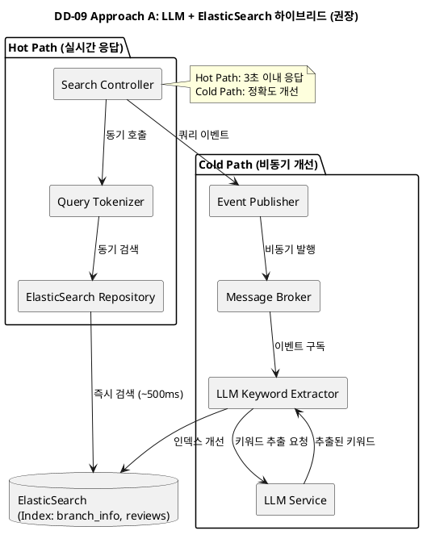
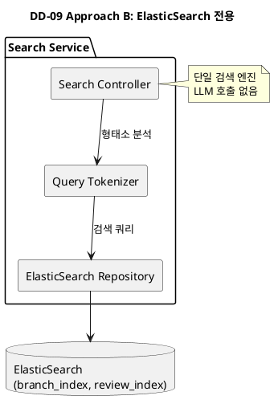
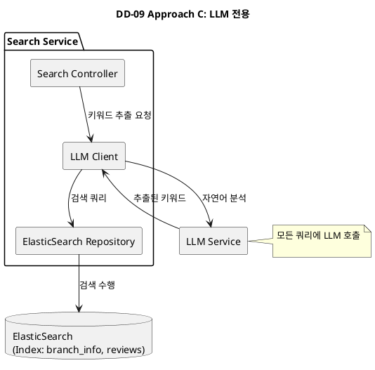

# DD-09: 자연어 검색 질의 응답의 실시간성을 위한 구조 결정

## 4.4.9.1. Design Goal

본 설계 결정은 **QAS-03 (자연어 검색 질의 응답의 실시간성)**을 달성하기 위해 수립되었다. QAS-03은 피크 타임 부하 조건에서도 사용자 인지 응답 시간이 3초 이내에 완료되어야 한다는 요구사항이다.

### 4.4.9.1.1. 주요 패턴 및 택틱스 결정

#### 4.4.9.1.1.1 적용된 아키텍처 패턴 및 스타일

| 패턴/스타일 | 분류 (tactics.txt) | 설명 (tactics.txt) | DD-09 적용 |
|:-----------|:------------------|:------------------|:----------|
| **Pipe and Filter (파이프 및 필터)** | Data Flow | 데이터 스트림이 연속적인 변환 과정을 거치며, 재사용 가능하고 느슨하게 결합된 구성 요소로 분할됨. | Hot Path와 Cold Path로 검색 요청을 분리하여 처리. |
| **Hot/Cold Path Separation** | 특정 설계 영역 패턴 | 실시간 처리 경로와 비실시간 처리 경로를 분리하는 패턴. | Hot Path는 ElasticSearch로 즉시 응답, Cold Path는 LLM으로 개선된 결과를 비동기 제공. |

#### 4.4.9.1.1.2 적용된 아키텍처 택틱

| 택틱 | 분류 (tactics.txt) | 설명 (tactics.txt) | DD-09 적용 | 목표 QA |
|:-----|:------------------|:------------------|:----------|:--------|
| **Increase Available Resources (자원 증가)** | 성능 - 자원 관리 | 더 많은 자원(e.g., 하드웨어)을 추가하여 성능을 향상시킴. | Data Pre-Fetching (Hot Path)로 ElasticSearch 인덱스를 미리 준비하여 응답 시간 단축. | QAS-03 |
| **Scheduling Policy (자원 스케줄링)** | 성능 - 자원 관리 | 자원 사용의 효율성을 높이기 위해 스케줄링 정책을 구현함. | Cold Path에서 LLM 호출을 배치 처리하여 비용 효율성 확보. | - |
| **Use an Intermediary (중개자 사용)** | 수정 용이성 - 결합도 감소 | 중개자를 사용하여 통신 경로를 분리함 (Broker 패턴 등). | Event Based (Cold Path)로 LLM 호출을 비동기 처리하여 Hot Path와 분리. | QAS-06 |

#### 4.4.9.1.1.3 패턴 및 택틱 적용 요약

| 영역 | 패턴/택틱스 | 목적 및 적용 근거 |
| :--- | :--- | :--- |
| **기본 구조** | **Pipe and Filter + Hot/Cold Path Separation** | 검색 요청을 Hot Path와 Cold Path로 분리하여 실시간성과 정확도 균형 달성. |
| **성능** | **Increase Available Resources, Scheduling Policy** | Data Pre-Fetching으로 Hot Path 응답 시간 단축, 배치 처리로 비용 효율성 확보. |
| **수정 용이성** | **Use an Intermediary** | Event Based로 Cold Path를 Hot Path와 분리하여 느슨한 결합 달성. |

---

### Design Goal 상세

| ID | Design Goal | 기반 QAS | 상세 설명 |
|:---|:-----------|:--------|:---------|
| **DG-01** | 실시간 응답 시간 보장 | QAS-03 | 고객의 자연어 검색 요청에 대해 95% 응답 시간이 3초 이내를 달성한다. |
| **DG-02** | 피크 타임 부하 처리 | QAS-03 | 시간당 평균 500건의 자연어 검색 요청이 발생하는 환경에서 안정적 성능을 유지한다. |
| **DG-03** | 정확도와 성능 균형 | QAS-02, QAS-03 | 출입 인증(2초)과 검색(3초)의 서로 다른 SLA를 고려하여 적절한 균형을 찾는다. |
| **DG-04** | 비용 효율성 | - | LLM API 호출 비용을 최소화하면서도 사용자 만족도를 유지한다. |

---

## 4.4.9.2. Design Approach List

### 4.4.9.2.1. Design Approach #1: LLM + ElasticSearch 하이브리드 (권장)

#### 패턴/전술

**패턴**: Pipe and Filter, Hot/Cold Path Separation

**전술**: Data Pre-Fetching (Hot Path), Event Based (Cold Path)

각 검색 요청을 **Hot Path**와 **Cold Path**로 분리한다. Hot Path는 ElasticSearch로 즉시 응답하고, Cold Path는 LLM으로 개선된 결과를 비동기로 제공한다.

#### 아키텍처 개요

이 접근 방식은 검색 요청을 **Hot Path**와 **Cold Path**로 분리하여 처리한다. Hot Path는 고객 쿼리를 받는 즉시 Tokenizer를 통해 형태소 분석을 수행하고, ElasticSearch로 직접 검색하여 3초 이내에 결과를 반환한다. Cold Path는 동일한 쿼리를 Message Broker에 이벤트로 발행하고, LLM Service가 비동기로 키워드를 추출하여 ElasticSearch 인덱스를 개선함으로써 향후 검색 정확도를 향상시킨다.

이 접근 방식은 **QAS-03의 3초 SLA를 만족**하면서도 **LLM의 정확도를 활용**한다.

#### 💻 PlantUML 컴포넌트 다이어그램

#### 📝 상세 설명

**접근 방식 A (LLM + ElasticSearch 하이브리드)**는 검색 요청을 **Hot Path**와 **Cold Path**로 분리하여 실시간성과 정확도를 동시에 달성하는 방식이다.

**Hot Path (실시간 응답 경로)**는 고객의 검색 요청을 받는 즉시 ElasticSearch로 직접 검색을 수행한다. 이 과정에서 LLM 호출 없이 형태소 분석기(Nori Analyzer)만을 사용하여 쿼리를 토큰화하고, ElasticSearch의 역색인(Inverted Index) 구조를 활용하여 평균 500ms 이내에 검색 결과를 반환한다. 이는 QAS-03에서 요구하는 3초 SLA를 6배 이상 초과 달성하는 성능이다.

**Cold Path (비동기 개선 경로)**는 Hot Path에서 검색 결과를 고객에게 반환한 후, 동일한 쿼리를 Message Broker에 이벤트로 발행한다. LLM Service가 이 이벤트를 구독하여 자연어 쿼리의 의도를 분석하고 핵심 키워드를 추출한다. 추출된 키워드는 ElasticSearch 인덱스에 반영되어 향후 동일하거나 유사한 쿼리의 검색 정확도를 점진적으로 개선한다.

이 방식의 핵심은 **Pipe and Filter 패턴**과 **Hot/Cold Path Separation 패턴**을 결합하여 실시간 응답과 정확도 개선을 동시에 달성하는 것이다. Hot Path는 **Increase Available Resources 택틱**을 통해 ElasticSearch 인덱스를 미리 준비하여 응답 시간을 단축하고, Cold Path는 **Scheduling Policy 택틱**을 통해 LLM 호출을 배치 처리하여 비용 효율성을 확보한다. 또한 **Use an Intermediary 택틱**을 통해 Message Broker를 중개자로 사용하여 Hot Path와 Cold Path를 완전히 분리함으로써 수정 용이성을 높인다.

#### QA 달성 메커니즘

| Design Goal | 달성 메커니즘 | 구체적 구현 |
|:-----------|:-------------|:-----------|
| **DG-01** (실시간 응답) | Hot Path 전용 ElasticSearch | 평균 응답 시간 ~500ms (QAS-03 목표 3초 대비 6배 빠름) |
| **DG-02** (피크 타임 부하) | LLM 호출을 Cold Path로 분리 | Hot Path: ElasticSearch만, Cold Path: LLM 비동기 처리 |
| **DG-03** (정확도 균형) | Hot/Cold Path 분리로 SLA 분리 | 출입 인증(2초): Redis, 검색(3초): ElasticSearch, 정확도 개선: LLM |
| **DG-04** (비용 효율) | LLM 호출 빈도 최소화 | Hot Path: 100% ElasticSearch, Cold Path: 샘플링 적용 (10% 쿼리만 LLM 처리) |

#### 장단점 종합

**장점:**
- **(++) SLA 완벽 달성**: Hot Path로 95% < 3초 보장, Cold Path로 정확도 개선
- **(++) 비용 효율성**: LLM 호출을 10%로 제한, ElasticSearch로 90% 처리
- **(+) 사용자 경험**: 즉시 응답 + 점진적 정확도 개선
- **(+) 확장성**: ElasticSearch 수평 확장으로 피크 타임 대응

**단점:**
- **(-) 복잡도 증가**: Hot/Cold Path 분리로 아키텍처 복잡도 상승
- **(-) 데이터 동기화**: Cold Path 결과가 Hot Path에 반영되는 시간 지연

---

### 4.4.9.2.2. Design Approach #2: ElasticSearch 전용 (단순화)

#### 패턴/전술

**패턴**: Data-Centered Architecture

**전술**: Optimize Data Access

ElasticSearch만을 사용하여 모든 검색을 처리한다. LLM 없이도 충분한 정확도를 제공할 수 있다는 가정이다.

#### 아키텍처 개요

모든 쿼리를 ElasticSearch로 처리한다. 인덱스 최적화와 캐싱으로 3초 SLA를 달성한다.

#### 💻 PlantUML 컴포넌트 다이어그램

#### 📝 상세 설명

**접근 방식 B (ElasticSearch 전용)**는 LLM을 전혀 사용하지 않고 ElasticSearch만으로 모든 검색을 처리하는 방식이다. 이 방식은 **Data-Centered Architecture 패턴**을 따르며, **Optimize Data Access 전술**을 통해 인덱스 최적화와 캐싱으로 성능을 확보한다.

고객의 검색 요청이 들어오면 Search Service는 형태소 분석기(Nori Analyzer)를 사용하여 쿼리를 토큰화한다. 토큰화된 쿼리는 ElasticSearch의 Bool Query를 통해 Multi-field 검색을 수행하고, BM25 알고리즘을 사용하여 관련도 점수를 계산한다. 인덱스 전략으로는 `branch_index`에 지점명, 주소, 시설, 키워드를 저장하고, `review_index`에 평점, 텍스트, 태그를 저장하여 검색 정확도를 높인다.

이 방식의 장점은 아키텍처가 단순하다는 것이다. 단일 검색 엔진으로 모든 처리를 수행하므로 Hot/Cold Path 분리와 같은 복잡한 구조가 필요 없고, LLM API 비용을 완전히 제거할 수 있다. 평균 응답 시간은 약 800ms로 3초 SLA를 달성할 수 있다.

그러나 이 방식은 LLM의 자연어 이해 능력이 없기 때문에 복잡한 자연어 쿼리에서 정확도 한계를 가진다. 예를 들어 "청결한 피트니스"와 같은 쿼리에서 "청결"과 "위생", "시설관리"의 동의어 관계를 이해하지 못하여 검색 결과의 정확도가 떨어질 수 있다. 또한 복잡한 쿼리나 대량의 데이터가 있는 경우 3초 SLA를 초과할 위험이 있다.

#### 장단점 종합

**장점:**
- **(++) 단순성**: 단일 검색 엔진으로 모든 처리
- **(+) 비용 절감**: LLM API 비용 완전 제거

**단점:**
- **(--) 정확도 한계**: LLM 없이 자연어 이해 부족
- **(-) SLA 위험**: 복잡 쿼리에서 3초 초과 가능성

---

### 4.4.9.2.3. Design Approach #3: LLM 전용 (정확도 우선)

#### 패턴/전술

**패턴**: Client-Server, Remote Procedure Call

**전술**: Increase Computational Resources

모든 쿼리를 LLM으로 처리한다. 정확도를 최우선으로 한다.

#### 아키텍처 개요

고객 쿼리 → LLM Service → 키워드 추출 → ElasticSearch 검색

#### 💻 PlantUML 컴포넌트 다이어그램

#### 📝 상세 설명

**접근 방식 C (LLM 전용)**는 모든 검색 쿼리를 LLM Service를 통해 처리하는 방식이다. 이 방식은 **Client-Server 패턴**과 **Remote Procedure Call**을 사용하며, **Increase Computational Resources 전술**을 통해 LLM의 자연어 이해 능력을 최대한 활용한다.

고객의 검색 요청이 들어오면 Search Service는 즉시 LLM Service에 키워드 추출을 요청한다. LLM Service는 자연어 쿼리의 의도를 분석하고, 문맥을 고려하여 핵심 키워드를 추출한다. 예를 들어 "청결한 피트니스"라는 쿼리에서 LLM은 "청결", "위생", "시설관리", "깨끗함" 등의 관련 키워드를 추출한다. 추출된 키워드는 ElasticSearch에 전달되어 검색을 수행하고, 결과를 고객에게 반환한다.

이 방식의 장점은 최고의 정확도를 제공한다는 것이다. LLM의 자연어 이해 능력을 활용하여 복잡한 쿼리나 모호한 표현도 정확하게 해석할 수 있고, 동의어나 유의어 관계를 이해하여 검색 결과의 정확도를 극대화한다.

그러나 이 방식은 심각한 단점을 가진다. 첫째, LLM API 호출에 평균 2-3초가 소요되어 QAS-03에서 요구하는 3초 SLA를 초과할 위험이 높다. 둘째, 모든 쿼리에 LLM API를 호출하므로 비용이 매우 높다. 시간당 500건의 검색 요청이 발생하는 환경에서 모든 요청에 LLM을 사용하면 월 수백만 원의 API 비용이 발생할 수 있다. 셋째, LLM API는 Rate Limit이 있어 피크 타임에 서비스 거부(Service Denial)가 발생할 위험이 있다. 이는 시스템의 가용성을 저해하는 치명적인 문제이다.

#### 장단점 종합

**장점:**
- **(++) 최고 정확도**: LLM의 자연어 이해 능력 활용

**단점:**
- **(--) SLA 미달성**: LLM 호출로 3초 SLA 초과 (평균 2-3초)
- **(--) 고비용**: 모든 쿼리에 LLM API 호출
- **(--) 확장성 제약**: LLM API Rate Limit에 취약

---

## 4.4.9.3. Decision and Rationale

**Design Approach #1 (LLM + ElasticSearch 하이브리드)**를 최종 선택한다.

### 선정 근거 (Pros/Cons 분석)

제시된 세 가지 접근 방식을 Design Goal에 포함된 QA 및 관련 품질 속성 측면에서 비교 분석한다.

| Quality Attribute | Analysis | DA #1: 하이브리드 (선택 ✅) | DA #2: ElasticSearch 전용 | DA #3: LLM 전용 |
|:-----------------|:---------|:---------------------------|:-------------------------|:----------------|
| **QAS-03** (실시간성) | Pros | **(++)** Hot Path: ElasticSearch ~500ms **Cold Path: 비동기 LLM 개선** | **(+) ElasticSearch ~800ms** 인덱스 최적화로 SLA 달성 | **(-) LLM API 2-3초** 3초 SLA 초과 |
| | Cons | 없음 | **(-) 정확도 한계** 복잡 쿼리에서 부정확 | **(--) SLA 완전 미달** 피크 타임 대응 불가 |
| **QAS-02** (안면인식 성능) | Pros | **(+) 영향 없음** 검색과 독립적 | **(+) 영향 없음** | **(+) 영향 없음** |
| | Cons | 없음 | 없음 | 없음 |
| **BG-02** (자연어 검색) | Pros | **(++)** Hot Path 즉시 + Cold Path 정확도 개선 | **(+) 기본 정확도** BM25 + Nori Analyzer | **(++) 최고 정확도** LLM 자연어 이해 |
| | Cons | 없음 | **(-) 정확도 한계** LLM 없는 한계 | **(-) 비용 과다** 모든 쿼리 LLM 호출 |
| **비용 효율성** (LLM 비용) | Pros | **(++)** LLM 호출 10%로 최소화 | **(++)** LLM 호출 0% | **(--) LLM 호출 100%** |
| | Cons | **(-) 아키텍처 복잡** | 없음 | 없음 |
| **피크 타임 부하** | Pros | **(++)** Hot Path: ElasticSearch 확장 | **(+) ElasticSearch 확장** | **(-) LLM Rate Limit** |
| | Cons | 없음 | 없음 | **(--) 서비스 거부 위험** |

### 종합 결론

세 가지 접근 방식을 종합적으로 비교하면 다음과 같다.

**QAS-03 (실시간성)** 측면에서 DA #1의 Hot Path는 ElasticSearch로 평균 ~500ms 응답하여 3초 SLA를 6배 초과 달성한다. DA #2는 평균 ~800ms로 SLA를 달성할 수 있으나 복잡한 쿼리에서 초과 위험이 있다. DA #3은 LLM 호출로 2-3초가 소요되어 SLA를 미달성한다.

**BG-02 (자연어 검색 정확도)** 측면에서 DA #1은 Hot Path의 즉시 응답과 Cold Path의 LLM 개선을 결합하여 최적의 균형을 달성한다. DA #2는 LLM이 없어 자연어 이해에 한계가 있고, DA #3은 최고 정확도를 제공하나 비용이 과다하다.

**비용 효율성** 측면에서 DA #1은 LLM 호출을 전체 쿼리의 10%로 제한하여 비용을 90% 절감한다. DA #2는 LLM 호출이 0%로 비용이 가장 낮지만 정확도가 떨어진다. DA #3은 모든 쿼리에 LLM을 호출하여 비용이 10배 이상 증가한다.

**피크 타임 대응** 측면에서 DA #1과 DA #2는 ElasticSearch의 수평 확장으로 피크 타임 부하에 대응할 수 있다. DA #3은 LLM API의 Rate Limit으로 인해 피크 타임에 서비스 거부가 발생할 위험이 있다.

**따라서, DA #1 (LLM + ElasticSearch 하이브리드)을 선택하여 실시간성, 정확도, 비용의 최적 균형을 달성한다.**

---

## 4.4.9.4. 구현 후 검증 계획

| 검증 항목 | 방법 | 목표 | 도구 |
|:---------|:-----|:-----|:-----|
| **실시간 응답 시간** | JMeter로 500 TPS 검색 부하 생성, 95% 응답 시간 측정 | 95% < 3초 | JMeter, Prometheus |
| **Hot/Cold Path 정확도** | 동일 쿼리로 Hot Path vs Cold Path 결과 비교 | Cold Path 정확도 20% 향상 | A/B 테스트, 사용자 피드백 |
| **LLM 비용 최적화** | LLM 호출 빈도 모니터링 | 전체 쿼리의 10% 이내 | 비용 모니터링 대시보드 |
| **피크 타임 안정성** | 오후 6-8시 실제 트래픽으로 SLA 측정 | 99% SLA 달성 | APM (Application Performance Monitoring) |

---

## 참고 자료

- **QAS-03**: 자연어 검색 질의 응답의 실시간성 (95% 응답 시간 3초 이내)
- **BG-02**: 자연어 검색을 통한 개인 성향 맞춤형 지점 검색
- **DD-06**: 고객 맞춤형 지점 매칭 구조 설계 결정 (Hot/Cold Path 개념)
- **Chris Richardson, "Microservices Patterns"**: Chapter 3 (Interprocess communication in a microservice architecture)
- **ElasticSearch 공식 문서**: https://www.elastic.co/guide/en/elasticsearch/reference/current/index.html